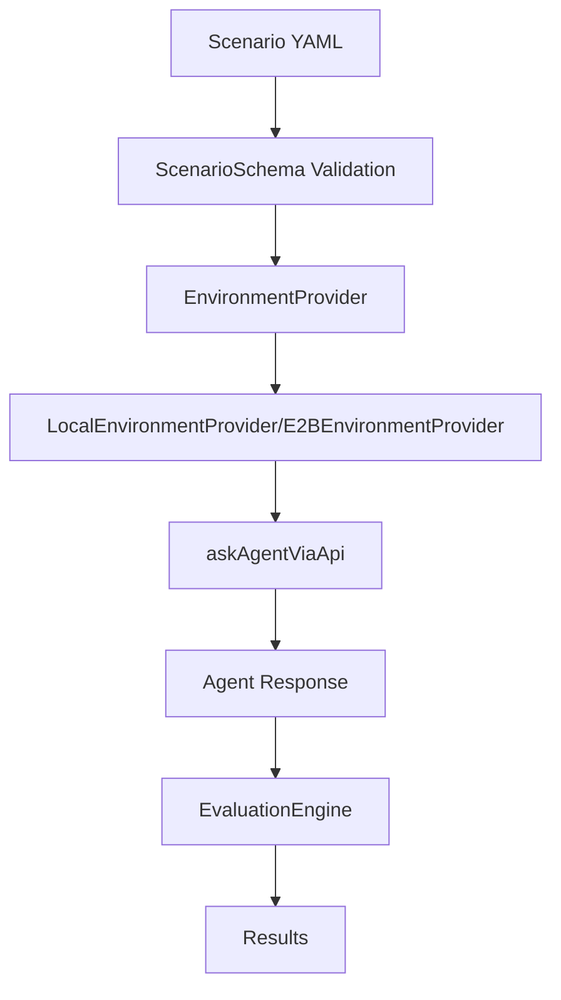
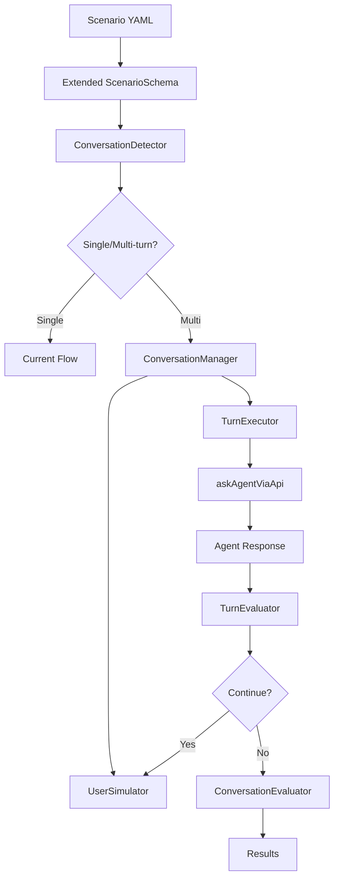

# Dynamic Prompting Engineering System Design

## Executive Summary

This document provides a detailed engineering design for implementing **Dynamic Prompting** (multi-turn conversations) in the ElizaOS scenario testing system. The design extends the existing single-turn scenario framework to support sophisticated conversation flows while maintaining 100% backward compatibility.

**Key Goals:**
- Enable multi-turn agent testing with simulated user responses
- Preserve all existing functionality and APIs
- Leverage current infrastructure (evaluation engine, trajectory reconstruction, providers)
- Support matrix testing with conversation parameters
- Provide rich evaluation capabilities for conversation quality

## Table of Contents

1. [System Architecture](#system-architecture)
2. [Component Design](#component-design)
3. [Interface Definitions](#interface-definitions)
4. [Implementation Plan](#implementation-plan)
5. [Database Schema](#database-schema)
6. [API Integration](#api-integration)
7. [Testing Strategy](#testing-strategy)
8. [Migration & Rollout](#migration--rollout)
9. [Performance Considerations](#performance-considerations)

---

## System Architecture

### Current Architecture Overview



### Extended Architecture with Dynamic Prompting



### Key Design Principles

1. **Non-Breaking Changes**: All existing scenarios continue to work unchanged
2. **Incremental Adoption**: Teams can add conversation features gradually
3. **Infrastructure Reuse**: Leverage existing `askAgentViaApi`, evaluation system, trajectory reconstruction
4. **Extensible Framework**: Easy to add new user simulation strategies and evaluation types

---

## Component Design

### 1. Schema Extensions

#### Extended RunStepSchema

```typescript
// File: packages/cli/src/commands/scenario/src/schema.ts
// MODIFICATION: Extend existing RunStepSchema

const ConversationConfigSchema = z.object({
  max_turns: z.number().int().min(2).max(20),
  timeout_per_turn_ms: z.number().int().min(1000).optional().default(30000),
  total_timeout_ms: z.number().int().min(10000).optional().default(300000),
  
  user_simulator: z.object({
    model_type: z.string().optional().default('TEXT_LARGE'),
    temperature: z.number().min(0).max(2).optional().default(0.7),
    max_tokens: z.number().int().min(50).max(500).optional().default(200),
    persona: z.string(),
    objective: z.string(),
    style: z.string().optional(),
    constraints: z.array(z.string()).optional().default([]),
    emotional_state: z.string().optional(),
    knowledge_level: z.enum(['beginner', 'intermediate', 'expert']).optional().default('intermediate'),
  }),
  
  termination_conditions: z.array(z.object({
    type: z.enum([
      'max_turns_reached',
      'user_expresses_satisfaction', 
      'agent_provides_solution',
      'conversation_stuck',
      'escalation_needed',
      'goal_achieved',
      'custom_condition'
    ]),
    description: z.string().optional(),
    keywords: z.array(z.string()).optional(),
    llm_judge: z.object({
      prompt: z.string(),
      threshold: z.number().min(0).max(1).optional().default(0.8)
    }).optional()
  })).optional().default([]),
  
  turn_evaluations: z.array(EvaluationSchema).optional().default([]),
  final_evaluations: z.array(EvaluationSchema).optional().default([]),
  
  debug_options: z.object({
    log_user_simulation: z.boolean().optional().default(false),
    log_turn_decisions: z.boolean().optional().default(false),
    export_full_transcript: z.boolean().optional().default(true),
  }).optional().default({})
});

// EXTEND existing RunStepSchema (backward compatible)
const RunStepSchema = z.object({
  name: z.string().optional(),
  lang: z.string().optional(), 
  code: z.string().optional(),
  input: z.string().optional(), // Natural language input to agent
  evaluations: z.array(EvaluationSchema),
  
  // NEW: Optional conversation configuration
  conversation: ConversationConfigSchema.optional(),
});
```

#### New Evaluation Types

```typescript
// File: packages/cli/src/commands/scenario/src/schema.ts
// ADDITION: New evaluation schemas for conversations

const ConversationLengthEvaluationSchema = BaseEvaluationSchema.extend({
  type: z.literal('conversation_length'),
  min_turns: z.number().int().min(1).optional(),
  max_turns: z.number().int().min(1).optional(),
  optimal_turns: z.number().int().min(1).optional(),
  target_range: z.array(z.number().int()).length(2).optional(),
});

const ConversationFlowEvaluationSchema = BaseEvaluationSchema.extend({
  type: z.literal('conversation_flow'),
  required_patterns: z.array(z.enum([
    'question_then_answer',
    'problem_then_solution', 
    'clarification_cycle',
    'empathy_then_solution',
    'escalation_pattern'
  ])),
  flow_quality_threshold: z.number().min(0).max(1).optional().default(0.7),
});

const UserSatisfactionEvaluationSchema = BaseEvaluationSchema.extend({
  type: z.literal('user_satisfaction'),
  satisfaction_threshold: z.number().min(0).max(1).optional().default(0.7),
  indicators: z.object({
    positive: z.array(z.string()).optional(),
    negative: z.array(z.string()).optional(),
  }).optional(),
  measurement_method: z.enum(['sentiment_analysis', 'keyword_analysis', 'llm_judge']).optional().default('llm_judge'),
});

const ContextRetentionEvaluationSchema = BaseEvaluationSchema.extend({
  type: z.literal('context_retention'),
  test_memory_of: z.array(z.string()),
  retention_turns: z.number().int().min(1).optional().default(3),
  memory_accuracy_threshold: z.number().min(0).max(1).optional().default(0.8),
});

// UPDATE: Extend main EvaluationSchema with new types
export const EvaluationSchema = z.discriminatedUnion('type', [
  StringContainsEvaluationSchema,
  RegexMatchEvaluationSchema,
  FileExistsEvaluationSchema,
  TrajectoryContainsActionEvaluationSchema,
  LLMJudgeEvaluationSchema,
  ExecutionTimeEvaluationSchema,
  // NEW conversation evaluators
  ConversationLengthEvaluationSchema,
  ConversationFlowEvaluationSchema,
  UserSatisfactionEvaluationSchema,
  ContextRetentionEvaluationSchema,
]);
```

### 2. Core Components

#### UserSimulator Class

```typescript
// File: packages/cli/src/commands/scenario/src/UserSimulator.ts
// NEW FILE

import { AgentRuntime, ModelType } from '@elizaos/core';
import { ConversationTurn, SimulationContext, UserSimulatorConfig } from './conversation-types';

export class UserSimulator {
  private runtime: AgentRuntime;
  private config: UserSimulatorConfig;
  
  constructor(runtime: AgentRuntime, config: UserSimulatorConfig) {
    this.runtime = runtime;
    this.config = config;
  }

  async generateResponse(
    conversationHistory: ConversationTurn[],
    latestAgentResponse: string,
    context: SimulationContext
  ): Promise<string> {
    const prompt = this.buildSimulationPrompt(
      conversationHistory,
      latestAgentResponse, 
      context
    );

    const response = await this.runtime.useModel(
      ModelType.TEXT_LARGE,
      {
        messages: [{ role: 'user', content: prompt }],
        temperature: this.config.temperature,
        maxTokens: this.config.max_tokens,
      }
    );

    // Log simulation for debugging
    if (context.debugOptions?.log_user_simulation) {
      console.log(`👤 [UserSimulator] Generated response: "${response}"`);
      console.log(`👤 [UserSimulator] Context: Turn ${context.turnNumber}/${context.maxTurns}`);
    }

    return response;
  }

  private buildSimulationPrompt(
    history: ConversationTurn[],
    agentResponse: string,
    context: SimulationContext
  ): string {
    const { persona, objective, style, constraints, emotionalState, knowledgeLevel } = this.config;
    
    let prompt = `You are simulating a user in a conversation with an AI agent.

**Your Persona:** ${persona}
**Your Objective:** ${objective}
**Your Communication Style:** ${style || 'natural and conversational'}
**Your Knowledge Level:** ${knowledgeLevel}`;

    if (emotionalState) {
      prompt += `\n**Your Emotional State:** ${emotionalState}`;
    }

    if (constraints.length > 0) {
      prompt += `\n**Behavioral Constraints:**\n${constraints.map(c => `- ${c}`).join('\n')}`;
    }

    prompt += `\n\n**Conversation Context:**
- This is turn ${context.turnNumber} of a maximum ${context.maxTurns} turn conversation
- Your goal is to ${objective}`;

    if (history.length > 0) {
      prompt += `\n\n**Conversation History:**`;
      history.forEach((turn, i) => {
        prompt += `\n${i + 1}. User: ${turn.userInput}`;
        prompt += `\n${i + 1}. Agent: ${turn.agentResponse}`;
      });
    }

    prompt += `\n\n**Latest Agent Response:** ${agentResponse}

**Instructions:**
1. Respond as the user persona described above
2. Keep your response realistic and natural (50-200 words)
3. Stay true to your personality and objective
4. Consider your knowledge level when asking questions or providing information
5. Progress toward your objective while maintaining realistic conversation flow

**Your Response:**`;

    return prompt;
  }
}
```

#### ConversationManager Class

```typescript
// File: packages/cli/src/commands/scenario/src/ConversationManager.ts
// NEW FILE

import { AgentRuntime, UUID } from '@elizaos/core';
import { AgentServer } from '@elizaos/server';
import { askAgentViaApi } from './runtime-factory';
import { UserSimulator } from './UserSimulator';
import { EvaluationEngine } from './EvaluationEngine';
import {
  ConversationConfig,
  ConversationResult,
  ConversationTurn,
  TerminationCondition,
  SimulationContext
} from './conversation-types';
import { TrajectoryReconstructor } from './TrajectoryReconstructor';

export class ConversationManager {
  private runtime: AgentRuntime;
  private server: AgentServer;
  private agentId: UUID;
  private serverPort: number;
  private userSimulator: UserSimulator;
  private evaluationEngine: EvaluationEngine;
  private trajectoryReconstructor: TrajectoryReconstructor;

  constructor(
    runtime: AgentRuntime,
    server: AgentServer, 
    agentId: UUID,
    serverPort: number,
    trajectoryReconstructor: TrajectoryReconstructor
  ) {
    this.runtime = runtime;
    this.server = server;
    this.agentId = agentId;
    this.serverPort = serverPort;
    this.evaluationEngine = new EvaluationEngine(runtime);
    this.trajectoryReconstructor = trajectoryReconstructor;
  }

  async executeConversation(
    initialInput: string,
    config: ConversationConfig
  ): Promise<ConversationResult> {
    const startTime = Date.now();
    const turns: ConversationTurn[] = [];
    let currentInput = initialInput;
    
    // Initialize user simulator
    this.userSimulator = new UserSimulator(this.runtime, config.user_simulator);
    
    console.log(`🗣️  [ConversationManager] Starting conversation: max_turns=${config.max_turns}`);
    console.log(`🗣️  [ConversationManager] User persona: ${config.user_simulator.persona}`);
    
    try {
      for (let turnNumber = 1; turnNumber <= config.max_turns; turnNumber++) {
        console.log(`🗣️  [ConversationManager] === TURN ${turnNumber}/${config.max_turns} ===`);
        
        const turn = await this.executeTurn(
          currentInput,
          turnNumber,
          config,
          turns
        );
        
        turns.push(turn);

        // Run turn-level evaluations
        if (config.turn_evaluations?.length > 0) {
          const turnEvaluations = await this.evaluationEngine.runEvaluations(
            config.turn_evaluations,
            turn.executionResult
          );
          
          turn.turnEvaluations = turnEvaluations;
          
          if (config.debug_options?.log_turn_decisions) {
            console.log(`📊 [ConversationManager] Turn ${turnNumber} evaluations:`, 
              turnEvaluations.map(e => `${e.success ? '✅' : '❌'} ${e.message}`));
          }
        }

        // Check termination conditions
        if (await this.checkTerminationConditions(turns, config.termination_conditions)) {
          console.log(`🛑 [ConversationManager] Termination condition met at turn ${turnNumber}`);
          break;
        }

        // Generate next user input (if not last turn)
        if (turnNumber < config.max_turns) {
          const simulationContext: SimulationContext = {
            turnNumber: turnNumber + 1,
            maxTurns: config.max_turns,
            debugOptions: config.debug_options
          };

          currentInput = await this.userSimulator.generateResponse(
            turns,
            turn.agentResponse,
            simulationContext
          );

          console.log(`👤 [ConversationManager] User (simulated): "${currentInput}"`);
        }
      }

      const endTime = Date.now();
      const totalDuration = endTime - startTime;

      // Run final evaluations
      let finalEvaluations = [];
      if (config.final_evaluations?.length > 0) {
        // Create a combined execution result for final evaluations
        const combinedResult = this.createCombinedExecutionResult(turns, totalDuration);
        finalEvaluations = await this.evaluationEngine.runEvaluations(
          config.final_evaluations,
          combinedResult
        );
      }

      const result: ConversationResult = {
        turns,
        totalDuration,
        terminatedEarly: turns.length < config.max_turns,
        terminationReason: await this.getTerminationReason(turns, config.termination_conditions),
        finalEvaluations,
        conversationTranscript: this.generateTranscript(turns),
        success: this.determineOverallSuccess(turns, finalEvaluations)
      };

      console.log(`🎯 [ConversationManager] Conversation completed: ${turns.length} turns, success=${result.success}`);
      
      return result;

    } catch (error) {
      console.error(`💥 [ConversationManager] Conversation failed:`, error);
      throw new Error(`Conversation execution failed: ${error instanceof Error ? error.message : String(error)}`);
    }
  }

  private async executeTurn(
    userInput: string,
    turnNumber: number,
    config: ConversationConfig,
    previousTurns: ConversationTurn[]
  ): Promise<ConversationTurn> {
    const turnStartTime = Date.now();
    
    console.log(`👤 [ConversationManager] Turn ${turnNumber} Input: "${userInput}"`);

    // Use existing askAgentViaApi infrastructure
    const { response: agentResponse, roomId } = await askAgentViaApi(
      this.server,
      this.agentId,
      userInput,
      config.timeout_per_turn_ms,
      this.serverPort
    );

    console.log(`🤖 [ConversationManager] Turn ${turnNumber} Response: "${agentResponse}"`);

    // Give time for trajectory to be written to database
    await new Promise(resolve => setTimeout(resolve, 2000));

    // Reconstruct trajectory for this turn
    const trajectory = await this.trajectoryReconstructor.getLatestTrajectory(roomId);

    const turnEndTime = Date.now();
    const turnDuration = turnEndTime - turnStartTime;

    // Create execution result for this turn (following existing pattern)
    const executionResult = {
      exitCode: 0,
      stdout: agentResponse,
      stderr: '',
      files: {}, // No file operations in conversation turns
      startedAtMs: turnStartTime,
      endedAtMs: turnEndTime,
      durationMs: turnDuration,
      trajectory
    };

    return {
      turnNumber,
      userInput,
      agentResponse,
      roomId,
      trajectory,
      duration: turnDuration,
      executionResult,
      turnEvaluations: [] // Will be populated later
    };
  }

  private async checkTerminationConditions(
    turns: ConversationTurn[],
    conditions: TerminationCondition[]
  ): Promise<boolean> {
    if (!conditions || conditions.length === 0) return false;

    for (const condition of conditions) {
      let shouldTerminate = false;

      switch (condition.type) {
        case 'user_expresses_satisfaction':
          shouldTerminate = await this.checkSatisfactionKeywords(turns, condition);
          break;
        case 'agent_provides_solution':
          shouldTerminate = await this.checkSolutionKeywords(turns, condition);
          break;
        case 'conversation_stuck':
          shouldTerminate = await this.checkConversationStuck(turns);
          break;
        case 'escalation_needed':
          shouldTerminate = await this.checkEscalationKeywords(turns, condition);
          break;
        case 'custom_condition':
          if (condition.llm_judge) {
            shouldTerminate = await this.checkLLMJudgeCondition(turns, condition);
          }
          break;
      }

      if (shouldTerminate) {
        console.log(`🛑 [ConversationManager] Termination condition met: ${condition.type}`);
        return true;
      }
    }

    return false;
  }

  private async checkSatisfactionKeywords(
    turns: ConversationTurn[],
    condition: TerminationCondition
  ): Promise<boolean> {
    const defaultKeywords = ['thank you', 'thanks', 'perfect', 'great', 'that works', 'solved', 'fixed'];
    const keywords = condition.keywords || defaultKeywords;
    
    const lastTurn = turns[turns.length - 1];
    const lastUserInput = turns.length > 1 ? turns[turns.length - 2]?.userInput || '' : '';
    const lastAgentResponse = lastTurn.agentResponse;
    
    const textToCheck = `${lastUserInput} ${lastAgentResponse}`.toLowerCase();
    
    return keywords.some(keyword => textToCheck.includes(keyword.toLowerCase()));
  }

  private async checkSolutionKeywords(
    turns: ConversationTurn[],
    condition: TerminationCondition  
  ): Promise<boolean> {
    const defaultKeywords = ['solution', 'try this', 'follow these steps', 'here\'s how', 'you can'];
    const keywords = condition.keywords || defaultKeywords;
    
    const lastTurn = turns[turns.length - 1];
    const agentResponse = lastTurn.agentResponse.toLowerCase();
    
    return keywords.some(keyword => agentResponse.includes(keyword.toLowerCase()));
  }

  private async checkConversationStuck(turns: ConversationTurn[]): Promise<boolean> {
    if (turns.length < 3) return false;
    
    // Check if last 2 agent responses are very similar (indicating repetition)
    const lastResponse = turns[turns.length - 1].agentResponse;
    const prevResponse = turns[turns.length - 2].agentResponse;
    
    // Simple similarity check - could be enhanced with more sophisticated NLP
    const similarity = this.calculateStringSimilarity(lastResponse, prevResponse);
    return similarity > 0.8;
  }

  private async checkEscalationKeywords(
    turns: ConversationTurn[],
    condition: TerminationCondition
  ): Promise<boolean> {
    const defaultKeywords = ['escalate', 'supervisor', 'manager', 'specialist', 'human agent'];
    const keywords = condition.keywords || defaultKeywords;
    
    const lastTurn = turns[turns.length - 1];
    const agentResponse = lastTurn.agentResponse.toLowerCase();
    
    return keywords.some(keyword => agentResponse.includes(keyword.toLowerCase()));
  }

  private async checkLLMJudgeCondition(
    turns: ConversationTurn[],
    condition: TerminationCondition
  ): Promise<boolean> {
    if (!condition.llm_judge) return false;
    
    const conversationText = this.generateTranscript(turns);
    const prompt = `${condition.llm_judge.prompt}\n\nConversation:\n${conversationText}\n\nShould this conversation be terminated? Respond with only 'yes' or 'no'.`;
    
    const response = await this.runtime.useModel(
      ModelType.TEXT_LARGE,
      {
        messages: [{ role: 'user', content: prompt }],
        temperature: 0.1,
      }
    );
    
    return response.toLowerCase().includes('yes');
  }

  private calculateStringSimilarity(str1: string, str2: string): number {
    // Simple Jaccard similarity for words
    const words1 = new Set(str1.toLowerCase().split(/\s+/));
    const words2 = new Set(str2.toLowerCase().split(/\s+/));
    
    const intersection = new Set([...words1].filter(x => words2.has(x)));
    const union = new Set([...words1, ...words2]);
    
    return intersection.size / union.size;
  }

  private createCombinedExecutionResult(turns: ConversationTurn[], totalDuration: number) {
    const combinedTrajectory = turns.flatMap(turn => turn.trajectory || []);
    const combinedOutput = turns.map((turn, i) => 
      `Turn ${i + 1}:\nUser: ${turn.userInput}\nAgent: ${turn.agentResponse}`
    ).join('\n\n');

    return {
      exitCode: 0,
      stdout: combinedOutput,
      stderr: '',
      files: {},
      startedAtMs: turns[0]?.executionResult?.startedAtMs || Date.now(),
      endedAtMs: Date.now(),
      durationMs: totalDuration,
      trajectory: combinedTrajectory
    };
  }

  private async getTerminationReason(
    turns: ConversationTurn[],
    conditions: TerminationCondition[]
  ): Promise<string | null> {
    if (turns.length === 0) return null;
    
    // Check which condition caused termination
    for (const condition of conditions) {
      if (await this.checkTerminationConditions([turns[turns.length - 1]], [condition])) {
        return condition.type;
      }
    }
    
    return 'max_turns_reached';
  }

  private generateTranscript(turns: ConversationTurn[]): string {
    return turns.map((turn, i) => 
      `Turn ${i + 1}:\nUser: ${turn.userInput}\nAgent: ${turn.agentResponse}\n`
    ).join('\n');
  }

  private determineOverallSuccess(
    turns: ConversationTurn[],
    finalEvaluations: any[]
  ): boolean {
    // Simple success criteria - can be made configurable
    const hasSuccessfulTurns = turns.some(turn => 
      turn.turnEvaluations?.every(eval => eval.success) !== false
    );
    
    const finalEvaluationsPass = finalEvaluations.length === 0 || 
      finalEvaluations.every(eval => eval.success);
    
    return hasSuccessfulTurns && finalEvaluationsPass;
  }
}
```

#### Type Definitions

```typescript
// File: packages/cli/src/commands/scenario/src/conversation-types.ts
// NEW FILE

import { UUID } from '@elizaos/core';
import { ExecutionResult } from './providers';
import { TrajectoryStep } from './TrajectoryReconstructor';
import { EvaluationResult } from './EvaluationEngine';

export interface UserSimulatorConfig {
  model_type: string;
  temperature: number;
  max_tokens: number;
  persona: string;
  objective: string;
  style?: string;
  constraints: string[];
  emotional_state?: string;
  knowledge_level: 'beginner' | 'intermediate' | 'expert';
}

export interface TerminationCondition {
  type: 'max_turns_reached' | 'user_expresses_satisfaction' | 'agent_provides_solution' | 
        'conversation_stuck' | 'escalation_needed' | 'goal_achieved' | 'custom_condition';
  description?: string;
  keywords?: string[];
  llm_judge?: {
    prompt: string;
    threshold: number;
  };
}

export interface ConversationConfig {
  max_turns: number;
  timeout_per_turn_ms: number;
  total_timeout_ms: number;
  user_simulator: UserSimulatorConfig;
  termination_conditions: TerminationCondition[];
  turn_evaluations: any[]; // EvaluationSchema[]
  final_evaluations: any[]; // EvaluationSchema[]
  debug_options: {
    log_user_simulation: boolean;
    log_turn_decisions: boolean;
    export_full_transcript: boolean;
  };
}

export interface ConversationTurn {
  turnNumber: number;
  userInput: string;
  agentResponse: string;
  roomId: UUID;
  trajectory: TrajectoryStep[];
  duration: number;
  executionResult: ExecutionResult;
  turnEvaluations: EvaluationResult[];
}

export interface ConversationResult {
  turns: ConversationTurn[];
  totalDuration: number;
  terminatedEarly: boolean;
  terminationReason: string | null;
  finalEvaluations: EvaluationResult[];
  conversationTranscript: string;
  success: boolean;
}

export interface SimulationContext {
  turnNumber: number;
  maxTurns: number;
  debugOptions?: {
    log_user_simulation: boolean;
    log_turn_decisions: boolean;
  };
}
```

### 3. Provider Integration

#### Extended LocalEnvironmentProvider

```typescript
// File: packages/cli/src/commands/scenario/src/LocalEnvironmentProvider.ts
// MODIFICATION: Add conversation support to existing class

export class LocalEnvironmentProvider implements EnvironmentProvider {
  // ... existing fields ...
  private conversationManager?: ConversationManager;

  // ... existing constructor and methods ...

  async run(scenario: Scenario): Promise<ExecutionResult[]> {
    if (!this.tempDir) {
      throw new Error('Setup must be called before run.');
    }

    const results: ExecutionResult[] = [];
    for (const step of scenario.run) {
      const startedAtMs = Date.now();

      // NEW: Check if this is a conversation step
      if (step.conversation) {
        if (!this.server || !this.agentId) {
          throw new Error(
            'LocalEnvironmentProvider requires a pre-created server and agent for conversation steps'
          );
        }

        // Initialize conversation manager if needed
        if (!this.conversationManager) {
          this.conversationManager = new ConversationManager(
            this.runtime!,
            this.server,
            this.agentId,
            this.serverPort,
            this.trajectoryReconstructor!
          );
        }

        console.log(`🗣️  [LocalEnvironmentProvider] Executing conversation step: ${step.name || 'unnamed'}`);
        
        const conversationResult = await this.conversationManager.executeConversation(
          step.input || '',
          step.conversation
        );

        // Convert conversation result to ExecutionResult format
        const endedAtMs = Date.now();
        const durationMs = endedAtMs - startedAtMs;

        const executionResult: ExecutionResult = {
          exitCode: conversationResult.success ? 0 : 1,
          stdout: conversationResult.conversationTranscript,
          stderr: conversationResult.success ? '' : 'Conversation failed',
          files: await this.captureFileSystem(),
          startedAtMs,
          endedAtMs,
          durationMs,
          trajectory: conversationResult.turns.flatMap(turn => turn.trajectory),
        };

        // Add conversation metadata to result
        (executionResult as any).conversationMetadata = {
          turnCount: conversationResult.turns.length,
          terminatedEarly: conversationResult.terminatedEarly,
          terminationReason: conversationResult.terminationReason,
          finalEvaluations: conversationResult.finalEvaluations
        };

        results.push(executionResult);

      } else if (step.input) {
        // EXISTING: Single-turn logic unchanged
        if (!this.server || !this.agentId) {
          throw new Error(
            'LocalEnvironmentProvider requires a pre-created server and agent for NL input'
          );
        }
        const { response, roomId } = await askAgentViaApi(
          this.server,
          this.agentId,
          step.input,
          30000, // timeout
          this.serverPort // Pass the actual server port
        );

        // Give database time to write logs before reconstructing trajectory
        await new Promise((resolve) => setTimeout(resolve, 3000)); // 3 second delay to allow async DB writes

        // Reconstruct trajectory from database logs (Ticket #5785 - Non-invasive approach)
        const trajectory =
          this.trajectoryReconstructor && roomId
            ? await this.trajectoryReconstructor.getLatestTrajectory(roomId)
            : [];

        // Debug trajectory reconstruction
        console.log(`🔍 [Trajectory Debug] Room ID: ${roomId}, Steps found: ${trajectory.length}`);
        if (trajectory.length > 0) {
          console.log(`📊 [Trajectory Debug] First step:`, JSON.stringify(trajectory[0], null, 2));
        }

        const endedAtMs = Date.now();
        const durationMs = endedAtMs - startedAtMs;

        results.push({
          exitCode: 0,
          stdout: response,
          stderr: '',
          files: await this.captureFileSystem(),
          startedAtMs,
          endedAtMs,
          durationMs,
          trajectory, // Add trajectory to execution result
        });
      } else if (step.code) {
        // EXISTING: Code execution logic unchanged
        // ... existing code execution implementation ...
      }
    }

    return results;
  }

  // ... rest of existing methods unchanged ...
}
```

### 4. Evaluation Extensions

#### New Conversation Evaluators

```typescript
// File: packages/cli/src/commands/scenario/src/ConversationEvaluators.ts
// NEW FILE

import { AgentRuntime } from '@elizaos/core';
import { ExecutionResult } from './providers';
import { Evaluator, EvaluationResult } from './EvaluationEngine';
import { Evaluation as EvaluationSchema } from './schema';

export class ConversationLengthEvaluator implements Evaluator {
  async evaluate(
    params: EvaluationSchema,
    runResult: ExecutionResult,
    runtime: AgentRuntime
  ): Promise<EvaluationResult> {
    const metadata = (runResult as any).conversationMetadata;
    if (!metadata) {
      return {
        success: false,
        message: 'No conversation metadata found - not a conversation step'
      };
    }

    const { turnCount } = metadata;
    const { min_turns, max_turns, optimal_turns, target_range } = params as any;

    let success = true;
    let message = `Conversation lasted ${turnCount} turns`;

    if (min_turns && turnCount < min_turns) {
      success = false;
      message += ` (below minimum of ${min_turns})`;
    }

    if (max_turns && turnCount > max_turns) {
      success = false;
      message += ` (above maximum of ${max_turns})`;
    }

    if (target_range && target_range.length === 2) {
      const [min, max] = target_range;
      if (turnCount < min || turnCount > max) {
        success = false;
        message += ` (outside target range ${min}-${max})`;
      }
    }

    if (optimal_turns) {
      const distance = Math.abs(turnCount - optimal_turns);
      message += ` (${distance} turns from optimal ${optimal_turns})`;
    }

    return { success, message };
  }
}

export class ConversationFlowEvaluator implements Evaluator {
  async evaluate(
    params: EvaluationSchema,
    runResult: ExecutionResult,
    runtime: AgentRuntime
  ): Promise<EvaluationResult> {
    const { required_patterns, flow_quality_threshold } = params as any;
    const conversationText = runResult.stdout;

    let detectedPatterns = [];
    let success = true;

    for (const pattern of required_patterns) {
      const detected = await this.detectPattern(pattern, conversationText, runtime);
      if (detected) {
        detectedPatterns.push(pattern);
      } else {
        success = false;
      }
    }

    const message = `Flow analysis: ${detectedPatterns.length}/${required_patterns.length} patterns detected (${detectedPatterns.join(', ')})`;

    return { success, message };
  }

  private async detectPattern(
    pattern: string,
    conversationText: string,
    runtime: AgentRuntime
  ): Promise<boolean> {
    const patternPrompts = {
      'question_then_answer': 'Does this conversation contain instances where the agent asks a question and the user provides an answer?',
      'problem_then_solution': 'Does this conversation show the user stating a problem and the agent providing a solution?',
      'clarification_cycle': 'Does this conversation include back-and-forth clarification between user and agent?',
      'empathy_then_solution': 'Does the agent show empathy before providing solutions?',
      'escalation_pattern': 'Does the conversation include appropriate escalation when needed?'
    };

    const prompt = patternPrompts[pattern];
    if (!prompt) return false;

    const analysisPrompt = `${prompt}

Conversation:
${conversationText}

Respond with only 'yes' or 'no'.`;

    const response = await runtime.useModel(
      'TEXT_LARGE' as any,
      {
        messages: [{ role: 'user', content: analysisPrompt }],
        temperature: 0.1,
      }
    );

    return response.toLowerCase().includes('yes');
  }
}

export class UserSatisfactionEvaluator implements Evaluator {
  async evaluate(
    params: EvaluationSchema,
    runResult: ExecutionResult,
    runtime: AgentRuntime
  ): Promise<EvaluationResult> {
    const { satisfaction_threshold, indicators, measurement_method } = params as any;
    const conversationText = runResult.stdout;

    let satisfactionScore = 0;
    let method = measurement_method || 'llm_judge';

    switch (method) {
      case 'keyword_analysis':
        satisfactionScore = this.analyzeKeywords(conversationText, indicators);
        break;
      case 'sentiment_analysis':
        satisfactionScore = await this.analyzeSentiment(conversationText, runtime);
        break;
      case 'llm_judge':
      default:
        satisfactionScore = await this.judgeWithLLM(conversationText, runtime);
        break;
    }

    const threshold = satisfaction_threshold || 0.7;
    const success = satisfactionScore >= threshold;
    const message = `User satisfaction: ${(satisfactionScore * 100).toFixed(1)}% (threshold: ${(threshold * 100).toFixed(1)}%)`;

    return { success, message };
  }

  private analyzeKeywords(conversationText: string, indicators: any): number {
    const text = conversationText.toLowerCase();
    const positive = indicators?.positive || ['thank you', 'thanks', 'great', 'perfect', 'helpful'];
    const negative = indicators?.negative || ['frustrated', 'unhelpful', 'confused', 'angry'];

    const positiveCount = positive.filter(word => text.includes(word.toLowerCase())).length;
    const negativeCount = negative.filter(word => text.includes(word.toLowerCase())).length;

    if (positiveCount === 0 && negativeCount === 0) return 0.5; // neutral
    return positiveCount / (positiveCount + negativeCount);
  }

  private async analyzeSentiment(conversationText: string, runtime: AgentRuntime): Promise<number> {
    const prompt = `Analyze the overall sentiment of the user in this conversation on a scale of 0.0 to 1.0, where:
- 0.0 = Very dissatisfied, angry, frustrated
- 0.5 = Neutral 
- 1.0 = Very satisfied, happy, grateful

Conversation:
${conversationText}

Respond with only a number between 0.0 and 1.0:`;

    const response = await runtime.useModel(
      'TEXT_LARGE' as any,
      {
        messages: [{ role: 'user', content: prompt }],
        temperature: 0.1,
      }
    );

    const score = parseFloat(response.trim());
    return isNaN(score) ? 0.5 : Math.max(0, Math.min(1, score));
  }

  private async judgeWithLLM(conversationText: string, runtime: AgentRuntime): Promise<number> {
    const prompt = `Evaluate how satisfied the user appears to be with this conversation on a scale of 0.0 to 1.0.

Consider:
- Did the user's problem get resolved?
- Was the user's tone positive or negative?
- Did the user express gratitude or frustration?
- Was the conversation helpful to the user?

Conversation:
${conversationText}

Respond with only a number between 0.0 and 1.0:`;

    const response = await runtime.useModel(
      'TEXT_LARGE' as any,
      {
        messages: [{ role: 'user', content: prompt }],
        temperature: 0.1,
      }
    );

    const score = parseFloat(response.trim());
    return isNaN(score) ? 0.5 : Math.max(0, Math.min(1, score));
  }
}

export class ContextRetentionEvaluator implements Evaluator {
  async evaluate(
    params: EvaluationSchema,
    runResult: ExecutionResult,
    runtime: AgentRuntime
  ): Promise<EvaluationResult> {
    const { test_memory_of, retention_turns, memory_accuracy_threshold } = params as any;
    const conversationText = runResult.stdout;

    const turns = this.parseConversationTurns(conversationText);
    const retentionTurns = retention_turns || 3;
    const threshold = memory_accuracy_threshold || 0.8;

    let memoryTests = [];

    for (const memoryItem of test_memory_of) {
      const accuracy = await this.testMemoryRetention(
        memoryItem,
        turns,
        retentionTurns,
        runtime
      );
      memoryTests.push({ item: memoryItem, accuracy });
    }

    const averageAccuracy = memoryTests.reduce((sum, test) => sum + test.accuracy, 0) / memoryTests.length;
    const success = averageAccuracy >= threshold;

    const message = `Context retention: ${(averageAccuracy * 100).toFixed(1)}% average (${memoryTests.map(t => `${t.item}: ${(t.accuracy * 100).toFixed(1)}%`).join(', ')})`;

    return { success, message };
  }

  private parseConversationTurns(conversationText: string): string[] {
    const turns = conversationText.split(/Turn \d+:/).filter(turn => turn.trim());
    return turns;
  }

  private async testMemoryRetention(
    memoryItem: string,
    turns: string[],
    retentionTurns: number,
    runtime: AgentRuntime
  ): Promise<number> {
    // Find where the memory item is first mentioned
    let mentionTurn = -1;
    for (let i = 0; i < turns.length; i++) {
      if (turns[i].toLowerCase().includes(memoryItem.toLowerCase())) {
        mentionTurn = i;
        break;
      }
    }

    if (mentionTurn === -1) return 0; // Item never mentioned

    // Check retention in subsequent turns
    let retentionScore = 0;
    let testsCount = 0;

    for (let i = mentionTurn + 1; i < Math.min(turns.length, mentionTurn + retentionTurns + 1); i++) {
      const retained = await this.checkMemoryInTurn(memoryItem, turns[i], turns.slice(0, i + 1), runtime);
      if (retained) retentionScore += 1;
      testsCount += 1;
    }

    return testsCount > 0 ? retentionScore / testsCount : 0;
  }

  private async checkMemoryInTurn(
    memoryItem: string,
    currentTurn: string,
    previousTurns: string[],
    runtime: AgentRuntime
  ): Promise<boolean> {
    const context = previousTurns.slice(0, -1).join('\n'); // All turns except current
    
    const prompt = `Based on the previous conversation context, does the agent demonstrate memory/awareness of "${memoryItem}" in the current turn?

Previous context:
${context}

Current turn:
${currentTurn}

Respond with only 'yes' or 'no'.`;

    const response = await runtime.useModel(
      'TEXT_LARGE' as any,
      {
        messages: [{ role: 'user', content: prompt }],
        temperature: 0.1,
      }
    );

    return response.toLowerCase().includes('yes');
  }
}
```

#### Register New Evaluators

```typescript
// File: packages/cli/src/commands/scenario/src/EvaluationEngine.ts
// MODIFICATION: Add new evaluator registrations

import { 
  ConversationLengthEvaluator,
  ConversationFlowEvaluator, 
  UserSatisfactionEvaluator,
  ContextRetentionEvaluator 
} from './ConversationEvaluators';

export class EvaluationEngine {
  private evaluators = new Map<string, Evaluator>();

  constructor(private runtime: AgentRuntime) {
    // EXISTING evaluators
    this.register('string_contains', new StringContainsEvaluator());
    this.register('regex_match', new RegexMatchEvaluator());
    this.register('file_exists', new FileExistsEvaluator());
    this.register('trajectory_contains_action', new TrajectoryContainsActionEvaluator());
    this.register('llm_judge', new LLMJudgeEvaluator());
    this.register('execution_time', new ExecutionTimeEvaluator());
    
    // NEW conversation evaluators
    this.register('conversation_length', new ConversationLengthEvaluator());
    this.register('conversation_flow', new ConversationFlowEvaluator());
    this.register('user_satisfaction', new UserSatisfactionEvaluator());
    this.register('context_retention', new ContextRetentionEvaluator());
  }

  // ... rest of existing methods unchanged ...
}
```

---

## Implementation Plan

### Phase 1: Core Infrastructure (Weeks 1-2)

**Week 1: Schema and Types**
```bash
# Files to create/modify:
- packages/cli/src/commands/scenario/src/schema.ts (extend)
- packages/cli/src/commands/scenario/src/conversation-types.ts (new)
- packages/cli/src/commands/scenario/src/__tests__/schema-conversation.test.ts (new)

# Implementation steps:
1. Add ConversationConfigSchema to schema.ts
2. Extend RunStepSchema with optional conversation field
3. Add new evaluation type schemas
4. Create comprehensive TypeScript interfaces
5. Write schema validation tests
```

**Week 2: User Simulator**
```bash
# Files to create:
- packages/cli/src/commands/scenario/src/UserSimulator.ts (new)
- packages/cli/src/commands/scenario/src/__tests__/UserSimulator.test.ts (new)

# Implementation steps:
1. Implement UserSimulator class with LLM-based response generation
2. Add persona-driven prompt building
3. Implement constraint handling
4. Add comprehensive unit tests
5. Integration test with actual LLM
```

### Phase 2: Conversation Management (Weeks 3-4)

**Week 3: ConversationManager**
```bash
# Files to create/modify:
- packages/cli/src/commands/scenario/src/ConversationManager.ts (new)
- packages/cli/src/commands/scenario/src/__tests__/ConversationManager.test.ts (new)

# Implementation steps:
1. Implement ConversationManager class
2. Add turn execution logic reusing askAgentViaApi
3. Implement termination condition checking
4. Add conversation result aggregation
5. Write comprehensive unit tests
```

**Week 4: Provider Integration** 
```bash
# Files to modify:
- packages/cli/src/commands/scenario/src/LocalEnvironmentProvider.ts (extend)
- packages/cli/src/commands/scenario/src/E2BEnvironmentProvider.ts (extend)
- packages/cli/src/commands/scenario/src/__tests__/LocalEnvironmentProvider.test.ts (extend)

# Implementation steps:
1. Add conversation detection to provider run() methods
2. Integrate ConversationManager with existing flow
3. Maintain backward compatibility
4. Add provider-level conversation tests
5. Test both single-turn and multi-turn scenarios
```

### Phase 3: Evaluation System (Weeks 5-6)

**Week 5: Conversation Evaluators**
```bash
# Files to create:
- packages/cli/src/commands/scenario/src/ConversationEvaluators.ts (new)
- packages/cli/src/commands/scenario/src/__tests__/ConversationEvaluators.test.ts (new)

# Implementation steps:
1. Implement ConversationLengthEvaluator
2. Implement ConversationFlowEvaluator
3. Implement UserSatisfactionEvaluator
4. Implement ContextRetentionEvaluator
5. Add evaluator registration to EvaluationEngine
```

**Week 6: Integration and Testing**
```bash
# Files to modify:
- packages/cli/src/commands/scenario/src/EvaluationEngine.ts (extend)
- packages/cli/src/commands/scenario/src/__tests__/integration/ (new tests)

# Implementation steps:
1. Register new evaluators in EvaluationEngine
2. Add end-to-end conversation scenario tests
3. Test matrix integration with conversation parameters
4. Performance testing and optimization
5. Documentation updates
```

### Phase 4: Polish and Documentation (Week 7)

```bash
# Files to create/update:
- packages/cli/src/commands/scenario/examples/ (new conversation examples)
- packages/cli/src/commands/scenario/DYNAMIC_PROMPTING_GUIDE.md (update)
- packages/cli/src/commands/scenario/SCENARIO_REPORT_SPEC.md (update)

# Implementation steps:
1. Create comprehensive example scenarios
2. Add migration guide for existing scenarios  
3. Update CLI help text and documentation
4. Performance optimizations
5. Final integration testing
```

---

## Database Schema

**No database schema changes required.** The implementation reuses existing infrastructure:

- **Messages Table**: Existing trajectory reconstruction works unchanged
- **Memory Storage**: Leverages existing runtime memory system
- **Agent State**: Uses existing agent runtime state management

The conversation turns are stored as part of the execution results and trajectory data, maintaining full compatibility with existing reporting and analysis tools.

---

## API Integration

### REST API Compatibility

**No REST API changes required.** The implementation uses existing endpoints:

```typescript
// Existing endpoints used by askAgentViaApi():
POST /api/messaging/central-channels          // Create conversation channel
POST /api/messaging/central-channels/:id/users  // Add agent to channel  
POST /api/messaging/central-channels/:id/messages  // Send user message
GET  /api/messaging/central-channels/:id/messages   // Get agent responses
```

### CLI Command Interface

**No CLI command changes required.** Existing commands work unchanged:

```bash
# Existing commands work with conversation scenarios
elizaos scenario run conversation-test.scenario.yaml
elizaos scenario matrix conversation-matrix.matrix.yaml --parallel 2

# New conversation scenarios are backward compatible
elizaos scenario run legacy-single-turn.scenario.yaml  # Still works
```

---

## Testing Strategy

### Unit Tests

```typescript
// packages/cli/src/commands/scenario/src/__tests__/UserSimulator.test.ts
describe('UserSimulator', () => {
  it('should generate contextual responses based on persona', async () => {
    const simulator = new UserSimulator(mockRuntime, {
      persona: 'frustrated customer',
      objective: 'get refund',
      temperature: 0.7
    });

    const response = await simulator.generateResponse(
      [], // empty history
      'How can I help you?',
      { turnNumber: 1, maxTurns: 5 }
    );

    expect(response).toContain('refund');
    expect(response.length).toBeGreaterThan(20);
  });

  it('should respect constraints in generated responses', async () => {
    const simulator = new UserSimulator(mockRuntime, {
      persona: 'technical user',
      objective: 'solve API issue',
      constraints: ['never mention competitor products']
    });

    // Test multiple responses to ensure constraint adherence
    for (let i = 0; i < 5; i++) {
      const response = await simulator.generateResponse(
        mockHistory,
        'Have you tried our new API?',
        { turnNumber: i + 1, maxTurns: 5 }
      );
      expect(response.toLowerCase()).not.toContain('competitor');
    }
  });
});
```

### Integration Tests

```typescript
// packages/cli/src/commands/scenario/src/__tests__/integration/conversation-flow.test.ts
describe('Conversation Integration', () => {
  it('should execute complete conversation scenario', async () => {
    const scenario = {
      name: 'Test Conversation',
      run: [{
        input: 'I need help',
        conversation: {
          max_turns: 3,
          user_simulator: {
            persona: 'confused user',
            objective: 'understand product features'
          },
          final_evaluations: [{
            type: 'user_satisfaction',
            satisfaction_threshold: 0.6
          }]
        },
        evaluations: []
      }]
    };

    const provider = new LocalEnvironmentProvider(server, agentId, runtime, port);
    await provider.setup(scenario);
    const results = await provider.run(scenario);

    expect(results).toHaveLength(1);
    expect(results[0].conversationMetadata.turnCount).toBe(3);
    expect(results[0].stdout).toContain('Turn 1:');
    expect(results[0].stdout).toContain('Turn 3:');
  });
});
```

### End-to-End Tests

```typescript
// packages/cli/src/commands/scenario/src/__tests__/e2e/conversation-scenarios.test.ts
describe('Conversation E2E Tests', () => {
  it('should run customer support conversation scenario', async () => {
    const scenarioPath = path.join(__dirname, '../examples/customer-support-conversation.yaml');
    
    // This runs actual scenario execution
    const result = await runScenarioCommand(scenarioPath);
    
    expect(result.exitCode).toBe(0);
    expect(result.stdout).toContain('Conversation completed');
    expect(result.stdout).toContain('turns');
  });
});
```

---

## Migration & Rollout

### Backward Compatibility

**100% backward compatible.** All existing scenarios work unchanged:

```yaml
# EXISTING scenarios continue to work exactly as before
name: "Legacy Test"
description: "Existing single-turn scenario"
environment:
  type: local
run:
  - input: "Hello agent"
    evaluations:
      - type: "string_contains"
        value: "hello"
judgment:
  strategy: all_pass
```

### Migration Path

#### Stage 1: Opt-In Enhancement

```yaml
# ENHANCED: Add conversation to existing scenario (optional)
name: "Enhanced Legacy Test"
description: "Gradually enhanced scenario"
environment:
  type: local
run:
  - input: "Hello agent"
    # NEW: Optional conversation block
    conversation:
      max_turns: 2
      user_simulator:
        persona: "friendly user"
        objective: "have brief chat"
    # EXISTING: Keep original evaluations for compatibility
    evaluations:
      - type: "string_contains"
        value: "hello"
judgment:
  strategy: all_pass
```

#### Stage 2: Full Conversation

```yaml 
# FULL: Complete conversation scenario
name: "Full Conversation Test"
description: "Complete conversation implementation"
environment:
  type: local
run:
  - input: "I have a problem"
    conversation:
      max_turns: 5
      user_simulator:
        persona: "customer with billing issue"
        objective: "resolve billing dispute"
      final_evaluations:
        - type: "user_satisfaction"
          satisfaction_threshold: 0.7
        - type: "conversation_length"
          optimal_turns: 3
    evaluations: [] # Can remove single-turn evaluations
judgment:
  strategy: all_pass
```

### Rollout Strategy

**Week 1-2: Internal Testing**
- Deploy to development environment
- Test with existing scenario suite
- Validate no regressions

**Week 3-4: Beta Release**
- Release to select teams
- Provide training and examples
- Collect feedback and iterate

**Week 5-6: Production Release**
- Full production deployment
- Documentation and training materials
- Monitor adoption and performance

**Week 7+: Enhancement**
- Advanced features based on feedback
- Performance optimizations
- Additional evaluator types

---

## Performance Considerations

### Resource Usage

**Memory**: Conversation scenarios use more memory due to:
- Multiple LLM calls per scenario
- Conversation history storage
- Enhanced trajectory data

**Mitigation**: 
```typescript
// Memory limits in ConversationConfig
const config = {
  max_turns: 8,  // Reasonable limit
  timeout_per_turn_ms: 30000,  // Prevent hanging
  user_simulator: {
    max_tokens: 200,  // Limit response length
    temperature: 0.7   // Balance creativity/consistency
  }
};
```

### LLM Usage Optimization

**Token Efficiency**:
```typescript
// UserSimulator optimization
private buildSimulationPrompt(history, agentResponse, context): string {
  // Only include last 3 turns to limit token usage
  const recentHistory = history.slice(-3);
  
  // Compress older context
  const compressedContext = history.length > 3 
    ? `Earlier conversation summary: ${this.summarizeEarlierTurns(history.slice(0, -3))}`
    : '';
    
  return `${compressedContext}\n\nRecent conversation:\n${recentHistory}...`;
}
```

**Parallel Execution**:
```typescript
// Matrix testing with conversations
elizaos scenario matrix conversation-robustness.matrix.yaml --parallel 3
# Limit parallelism to manage LLM API rate limits
```

### Monitoring and Observability

```typescript
// Built-in performance metrics
export interface ConversationMetrics {
  totalDuration: number;
  turnCount: number;
  avgTurnDuration: number;
  llmCallsPerTurn: number;
  tokenUsage: {
    total: number;
    userSimulation: number;
    agentResponses: number;
    evaluations: number;
  };
}
```

---

## Risk Analysis & Mitigation

### Technical Risks

**Risk**: LLM API failures or rate limits
**Mitigation**: Retry logic, graceful degradation, configurable timeouts

**Risk**: Infinite conversation loops
**Mitigation**: Hard max_turns limit, termination conditions, timeout mechanisms

**Risk**: Memory leaks from long conversations  
**Mitigation**: Turn-based cleanup, memory limits, conversation archiving

### Integration Risks

**Risk**: Breaking existing scenarios
**Mitigation**: Comprehensive backward compatibility testing, gradual rollout

**Risk**: Performance impact on matrix testing
**Mitigation**: Resource monitoring, parallel execution limits, optimization

---

## Success Metrics

### Adoption Metrics
- **Scenario Enhancement Rate**: % of existing scenarios enhanced with conversation
- **New Conversation Scenarios**: Number of new conversation-first scenarios created
- **Team Adoption**: Number of teams using conversation features

### Quality Metrics  
- **Test Coverage**: Conversation scenarios covering edge cases previously untestable
- **Bug Detection**: Issues found by conversation testing vs single-turn
- **Agent Quality**: Improvement in agent conversation capabilities

### Performance Metrics
- **Execution Time**: Conversation scenario runtime vs complexity
- **Resource Usage**: Memory, CPU, and LLM API usage efficiency
- **Reliability**: Success rate of conversation scenario execution

---

This engineering design provides a complete, implementable solution for dynamic prompting in ElizaOS scenarios. The design maintains full backward compatibility while enabling sophisticated conversation testing capabilities that can reveal agent behaviors impossible to detect with single-turn interactions.
