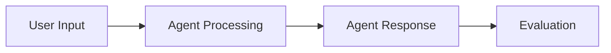
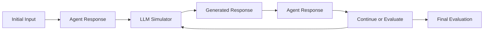

# Dynamic Prompting in ElizaOS Scenarios - Implementation Guide

This guide explains how to implement and use **Dynamic Prompting** (multi-turn conversations) in ElizaOS scenarios, enabling sophisticated testing of agent behavior through extended conversations where an LLM simulates realistic user responses.

## Table of Contents

1. [Overview](#overview)
2. [Current Architecture](#current-architecture)
3. [Dynamic Prompting Implementation](#dynamic-prompting-implementation)
4. [Schema Extensions](#schema-extensions)
5. [Configuration Examples](#configuration-examples)
6. [Evaluation Strategies](#evaluation-strategies)
7. [Implementation Patterns](#implementation-patterns)
8. [Advanced Use Cases](#advanced-use-cases)
9. [Best Practices](#best-practices)

## Overview

**Dynamic Prompting** extends ElizaOS scenarios from single-turn interactions to multi-turn conversations where:

1. **Agent** receives initial user input
2. **Agent** responds with thoughts, actions, and replies
3. **LLM Simulator** generates realistic user follow-up based on agent response
4. **Agent** continues the conversation based on simulated user input
5. Process repeats for specified number of turns or until conditions are met

This enables testing complex interaction patterns like:
- Clarification and follow-up questions
- Multi-step problem solving
- Context retention across turns
- Error recovery and correction flows
- Natural conversation flow assessment

## Current Architecture

### Existing Single-Turn Flow



### Proposed Multi-Turn Flow



## Dynamic Prompting Implementation

### Core Components

#### 1. **ConversationStep** Extension

```typescript
interface ConversationStep extends RunStep {
  // Existing fields
  name?: string;
  input?: string;
  evaluations: Evaluation[];
  
  // New dynamic prompting fields
  conversation?: {
    max_turns: number;
    user_simulator?: {
      model_type?: string;
      temperature?: number;
      persona?: string;
      objective?: string;
      style?: string;
      constraints?: string[];
    };
    termination_conditions?: TerminationCondition[];
    turn_evaluations?: Evaluation[];
    final_evaluations?: Evaluation[];
  };
}
```

#### 2. **UserSimulator** Component

```typescript
interface UserSimulator {
  generateResponse(
    conversationHistory: ConversationTurn[],
    agentResponse: string,
    context: SimulationContext
  ): Promise<string>;
}

interface SimulationContext {
  persona: string;
  objective: string;
  turn: number;
  maxTurns: number;
  style?: string;
  constraints?: string[];
}
```

#### 3. **ConversationManager** Class

```typescript
class ConversationManager {
  async executeConversation(
    step: ConversationStep,
    provider: EnvironmentProvider
  ): Promise<ConversationResult>;
  
  private async executeTurn(
    input: string,
    turnNumber: number,
    context: ConversationContext
  ): Promise<ConversationTurn>;
  
  private checkTerminationConditions(
    history: ConversationTurn[],
    conditions: TerminationCondition[]
  ): Promise<boolean>;
}
```

## Schema Extensions

### RunStep Schema Enhancement

```yaml
# Extended schema supporting both single-turn and multi-turn modes
run:
  - name: "Multi-turn customer support scenario"
    input: "I'm having trouble with my account login"
    
    # NEW: Conversation configuration
    conversation:
      max_turns: 5
      user_simulator:
        model_type: "TEXT_LARGE"
        temperature: 0.7
        persona: "frustrated customer"
        objective: "resolve login issue but be initially vague about details"
        style: "casual, somewhat impatient"
        constraints:
          - "Don't reveal technical details immediately"
          - "Ask clarifying questions when confused"
          - "Show appreciation when helped"
      
      # Conditions to end conversation early
      termination_conditions:
        - type: "agent_provides_solution"
          description: "Agent gives working solution"
        - type: "user_expresses_satisfaction"
          description: "User indicates problem is resolved"
        - type: "conversation_stuck"
          description: "No progress for 2 consecutive turns"
      
      # Evaluate each turn individually
      turn_evaluations:
        - type: "llm_judge"
          prompt: "Did the agent ask appropriate follow-up questions?"
          expected: "yes"
        - type: "trajectory_contains_action"
          action: "SEARCH_KNOWLEDGE_BASE"
      
      # Final evaluation after conversation ends
      final_evaluations:
        - type: "llm_judge"
          prompt: "Was the customer's problem resolved satisfactorily?"
          expected: "yes"
          capabilities:
            - "Identified root cause of login issue"
            - "Provided clear solution steps"
            - "Maintained helpful tone throughout"
        - type: "conversation_length"
          min_turns: 2
          max_turns: 5
          optimal_turns: 3

    # Traditional single evaluations still supported
    evaluations:
      - type: "string_contains"
        value: "login"
```

### New Evaluation Types

#### Conversation Length Evaluator

```yaml
- type: "conversation_length"
  min_turns: 2          # Minimum acceptable turns
  max_turns: 10         # Maximum before considering inefficient
  optimal_turns: 4      # Target number of turns
```

#### Conversation Flow Evaluator

```yaml
- type: "conversation_flow"
  required_patterns:
    - "question_then_answer"     # Agent asks question, user answers
    - "problem_then_solution"    # User states problem, agent provides solution
    - "clarification_cycle"      # Multiple clarification exchanges
  flow_quality_threshold: 0.8   # Minimum quality score
```

#### User Satisfaction Evaluator

```yaml
- type: "user_satisfaction"
  indicators:
    positive: ["thank you", "that works", "perfect", "great"]
    negative: ["frustrated", "doesn't work", "confused", "unhelpful"]
  satisfaction_threshold: 0.7
```

#### Context Retention Evaluator

```yaml
- type: "context_retention"
  test_memory_of:
    - "user_name"
    - "problem_description"
    - "attempted_solutions"
  retention_turns: 3    # How many turns back to check
```

## Configuration Examples

### Basic Multi-Turn Conversation

```yaml
name: "Basic Multi-Turn Support Test"
description: "Tests agent's ability to handle basic customer support conversation"

plugins:
  - "@elizaos/plugin-bootstrap"
  - "@elizaos/plugin-openai"

environment:
  type: local

run:
  - name: "Customer support conversation"
    input: "Hi, I need help with something"
    
    conversation:
      max_turns: 4
      user_simulator:
        persona: "polite customer with a billing question"
        objective: "find out why charged twice this month"
        temperature: 0.6
      
      final_evaluations:
        - type: "llm_judge"
          prompt: "Did the agent successfully help resolve the billing issue?"
          expected: "yes"

judgment:
  strategy: all_pass
```

### Advanced Persona-Driven Conversation

```yaml
name: "Complex Customer Persona Test"
description: "Tests agent handling of difficult customer personas"

run:
  - name: "Frustrated customer scenario"
    input: "This is ridiculous! Your product doesn't work!"
    
    conversation:
      max_turns: 6
      user_simulator:
        model_type: "TEXT_REASONING_LARGE"
        temperature: 0.8
        persona: "angry customer who had bad experience"
        objective: "vent frustration but eventually want help"
        style: "initially hostile, gradually becomes cooperative if handled well"
        constraints:
          - "Start with complaints and criticism"
          - "Don't accept first solution immediately"
          - "Become more cooperative if agent shows empathy"
          - "Provide specific details when asked properly"
      
      termination_conditions:
        - type: "user_expresses_satisfaction"
        - type: "agent_escalates_to_human"
        - type: "conversation_becomes_unproductive"
      
      turn_evaluations:
        - type: "llm_judge"
          prompt: "Did the agent respond appropriately to customer's emotional state?"
          expected: "yes"
        - type: "llm_judge"
          prompt: "Did the agent avoid being defensive or argumentative?"
          expected: "yes"
      
      final_evaluations:
        - type: "llm_judge"
          prompt: "Was the customer's frustration appropriately addressed?"
          expected: "yes"
          capabilities:
            - "Acknowledged customer's frustration with empathy"
            - "Asked clarifying questions to understand the issue"
            - "Provided actionable solutions"
            - "Maintained professional tone despite hostility"
            - "De-escalated the emotional tension"
        - type: "conversation_flow"
          required_patterns:
            - "empathy_then_solution"
            - "clarification_cycle"
        - type: "user_satisfaction"
          satisfaction_threshold: 0.6  # Lower threshold for difficult customer

judgment:
  strategy: all_pass
```

### Technical Troubleshooting Conversation

```yaml
name: "Technical Support Multi-Turn"
description: "Tests agent's technical troubleshooting through guided conversation"

run:
  - name: "WiFi troubleshooting"
    input: "My internet is not working"
    
    conversation:
      max_turns: 8
      user_simulator:
        persona: "non-technical user with home WiFi issues"
        objective: "get internet working again"
        style: "confused by technical terms, needs simple explanations"
        constraints:
          - "Only provide information when asked specific questions"
          - "Express confusion with technical jargon"
          - "Follow instructions but may misunderstand complex steps"
          - "Describe results in simple, non-technical language"
      
      termination_conditions:
        - type: "problem_resolved"
          keywords: ["working", "connected", "fixed"]
        - type: "escalation_needed"
          keywords: ["too complicated", "need technician"]
      
      turn_evaluations:
        - type: "trajectory_contains_action"
          action: "ASK_DIAGNOSTIC_QUESTION"
        - type: "llm_judge"
          prompt: "Did the agent use appropriate technical language level?"
          expected: "yes"
      
      final_evaluations:
        - type: "llm_judge"
          prompt: "Did the agent successfully diagnose and resolve the WiFi issue?"
          expected: "yes"
          capabilities:
            - "Asked systematic diagnostic questions"
            - "Provided step-by-step instructions"
            - "Used appropriate technical language level"
            - "Verified each step was completed"
            - "Identified root cause of the problem"
        - type: "context_retention"
          test_memory_of:
            - "device_type"
            - "error_symptoms"
            - "attempted_fixes"
          retention_turns: 5

judgment:
  strategy: all_pass
```

## Evaluation Strategies

### Multi-Level Evaluation Approach

Dynamic prompting scenarios should use a **three-tier evaluation strategy**:

#### 1. **Turn-Level Evaluations**
Run after each conversation turn to catch issues early:

```yaml
turn_evaluations:
  - type: "response_appropriateness"
    prompt: "Is the agent's response appropriate for this turn?"
  - type: "trajectory_contains_action"
    action: "REQUIRED_ACTION_FOR_THIS_TURN"
  - type: "response_length"
    min_words: 10
    max_words: 100
```

#### 2. **Flow-Level Evaluations**
Assess conversation patterns and dynamics:

```yaml
flow_evaluations:
  - type: "conversation_flow"
    required_patterns: ["problem_identification", "solution_proposal"]
  - type: "context_retention"
    test_memory_of: ["user_goal", "key_details"]
  - type: "conversation_coherence"
    coherence_threshold: 0.8
```

#### 3. **Outcome-Level Evaluations**
Final assessment of conversation success:

```yaml
final_evaluations:
  - type: "goal_achievement"
    user_objective: "resolve login issue"
  - type: "user_satisfaction"
    satisfaction_threshold: 0.7
  - type: "efficiency"
    optimal_turn_range: [3, 6]
```

### Advanced LLM Judge for Conversations

```yaml
- type: "llm_judge"
  prompt: |
    Evaluate this complete conversation between an AI agent and a user.
    Consider the following aspects:
    1. Did the agent understand the user's initial problem?
    2. Did the agent ask appropriate follow-up questions?
    3. Were the solutions provided practical and correct?
    4. Did the agent maintain a helpful tone throughout?
    5. Was the conversation resolved satisfactorily?
  expected: "yes"
  json_schema:
    type: "object"
    properties:
      understanding: 
        type: "number"
        minimum: 0
        maximum: 1
        description: "How well did agent understand the problem (0-1)"
      questioning:
        type: "number" 
        minimum: 0
        maximum: 1
        description: "Quality of follow-up questions (0-1)"
      solution_quality:
        type: "number"
        minimum: 0
        maximum: 1
        description: "Practicality and correctness of solutions (0-1)"
      tone_consistency:
        type: "number"
        minimum: 0
        maximum: 1
        description: "Maintained helpful tone throughout (0-1)"
      resolution_success:
        type: "boolean"
        description: "Was the conversation resolved successfully"
      improvement_suggestions:
        type: "array"
        items:
          type: "string"
        description: "Specific suggestions for improvement"
      conversation_highlights:
        type: "array"
        items:
          type: "string"
        description: "Best moments in the conversation"
    required: ["understanding", "questioning", "solution_quality", "tone_consistency", "resolution_success"]
```

## Implementation Patterns

### Pattern 1: Service Desk Scenario

```yaml
name: "Service Desk Multi-Turn Pattern"
description: "Standard customer support conversation flow"

setup:
  mocks:
    - service: "knowledge_base"
      method: "search"
      when:
        input:
          query: "login issues"
      response:
        articles:
          - title: "Common Login Problems"
            solution: "Clear browser cache and cookies"
          - title: "Password Reset Guide"
            solution: "Use forgot password link"

run:
  - input: "I can't log into my account"
    conversation:
      max_turns: 5
      user_simulator:
        persona: "business user who needs to access account for work"
        objective: "regain access to account quickly"
        constraints:
          - "Provide details when asked"
          - "Express urgency about work deadline"
          - "Follow technical instructions carefully"
      
      final_evaluations:
        - type: "problem_resolution"
          success_indicators: ["logged in", "access restored", "working now"]
```

### Pattern 2: Onboarding Assistant

```yaml
name: "New User Onboarding Pattern"
description: "Guide new user through product setup"

run:
  - input: "I just signed up, what should I do first?"
    conversation:
      max_turns: 8
      user_simulator:
        persona: "new user, eager to learn but overwhelmed by options"
        objective: "successfully complete initial setup"
        style: "asks many questions, wants reassurance"
        constraints:
          - "Express excitement but also uncertainty"
          - "Ask for clarification when steps seem complex"
          - "Confirm understanding before proceeding"
      
      turn_evaluations:
        - type: "guidance_clarity"
          prompt: "Did the agent provide clear next steps?"
        - type: "encouragement_level"
          prompt: "Did the agent provide appropriate encouragement?"
      
      final_evaluations:
        - type: "onboarding_completion"
          required_steps: ["profile_setup", "first_task", "tutorial_completion"]
```

### Pattern 3: Escalation Handling

```yaml
name: "Escalation Decision Pattern"
description: "Test agent's ability to recognize when to escalate"

run:
  - input: "I've been trying to fix this for hours and nothing works!"
    conversation:
      max_turns: 6
      user_simulator:
        persona: "frustrated user who has tried basic solutions"
        objective: "get advanced help or escalation"
        constraints:
          - "Mention previous attempts at solutions"
          - "Express increasing frustration if basic solutions offered"
          - "Accept escalation if offered"
      
      termination_conditions:
        - type: "agent_escalates"
          keywords: ["specialist", "escalate", "supervisor", "advanced support"]
        - type: "advanced_solution_provided"
          description: "Agent provides non-standard solution"
      
      final_evaluations:
        - type: "escalation_decision"
          prompt: "Did the agent appropriately escalate or provide advanced solution?"
          expected: "yes"
```

## Advanced Use Cases

### Multi-Agent Conversations

```yaml
name: "Multi-Agent Collaboration"
description: "Test agent collaboration in complex scenarios"

run:
  - name: "Sales and Support Handoff"
    input: "I want to upgrade my plan but I'm having billing issues"
    
    conversation:
      max_turns: 10
      agents:
        - role: "sales"
          priority: 0.6
          expertise: ["pricing", "upgrades", "plans"]
        - role: "support"
          priority: 0.4
          expertise: ["billing", "account_issues", "technical_problems"]
      
      user_simulator:
        persona: "existing customer with mixed sales and support needs"
        objective: "upgrade plan after resolving billing issue"
      
      final_evaluations:
        - type: "agent_collaboration"
          prompt: "Did agents coordinate effectively?"
        - type: "handoff_quality"
          required_elements: ["context_transfer", "seamless_transition"]
```

### Emotional Intelligence Testing

```yaml
name: "Emotional Intelligence Assessment"
description: "Test agent's ability to handle emotional conversations"

run:
  - input: "I'm really stressed about this deadline and your software crashed"
    
    conversation:
      max_turns: 5
      user_simulator:
        persona: "highly stressed professional facing work deadline"
        emotional_state: "anxiety, frustration, urgency"
        objectives:
          - primary: "get software working immediately"
          - secondary: "feel heard and supported"
        
        emotional_progression:
          - turn: 1
            state: "high stress, frustrated"
          - turn: 2-3
            state: "cautiously hopeful if agent shows empathy"
          - turn: 4-5
            state: "grateful if problem resolved, still stressed about deadline"
      
      final_evaluations:
        - type: "emotional_intelligence"
          criteria:
            - "acknowledged user's emotional state"
            - "showed appropriate empathy"
            - "prioritized urgent problem solving"
            - "avoided dismissive language"
        - type: "stress_level_change"
          expected_direction: "decrease"
          measurement_method: "sentiment_analysis"
```

### Knowledge Transfer Testing

```yaml
name: "Complex Knowledge Transfer"
description: "Test agent's ability to teach complex concepts"

run:
  - input: "Can you explain how machine learning works? I'm not very technical"
    
    conversation:
      max_turns: 12
      user_simulator:
        persona: "curious non-technical professional"
        learning_style: "needs analogies and concrete examples"
        knowledge_level: "beginner"
        constraints:
          - "Ask clarifying questions when confused"
          - "Request simpler explanations for complex terms"
          - "Give feedback on understanding level"
          - "Ask for practical applications"
      
      turn_evaluations:
        - type: "explanation_clarity"
          prompt: "Was the explanation appropriate for a beginner?"
        - type: "analogy_usage"
          prompt: "Did the agent use helpful analogies or examples?"
      
      final_evaluations:
        - type: "knowledge_transfer_success"
          assessment_method: "comprehension_questions"
          passing_score: 0.7
        - type: "teaching_quality"
          capabilities:
            - "Adapted language to user's level"
            - "Used concrete examples and analogies"
            - "Checked understanding regularly"
            - "Built concepts progressively"
            - "Encouraged questions"
```

## Best Practices

### 1. Conversation Design Principles

#### **Start Simple**
```yaml
# Begin with basic 2-3 turn conversations
conversation:
  max_turns: 3
  user_simulator:
    persona: "straightforward user"
    objective: "simple, clear goal"
```

#### **Gradual Complexity**
```yaml
# Build up to complex multi-persona scenarios
conversation:
  max_turns: 8
  user_simulator:
    persona: "complex user with changing needs"
    emotional_progression: [...]
    objective_evolution: [...]
```

### 2. User Simulator Best Practices

#### **Persona Consistency**
```yaml
user_simulator:
  persona: "experienced developer who values efficiency"
  style: "direct, technical, impatient with basic explanations"
  constraints:
    - "Use technical terminology correctly"
    - "Skip basic explanations"
    - "Ask detailed implementation questions"
```

#### **Realistic Objectives**
```yaml
user_simulator:
  # Good: Specific, measurable objective
  objective: "configure SSL certificate for production deployment"
  
  # Avoid: Vague objective
  # objective: "get help with website"
```

#### **Dynamic Behavior**
```yaml
user_simulator:
  behavior_changes:
    - condition: "agent_shows_expertise"
      change: "become more trusting, ask advanced questions"
    - condition: "agent_provides_wrong_info"
      change: "become skeptical, ask for clarification"
```

### 3. Evaluation Strategy Guidelines

#### **Multi-Tier Assessment**
```yaml
# Immediate feedback
turn_evaluations:
  - type: "response_appropriateness"
    
# Pattern recognition  
flow_evaluations:
  - type: "conversation_flow"
    
# Overall success
final_evaluations:
  - type: "goal_achievement"
```

#### **Balanced Expectations**
```yaml
final_evaluations:
  - type: "user_satisfaction"
    # Realistic threshold based on conversation difficulty
    satisfaction_threshold: 0.7  # Not 0.9+ for difficult scenarios
  - type: "efficiency"
    # Allow reasonable conversation length
    optimal_turn_range: [3, 8]  # Not too restrictive
```

### 4. Performance Considerations

#### **Resource Management**
```yaml
conversation:
  max_turns: 6  # Reasonable limit to prevent infinite loops
  timeout_per_turn: 30000  # 30 second timeout per turn
  total_timeout: 300000    # 5 minute total conversation timeout
```

#### **LLM Usage Optimization**
```yaml
user_simulator:
  model_type: "TEXT_LARGE"  # Use appropriate model size
  temperature: 0.7          # Balance creativity and consistency
  max_tokens: 150           # Limit response length
```

### 5. Matrix Testing with Dynamic Prompting

```yaml
name: "Dynamic Prompting Matrix"
base_scenario: "customer-support-conversation.scenario.yaml"
runs_per_combination: 2

matrix:
  # Test different user personas
  - parameter: "run[0].conversation.user_simulator.persona"
    values:
      - "frustrated customer"
      - "confused beginner"
      - "experienced power user"
      - "non-native English speaker"
  
  # Test different conversation lengths
  - parameter: "run[0].conversation.max_turns"
    values: [3, 5, 8]
  
  # Test different termination conditions
  - parameter: "run[0].conversation.termination_conditions[0].type"
    values:
      - "problem_resolved"
      - "user_expresses_satisfaction"
      - "escalation_needed"
```

### 6. Debugging and Troubleshooting

#### **Conversation Logging**
```yaml
conversation:
  debug_options:
    log_user_simulation: true
    log_turn_decisions: true
    log_termination_checks: true
    export_full_transcript: true
```

#### **Turn-by-Turn Analysis**
```yaml
turn_evaluations:
  # Debug evaluation to understand conversation flow
  - type: "turn_analysis"
    analysis_points:
      - "user_intent_detection"
      - "agent_response_relevance"
      - "conversation_progress"
      - "emotional_tone_tracking"
```

## Migration from Single-Turn Scenarios

### Step 1: Identify Conversion Candidates

Good candidates for dynamic prompting:
- Customer support scenarios
- Onboarding flows
- Complex problem-solving tasks
- Error recovery testing
- Educational/tutoring interactions

### Step 2: Gradual Enhancement

```yaml
# Original single-turn scenario
run:
  - input: "I need help with login"
    evaluations:
      - type: "string_contains"
        value: "password"

# Enhanced with minimal dynamic prompting
run:
  - input: "I need help with login"
    conversation:
      max_turns: 3  # Start small
      user_simulator:
        persona: "basic user"
        objective: "resolve login issue"
    evaluations:
      - type: "string_contains"
        value: "password"
      # Keep existing evaluations for backward compatibility
```

### Step 3: Full Dynamic Enhancement

```yaml
run:
  - input: "I need help with login"
    conversation:
      max_turns: 5
      user_simulator:
        persona: "business user who forgot password but unsure of username"
        objective: "regain access to work account"
        constraints:
          - "Initially only remembers email address"
          - "Becomes helpful when asked specific questions"
      
      final_evaluations:
        - type: "llm_judge"
          prompt: "Did the agent successfully help resolve the login issue?"
          expected: "yes"
          capabilities:
            - "Identified the specific login problem"
            - "Guided user through appropriate recovery steps"
            - "Confirmed successful resolution"
```

---

This guide provides a comprehensive framework for implementing dynamic prompting in ElizaOS scenarios. The approach maintains backward compatibility while enabling sophisticated multi-turn conversation testing that can reveal nuanced agent behaviors impossible to detect with single-turn interactions.

For additional examples and implementation details, refer to the scenario examples in `packages/cli/src/commands/scenario/examples/` and the main scenario specification in `SCENARIO_REPORT_SPEC.md`.
