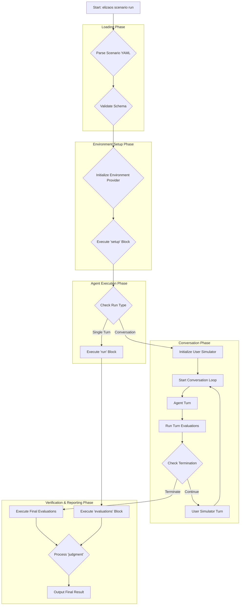

# ElizaOS Scenario Runner: Technical Specification

This document provides a detailed technical specification for the `elizaos scenario` command-line tool. It is intended for developers working on or extending the Scenario Runner's functionality.

For a high-level overview of the "why" behind this system, please see [`scenarios.md`](./scenarios.md).

---

## 1. CLI Command Architecture

The Scenario Runner is exposed through the main `elizaos` CLI application.

- **Command**: `elizaos scenario run [filePath]`
- **Arguments**:
  - `filePath`: The required path to the `.scenario.yaml` file to be executed.
- **Options**:
  - `--live`: (Boolean, default: `false`) When this flag is present, the runner will execute in "Live Mode," which ignores all `setup.mocks` and connects to real services.
  - `--env-file`: (String) Path to a custom `.env` file to load for the execution.

The command will be registered within the `packages/cli` using the `yargs` library, similar to other commands like `test` and `start`.

---

## 2. Execution Flow

The Scenario Runner follows a strict, sequential lifecycle to ensure repeatable and predictable test execution. For multi-turn conversation scenarios, the execution flow includes additional loops for turn-based evaluation and user simulation.



1.  **Parse YAML**: Read the file from disk and parse it using `js-yaml`.
2.  **Validate Schema**: The parsed object is validated against a set of TypeScript interfaces to ensure it is well-formed. Mismatches will cause an immediate exit with a clear error.
3.  **Initialize Environment Provider**: Based on the `environment.type` field (`e2b` or `local`), instantiate the corresponding provider. If `e2b` is specified, the runner will verify that the `@elizaos/plugin-e2b` is available.
4.  **Execute `setup` Block**: The runner sequentially processes the `setup` instructions:
    - **Mocks**: The Mocking Engine (see below) is configured.
    - **Virtual FS**: Files are written to the environment via the provider.
    - **Database Seeding**: The database adapter is called to execute seeding.
5.  **Execute `run` Block**: 
    - **Single-turn scenarios**: The `run.input` is sent to the agent and waits for completion.
    - **Conversation scenarios**: Initialize the user simulator and begin the conversation loop.
6.  **Conversation Loop** (for conversation scenarios):
    - **Agent Turn**: Send current input to the agent and receive response.
    - **Turn Evaluations**: Execute any `turn_evaluations` defined in the conversation block.
    - **Termination Check**: Evaluate termination conditions to determine if conversation should continue.
    - **User Simulator Turn**: Generate next user response based on persona, objective, and conversation history.
7.  **Execute Evaluations**: 
    - **Single-turn**: Execute items in the `evaluations` array.
    - **Conversation**: Execute `final_evaluations` from the conversation block, plus any traditional `evaluations`.
8.  **Process `judgment`**: The results of all evaluations are aggregated based on the `judgment.strategy`.
9.  **Output Result**: A summary of the run is printed to the console, including the final pass/fail status, conversation transcript (if applicable), and details on any failed evaluations. The process exits with code `0` for success and `1` for failure.

---

## 3. Environment Provider Interface

To abstract the execution context, the runner uses an `EnvironmentProvider` interface.

```typescript
// in packages/cli/src/scenarios/providers/types.ts

interface FileSystemOperation {
  type: 'write';
  path: string;
  content: string;
}

interface ExecutionResult {
  exitCode: number;
  stdout: string;
  stderr: string;
  files: Record<string, string>; // A map of file paths to their content after execution.
}

interface EnvironmentProvider {
  /**
   * Prepares the environment, including setting up the file system.
   */
  setup(fs: FileSystemOperation[]): Promise<void>;

  /**
   * Executes a command within the environment.
   */
  run(command: string): Promise<ExecutionResult>;

  /**
   * Cleans up any resources created during the run.
   */
  teardown(): Promise<void>;
}
```

- **`LocalEnvironmentProvider`**: Implements the interface using Node.js `child_process` for execution and `fs` for file operations on the host machine.
- **`E2BEnvironmentProvider`**: Implements the interface by calling the `@elizaos/plugin-e2b` service. It uses `e2bService.writeFileToSandbox()` and `e2bService.runCommand()` under the hood.

---

## 4. Mocking Engine Internals

The mocking engine's goal is to intercept calls to service methods without modifying the agent's source code. This will be achieved via monkey-patching the `AgentRuntime`.

The proposed mechanism is to add a method to the `AgentRuntime` itself:

```typescript
// in packages/core/src/runtime.ts
class AgentRuntime {
  // ... existing properties

  private mockRegistry: Map<string, Function> = new Map();

  public getService<T>(name: string): T {
    const serviceMethodKey = `${name}.${methodName}`; // e.g., "github-service.readFile"
    if (this.mockRegistry.has(serviceMethodKey)) {
      // Return a proxy that calls the mock function
    }
    // ... existing logic
  }

  public registerMock(serviceMethodKey: string, mockFunction: Function) {
    this.mockRegistry.set(serviceMethodKey, mockFunction);
  }
}
```

The Scenario Runner will call `runtime.registerMock()` for each item in the `setup.mocks` array before the `run` block is executed. This provides a clean, centralized way to inject test-specific behavior.

---

## 5. Conversation System

The Scenario Runner supports multi-turn conversation scenarios through a sophisticated conversation system that includes user simulation, turn-based evaluation, and intelligent termination conditions.

### 5.1 Conversation Configuration

```yaml
# Example conversation configuration in run block
run:
  - name: "Customer Support Conversation"
    input: "Hi, I need help with billing"
    
    conversation:
      max_turns: 6
      user_simulator:
        persona: "polite customer with a billing question"
        objective: "find out why charged twice this month"
        temperature: 0.6
        style: "friendly and patient"
        constraints:
          - "Be polite and cooperative"
          - "Provide details when asked"
      
      termination_conditions:
        - type: "user_expresses_satisfaction"
          keywords: ["thank you", "resolved", "perfect"]
        - type: "agent_provides_solution"
          keywords: ["follow these steps", "issue resolved"]
      
      turn_evaluations:
        - type: "llm_judge"
          prompt: "Did the agent respond helpfully?"
          expected: "yes"
      
      final_evaluations:
        - type: "llm_judge"
          prompt: "Was the issue successfully resolved?"
          expected: "yes"
          capabilities:
            - "Understood the customer's concern"
            - "Provided helpful solutions"
```

### 5.2 User Simulator

The user simulator generates realistic user responses based on:

- **Persona**: Character description for the simulated user
- **Objective**: What the user is trying to accomplish
- **Temperature**: Creativity level for response generation (0.0-1.0)
- **Style**: Communication style guidelines
- **Constraints**: Rules the simulated user must follow

### 5.3 Termination Conditions

Conversations can terminate based on:

- **Keyword-based**: Detecting specific phrases indicating completion
- **Turn limit**: Maximum number of conversation turns
- **LLM evaluation**: AI-based assessment of conversation completion
- **Custom logic**: Extensible system for custom termination rules

### 5.4 Turn-based Evaluation

- **Turn Evaluations**: Run after each agent response
- **Final Evaluations**: Run at conversation completion
- **Conversation-specific evaluators**: Length checks, satisfaction metrics

---

## 6. Evaluator Reference

Each evaluation is a class that implements a simple `Evaluator` interface.

```typescript
// in packages/cli/src/scenarios/evaluators/types.ts
interface EvaluationResult {
  success: boolean;
  message: string;
}

interface Evaluator {
  type: string;
  evaluate(params: any, result: ExecutionResult): Promise<EvaluationResult>;
}
```

**Core Evaluators:**

| Type                         | Description                                                                            | Parameters                 |
| ---------------------------- | -------------------------------------------------------------------------------------- | -------------------------- |
| `string_contains`            | Checks if the agent's final response contains a given substring.                       | `value`, `case_sensitive`  |
| `regex_match`                | Checks if the agent's final response matches a regular expression.                     | `pattern`                  |
| `file_exists`                | Checks if a file exists in the execution environment at a given path.                  | `path`                     |
| `file_contains`              | Checks if a file's content contains a given substring.                                 | `path`, `value`            |
| `command_exit_code_is`       | Checks the exit code of a command run inside the environment.                          | `command`, `expected_code` |
| `trajectory_contains_action` | Checks the agent's internal event log to see if a specific action was executed.        | `action`                   |
| `llm_judge`                  | Asks an LLM to judge the agent's response based on a given prompt and expected answer. | `prompt`, `expected`, `capabilities` |

**Conversation-Specific Evaluators:**

| Type                         | Description                                                                            | Parameters                 |
| ---------------------------- | -------------------------------------------------------------------------------------- | -------------------------- |
| `conversation_length`        | Validates the conversation length against expected bounds.                             | `min_turns`, `max_turns`, `optimal_turns` |
| `user_satisfaction`          | Evaluates user satisfaction based on conversation analysis.                           | `satisfaction_threshold`   |
| `turn_quality`               | Assesses the quality of individual conversation turns.                                | `quality_threshold`        |
| `objective_completion`       | Checks if the user simulator's objective was achieved.                                | `completion_threshold`     |
