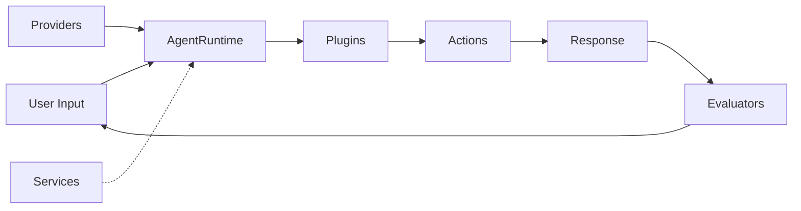

## Building Blocks

<CardGroup cols={3}>
  <Card title="Agents" icon="robot" href="/core-concepts/agents">
    AI personalities with memory
  </Card>
  <Card title="Plugins" icon="puzzle" href="/core-concepts/plugins">
    Extend capabilities
  </Card>
  <Card title="Projects" icon="folder-tree" href="/core-concepts/projects">
    Deploy applications
  </Card>
</CardGroup>

## Architecture Overview



## Complete Example

```typescript
import { Character } from '@elizaos/core';

export const character: Character = {
  name: "Assistant",
  bio: "A helpful AI agent",
  plugins: [
    "@elizaos/plugin-bootstrap",     // Core functionality
    "@elizaos/plugin-discord",       // Discord integration
    "plugin-web-search"              // Web search capability
  ]
};
```

## Plugin Components

| Component | Purpose | Example |
|-----------|---------|--------|
| **Actions** | Tasks to perform | Send message, fetch data |
| **Providers** | Supply context | Time, user info, knowledge |
| **Evaluators** | Process responses | Extract facts, filter content |
| **Services** | Background tasks | Scheduled posts, monitoring |

## Getting Started

<Steps>
  <Step title="Define an Agent">
    Create your character configuration
  </Step>
  
  <Step title="Add Plugins">
    Enable capabilities you need
  </Step>
  
  <Step title="Deploy">
    Run locally or in production
  </Step>
</Steps>

## Learn More

- **New to elizaOS?** Start with [Agents](/core-concepts/agents)
- **Building features?** Explore [Plugins](/core-concepts/plugins)
- **Ready to deploy?** Check [Projects](/core-concepts/projects)
- **Want details?** Dive into [Architecture](/deep-dive/architecture)