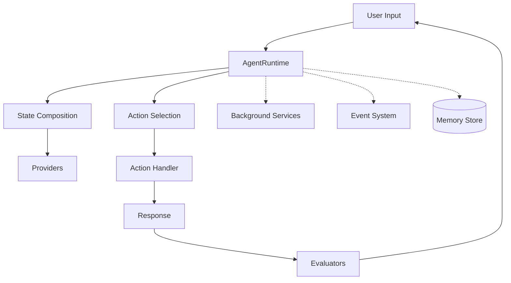

## System Architecture

elizaOS follows a modular, plugin-based architecture:



## Core Components

### AgentRuntime

The central orchestrator that:
- Manages agent lifecycle
- Processes messages
- Coordinates plugins
- Handles state composition
- Manages services

### Plugin System

Plugins extend functionality through:
- **Actions** - Discrete tasks
- **Providers** - Context data
- **Evaluators** - Response processing
- **Services** - Background processes
- **Routes** - HTTP endpoints
- **Events** - Event handlers

### Memory System

Hierarchical memory storage:
- **Messages** - Conversation history
- **Facts** - Extracted information
- **Documents** - Knowledge base
- **Relationships** - Entity connections

### State Management

State flows through the system:
1. Providers contribute context
2. Runtime composes state
3. Actions use state for decisions
4. Evaluators process results

## Plugin Loading

```typescript
// Plugin priority determines load order
const pluginLoadOrder = [
  databases,      // Priority: -100
  modelProviders, // Priority: -50
  corePlugins,    // Priority: 0
  features,       // Priority: 50
  platforms       // Priority: 100
];
```

## Service Lifecycle

```typescript
class Service {
  async start(runtime: IAgentRuntime) {
    // Initialize service
  }
  
  async stop() {
    // Cleanup
  }
}
```

## Event Flow

Events propagate through the system:
1. Runtime emits event
2. Plugins handle event
3. Services react to events
4. State updates

## Database Abstraction

```typescript
interface IDatabaseAdapter {
  // Memory operations
  createMemory(memory: Memory): Promise<void>
  searchMemories(query: string): Promise<Memory[]>
  
  // Entity management
  createEntity(entity: Entity): Promise<void>
  updateEntity(entity: Entity): Promise<void>
  
  // Relationships
  createRelationship(rel: Relationship): Promise<void>
}
```

## Next Steps

<CardGroup cols={1}>
  <Card title="Runtime Deep Dive" icon="brain" href="/deep-dive/runtime">
    Explore the AgentRuntime
  </Card>
</CardGroup>