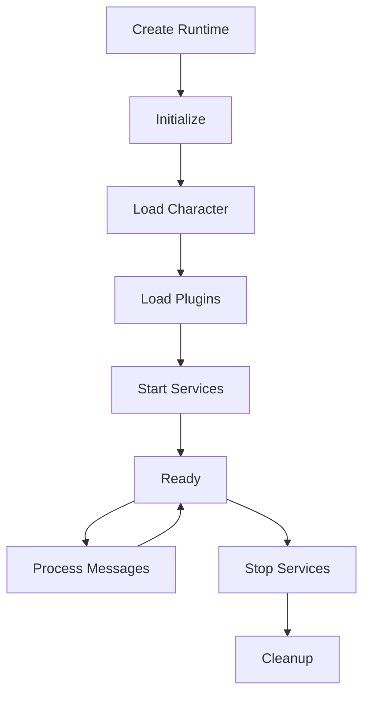

## What is AgentRuntime?

The AgentRuntime is the central orchestrator that manages agent lifecycle, processes messages, and coordinates all system components.

## Key Responsibilities

### 1. Action Processing

```typescript
async processActions(message: Memory, responses: Memory[], state?: State): Promise<void> {
  // Select and execute actions based on context
  const actions = await this.selectActions(message, state);
  
  for (const action of actions) {
    await action.handler(this, message, state);
  }
  
  // Run evaluators on results
  await this.evaluate(message, state);
}
```

### 2. State Composition

The runtime builds context by aggregating data from all providers:

```typescript
async composeState(message: Memory): Promise<State> {
  const state = {};
  
  for (const provider of this.providers) {
    const data = await provider.get(this, message, state);
    Object.assign(state, data);
  }
  
  return state;
}
```

### 3. Plugin Management

```typescript
async registerPlugin(plugin: Plugin) {
  // Register components
  plugin.actions?.forEach(a => this.registerAction(a));
  plugin.providers?.forEach(p => this.registerProvider(p));
  plugin.evaluators?.forEach(e => this.registerEvaluator(e));
  plugin.services?.forEach(s => this.registerService(s));
  
  // Initialize plugin
  await plugin.init?.(this.config, this);
}
```

## Runtime Interface

```typescript
interface IAgentRuntime extends IDatabaseAdapter {
  // Core properties
  agentId: UUID;
  character: Character;
  providers: Provider[];
  actions: Action[];
  evaluators: Evaluator[];
  services: Service[];
  
  // Action processing
  processActions(message: Memory, responses: Memory[], state?: State): Promise<void>;
  composeState(message: Memory, state?: State): Promise<State>;
  evaluate(message: Memory, state?: State): Promise<void>;
  
  // Component registration
  registerAction(action: Action): void;
  registerProvider(provider: Provider): void;
  registerEvaluator(evaluator: Evaluator): void;
  registerService(service: Service): void;
  
  // Service management
  getService<T>(name: ServiceType): T;
  stop(): Promise<void>;
  
  // Model management
  useModel<T extends ModelTypeName>(modelType: T, params: ModelParamsMap[T], provider?: string): Promise<ModelResultMap[T]>;
  registerModel(modelType: ModelTypeName, handler: ModelHandler, provider?: string, priority?: number): void;
  getModel(modelType: ModelTypeName, provider?: string): ModelHandler | undefined;
  
  // Event system
  emit(eventType: EventType, data: any): Promise<void>;
  on(eventType: EventType, handler: EventHandler): void;
}
```

## Lifecycle



## Model Management

The runtime manages AI model selection through a priority system:

```typescript
// Plugins register model handlers
runtime.registerModel(
  ModelType.TEXT_LARGE,
  async (runtime, params) => {
    // Call OpenAI API, Anthropic, etc.
    return generatedText;
  },
  'openai',  // provider name
  100        // priority
);

// Use models with type safety
const result = await runtime.useModel(
  ModelType.TEXT_LARGE,
  {
    prompt: "Generate a response",
    temperature: 0.7
  }
);

// Get embeddings
const embedding = await runtime.useModel(
  ModelType.TEXT_EMBEDDING,
  { input: "Text to embed" }
);
```

## Memory Management

```typescript
// Store memories
await runtime.databaseAdapter.createMemory({
  type: MemoryType.MESSAGE,
  content: { text: "User message" },
  roomId: message.roomId
});

// Search memories
const memories = await runtime.databaseAdapter.searchMemories({
  query: "previous conversation",
  limit: 10
});
```

## Best Practices

- Initialize plugins in dependency order
- Start services after all plugins loaded
- Clean up resources on shutdown
- Handle errors gracefully
- Use appropriate model sizes

## Next Steps

<CardGroup cols={1}>
  <Card title="Services" icon="server" href="/deep-dive/services">
    Learn about background services
  </Card>
</CardGroup>