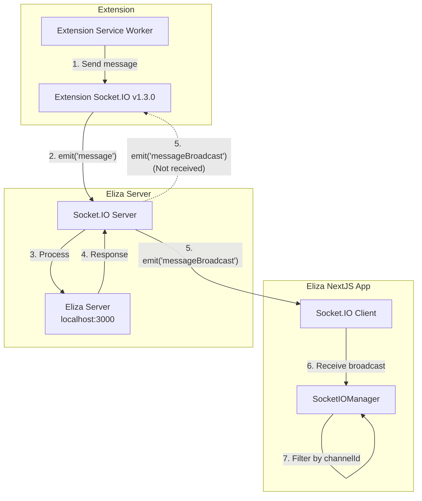

## Overview

This guide explains how Socket.IO works in the Eliza NextJS starter and provides solutions for integrating external clients (like browser extensions) with the Eliza server.

## Reference Implementation

<Card title="Eliza NextJS Starter" icon="github" href="https://github.com/elizaOS/eliza-nextjs-starter">
  A complete working example demonstrating Socket.IO integration with Eliza, including real-time messaging, agent participation management, and comprehensive error handling.
</Card>

## Architecture

### How WebSockets Work in This Project

The project uses **Socket.IO** (not raw WebSockets) for real-time communication between clients and the Eliza server.



### Key Components

1. **Direct Connection**: Socket.IO connects directly to the Eliza server (default: `http://localhost:3000`)
2. **Channel-Based Communication**: Messages are organized by channels (or rooms for backward compatibility)
3. **Message Filtering**: Clients filter incoming broadcasts by channel/room ID

## Socket.IO Events and Message Types

### Message Types Enum
```javascript
enum SOCKET_MESSAGE_TYPE {
  ROOM_JOINING = 1,      // Join a channel/room
  SEND_MESSAGE = 2,      // Send a message
  MESSAGE = 3,           // Generic message
  ACK = 4,              // Acknowledgment
  THINKING = 5,         // Agent is thinking
  CONTROL = 6           // Control messages
}
```

### Key Events
- `messageBroadcast` - Incoming messages from agents/users
- `messageComplete` - Message processing complete
- `controlMessage` - UI control (enable/disable input)
- `connection_established` - Connection confirmed

## Common Issue: Extension Not Receiving Responses

### The Problem
Your extension can send messages to Eliza (server receives them), but doesn't receive responses back.

### Root Causes
1. **Not listening for the correct event** - Must listen for `messageBroadcast`, not `message`
2. **Not joining the room/channel** - Must emit a `ROOM_JOINING` message first
3. **Room/Channel ID mismatch** - IDs must match exactly
4. **Incorrect message payload structure**

## Solution: Minimal Socket.IO Client

Here's a minimal Socket.IO client implementation for your extension:

```javascript
// Socket.IO v1.3.0 is VERY old (2015). If possible, upgrade to v4.x
// But here's code that should work with both old and new versions:

const SOCKET_URL = 'http://localhost:3000';

// 1. Connect to Socket.IO
const socket = io(SOCKET_URL, {
  // For v1.3.0 compatibility
  'force new connection': true,
  'reconnection': true,
  'reconnectionDelay': 1000,
  'reconnectionAttempts': 5,
  'timeout': 20000,
  'transports': ['polling', 'websocket']
});

// Your IDs (make sure these match exactly)
const entityId = 'your-extension-entity-id';
const roomId = 'your-room-id'; // This should match the agent/channel ID

// 2. CRITICAL: Join the room when connected
socket.on('connect', function() {
  console.log('[SUCCESS] Connected to Eliza, socket ID:', socket.id);
  
  // JOIN THE ROOM - This is required to receive broadcasts!
  socket.emit('message', {
    type: 1, // ROOM_JOINING
    payload: {
      roomId: roomId,
      entityId: entityId
    }
  });
  
  console.log('[SENT] Room join request for room:', roomId);
});

// 3. LISTEN FOR THE CORRECT EVENT: "messageBroadcast" (not "message")
socket.on('messageBroadcast', function(data) {
  console.log('[RECEIVED] Broadcast:', data);
  
  // Check if this message is for your room
  if (data.roomId === roomId || data.channelId === roomId) {
    console.log('[SUCCESS] Message is for our room!');
    console.log('Sender:', data.senderName);
    console.log('Text:', data.text);
    console.log('Full data:', JSON.stringify(data, null, 2));
  } else {
    console.log('[ERROR] Message is for different room:', data.roomId || data.channelId);
  }
});

// 4. Listen for other important events
socket.on('messageComplete', function(data) {
  console.log('[SUCCESS] Message processing complete:', data);
});

socket.on('connection_established', function(data) {
  console.log('[SUCCESS] Connection established:', data);
});

// 5. Send a message (make sure format is exact)
function sendMessageToEliza(text) {
  const messagePayload = {
    type: 2, // SEND_MESSAGE
    payload: {
      senderId: entityId,
      senderName: 'Extension User',
      message: text,
      roomId: roomId,        // Include roomId
      messageId: generateUUID(),
      source: 'extension',
      attachments: [],
      metadata: {}
    }
  };
  
  console.log('[SENDING] Message:', messagePayload);
  socket.emit('message', messagePayload);
}

// Helper function for UUID
function generateUUID() {
  return 'xxxxxxxx-xxxx-4xxx-yxxx-xxxxxxxxxxxx'.replace(/[xy]/g, function(c) {
    const r = Math.random() * 16 | 0;
    const v = c === 'x' ? r : (r & 0x3 | 0x8);
    return v.toString(16);
  });
}

// 6. Debug: Log ALL events (remove in production)
const originalEmit = socket.emit;
socket.emit = function() {
  console.log('[EMIT] Event:', arguments[0], arguments[1]);
  return originalEmit.apply(socket, arguments);
};

// For Socket.IO v1.3.0, use this to catch all events:
const onevent = socket.onevent;
socket.onevent = function(packet) {
  console.log('[RECEIVE] Event:', packet.data);
  onevent.call(socket, packet);
};

// Connection error handling
socket.on('connect_error', function(error) {
  console.error('[ERROR] Connection error:', error);
});

socket.on('disconnect', function(reason) {
  console.log('[DISCONNECTED] Reason:', reason);
});

// Test the connection
socket.on('connect', function() {
  // Send a test message after 2 seconds
  setTimeout(function() {
    sendMessageToEliza('Hello from extension!');
  }, 2000);
});
```

## Key Points to Check

### 1. Event Name
```javascript
// [WRONG]
socket.on('message', handler)

// [CORRECT]
socket.on('messageBroadcast', handler)
```

### 2. Room Joining Required
```javascript
// You MUST join the room before receiving broadcasts
socket.emit('message', {
  type: 1, // ROOM_JOINING
  payload: {
    roomId: roomId,
    entityId: entityId
  }
});
```

### 3. Exact Message Format
```javascript
// The structure must be exact
{
  type: 2, // SEND_MESSAGE type
  payload: {
    senderId: entityId,
    senderName: 'Extension User',
    message: text,
    roomId: roomId,
    messageId: generateUUID(),
    source: 'extension',
    attachments: [],
    metadata: {}
  }
}
```

## Modern Implementation (Socket.IO v4.x)

For newer Socket.IO versions, here's a cleaner implementation:

```javascript
import { io } from 'socket.io-client';

const SOCKET_URL = 'http://localhost:3000';

class ElizaSocketClient {
  constructor(entityId, roomId) {
    this.entityId = entityId;
    this.roomId = roomId;
    this.socket = null;
  }

  connect() {
    this.socket = io(SOCKET_URL, {
      transports: ['polling', 'websocket'],
      reconnection: true,
      reconnectionAttempts: 5,
      reconnectionDelay: 1000,
    });

    this.socket.on('connect', () => {
      console.log('Connected to Eliza');
      this.joinRoom();
    });

    this.socket.on('messageBroadcast', (data) => {
      if (data.roomId === this.roomId || data.channelId === this.roomId) {
        this.onMessageReceived(data);
      }
    });

    // Debug: Log all events
    this.socket.onAny((eventName, ...args) => {
      console.log('Event:', eventName, args);
    });
  }

  joinRoom() {
    this.socket.emit('message', {
      type: 1, // ROOM_JOINING
      payload: {
        roomId: this.roomId,
        entityId: this.entityId,
      }
    });
  }

  sendMessage(text) {
    this.socket.emit('message', {
      type: 2, // SEND_MESSAGE
      payload: {
        senderId: this.entityId,
        senderName: 'Extension User',
        message: text,
        roomId: this.roomId,
        messageId: this.generateUUID(),
        source: 'extension',
        attachments: [],
        metadata: {}
      }
    });
  }

  onMessageReceived(data) {
    console.log('Message received:', data);
    // Handle the message in your extension
  }

  generateUUID() {
    return crypto.randomUUID ? crypto.randomUUID() : 
      'xxxxxxxx-xxxx-4xxx-yxxx-xxxxxxxxxxxx'.replace(/[xy]/g, (c) => {
        const r = Math.random() * 16 | 0;
        const v = c === 'x' ? r : (r & 0x3 | 0x8);
        return v.toString(16);
      });
  }

  disconnect() {
    if (this.socket) {
      this.socket.disconnect();
    }
  }
}

// Usage
const client = new ElizaSocketClient('my-extension-id', 'agent-room-id');
client.connect();

// Send a message
client.sendMessage('Hello from extension!');
```

## Debugging Steps

### 1. Verify Events
```javascript
// For newer Socket.IO versions
socket.onAny((eventName, ...args) => {
  console.log('Event received:', eventName, args);
});

// For older versions
const onevent = socket.onevent;
socket.onevent = function(packet) {
  console.log('Event:', packet.data);
  onevent.call(socket, packet);
};
```

### 2. Check Room ID
- Ensure the room ID matches exactly between your extension and the server
- Even a single character difference will prevent message delivery

### 3. CORS Issues
For browser extensions, ensure your manifest includes:
```json
{
  "permissions": ["http://localhost:3000/*"],
  "host_permissions": ["http://localhost:3000/*"]
}
```

### 4. Transport Issues
If WebSocket fails, force polling:
```javascript
const socket = io(SOCKET_URL, {
  transports: ['polling'] // Avoid WebSocket issues
});
```

## Socket.IO Version Compatibility

### Version Issues
- **v1.3.0** (2015) - Very old, may have compatibility issues
- **v4.x** (Current) - Recommended for new implementations

### Upgrading
```json
// package.json
{
  "dependencies": {
    "socket.io-client": "^4.5.0"
  }
}
```

## Complete Message Flow

1. **Client connects** → Server accepts connection
2. **Client joins room** → Server adds client to room
3. **Client sends message** → Server receives and processes
4. **Server broadcasts response** → All clients in room receive
5. **Clients filter by room ID** → Only relevant messages shown

## Common Mistakes

1. **Wrong event name** - Using `message` instead of `messageBroadcast`
2. **Not joining room** - Forgetting the `ROOM_JOINING` step
3. **ID mismatch** - Room/channel IDs don't match exactly
4. **Missing fields** - Payload missing required fields
5. **CORS blocked** - Extension lacks permissions

## Testing Your Implementation

1. Open browser console
2. Check for connection logs
3. Verify room join confirmation
4. Send test message
5. Check for broadcast reception

## Support

If you're still having issues:
1. Enable all debug logging
2. Check exact room/channel IDs
3. Verify Socket.IO versions match
4. Test with the minimal client above
5. Check browser/extension permissions