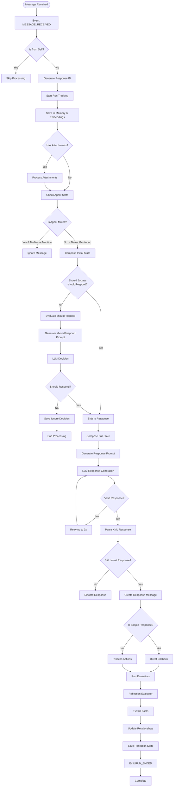
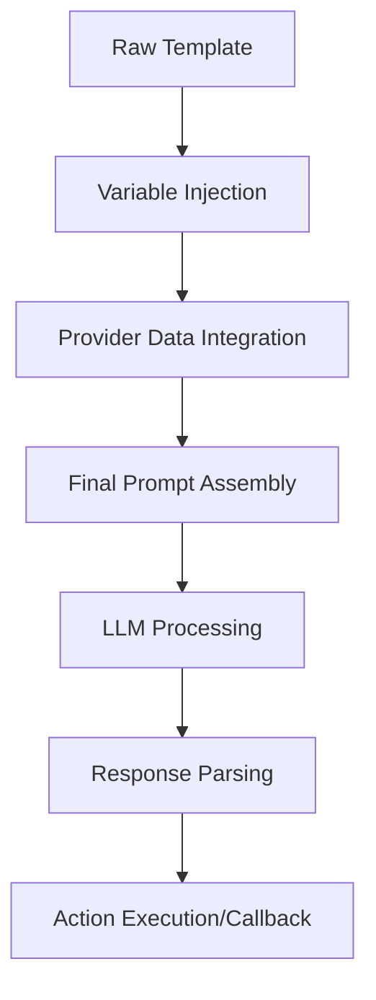

# Message Processing Flow - Detailed Breakdown

This document provides a step-by-step breakdown of how messages flow through the plugin-bootstrap system.

## Complete Message Flow Diagram



## Detailed Step Descriptions

### 1. Initial Message Reception

```typescript
// Event triggered by platform (Discord, Telegram, etc.)
EventType.MESSAGE_RECEIVED → messageReceivedHandler
```

### 2. Self-Check

```typescript
if (message.entityId === runtime.agentId) {
  logger.debug('Skipping message from self');
  return;
}
```

### 3. Response ID Generation

```typescript
// Prevents duplicate responses for rapid messages
const responseId = v4();
latestResponseIds.get(runtime.agentId).set(message.roomId, responseId);
```

### 4. Run Tracking

```typescript
const runId = runtime.startRun();
await runtime.emitEvent(EventType.RUN_STARTED, {...});
```

### 5. Memory Storage

```typescript
await Promise.all([
  runtime.addEmbeddingToMemory(message), // Vector embeddings
  runtime.createMemory(message, 'messages'), // Message history
]);
```

### 6. Attachment Processing

```typescript
if (message.content.attachments?.length > 0) {
  // Images: Generate descriptions
  // Documents: Extract text
  // Other: Process as configured
  message.content.attachments = await processAttachments(message.content.attachments, runtime);
}
```

### 7. Agent State Check

```typescript
const agentUserState = await runtime.getParticipantUserState(message.roomId, runtime.agentId);

if (
  agentUserState === 'MUTED' &&
  !message.content.text?.toLowerCase().includes(runtime.character.name.toLowerCase())
) {
  return; // Ignore if muted and not mentioned
}
```

### 8. Should Respond Evaluation

#### Bypass Conditions

```typescript
function shouldBypassShouldRespond(runtime, room, source) {
  // Default bypass types
  const bypassTypes = [ChannelType.DM, ChannelType.VOICE_DM, ChannelType.SELF, ChannelType.API];

  // Default bypass sources
  const bypassSources = ['client_chat'];

  // Plus any configured in environment
  return bypassTypes.includes(room.type) || bypassSources.includes(source);
}
```

#### LLM Evaluation

```typescript
if (!shouldBypassShouldRespond) {
  const state = await runtime.composeState(message, [
    'ANXIETY',
    'SHOULD_RESPOND',
    'ENTITIES',
    'CHARACTER',
    'RECENT_MESSAGES',
    'ACTIONS',
  ]);

  const prompt = composePromptFromState({
    state,
    template: shouldRespondTemplate,
  });

  const response = await runtime.useModel(ModelType.TEXT_SMALL, { prompt });
  const parsed = parseKeyValueXml(response);

  shouldRespond = parsed?.action && !['IGNORE', 'NONE'].includes(parsed.action.toUpperCase());
}
```

### 9. Response Generation

#### State Composition with Providers

```typescript
state = await runtime.composeState(message, ['ACTIONS']);

// Each provider adds context:
// - RECENT_MESSAGES: Conversation history
// - CHARACTER: Personality traits
// - ENTITIES: User information
// - TIME: Temporal context
// - RELATIONSHIPS: Social connections
// - WORLD: Environment details
// - etc.
```

#### LLM Response

```typescript
const prompt = composePromptFromState({
  state,
  template: messageHandlerTemplate,
});

let response = await runtime.useModel(ModelType.TEXT_LARGE, { prompt });

// Expected XML format:
/*
<thought>Agent's internal reasoning</thought>
<actions>REPLY,FOLLOW_ROOM</actions>
<providers>TECHNICAL_DOCS,FAQ</providers>
<text>The actual response text</text>
<simple>false</simple>
*/
```

### 10. Response Validation

```typescript
// Retry logic for missing fields
while (retries < 3 && (!responseContent?.thought || !responseContent?.actions)) {
  // Regenerate response
  retries++;
}

// Check if still the latest response
if (latestResponseIds.get(runtime.agentId).get(message.roomId) !== responseId) {
  return; // Newer message is being processed
}
```

### 11. Action Processing

#### Simple Response

```typescript
// Simple = REPLY action only, no providers
if (responseContent.simple && responseContent.text) {
  await callback(responseContent);
}
```

#### Complex Response

```typescript
// Multiple actions or providers
await runtime.processActions(message, responseMessages, state, callback);
```

### 12. Evaluator Execution

#### Reflection Evaluator

```typescript
// Runs after response generation
await runtime.evaluate(message, state, shouldRespond, callback, responseMessages);

// Reflection evaluator:
// 1. Analyzes conversation quality
// 2. Extracts new facts
// 3. Updates relationships
// 4. Self-reflects on performance
```

## Key Decision Points

### 1. Should Respond Decision Tree

```
Is DM? → YES → Respond
Is Voice DM? → YES → Respond
Is API Call? → YES → Respond
Is Muted + Name Mentioned? → YES → Respond
Is Muted? → NO → Ignore
Run shouldRespond LLM →
  - Action = REPLY/etc → Respond
  - Action = IGNORE/NONE → Ignore
```

### 2. Response Type Decision

```
Actions = [REPLY] only AND Providers = [] → Simple Response
Otherwise → Complex Response with Action Processing
```

### 3. Evaluator Trigger Conditions

```
Message Count > ConversationLength / 4 → Run Reflection
New Interaction → Update Relationships
Facts Mentioned → Extract and Store
```

## Performance Optimizations

### 1. Response ID Tracking

- Prevents duplicate responses when multiple messages arrive quickly
- Only processes the latest message per room

### 2. Parallel Operations

```typescript
// Parallel memory operations
await Promise.all([
  runtime.addEmbeddingToMemory(message),
  runtime.createMemory(message, 'messages')
]);

// Parallel data fetching in providers
const [entities, room, messages, interactions] = await Promise.all([
  getEntityDetails({ runtime, roomId }),
  runtime.getRoom(roomId),
  runtime.getMemories({ tableName: 'messages', roomId }),
  getRecentInteractions(...)
]);
```

### 3. Timeout Protection

```typescript
const timeoutDuration = 60 * 60 * 1000; // 1 hour
await Promise.race([processingPromise, timeoutPromise]);
```

## Error Handling

### 1. Run Lifecycle Events

```typescript
try {
  // Process message
  await runtime.emitEvent(EventType.RUN_ENDED, { status: 'completed' });
} catch (error) {
  await runtime.emitEvent(EventType.RUN_ENDED, {
    status: 'error',
    error: error.message,
  });
}
```

### 2. Graceful Degradation

- Missing attachments → Continue without them
- Provider errors → Use default values
- LLM failures → Retry with backoff
- Database errors → Log and continue

## Platform-Specific Handling

### Discord

- Channels → Rooms with ChannelType
- Servers → Worlds
- Users → Entities

### Telegram

- Chats → Rooms
- Groups → Worlds
- Users → Entities

### Message Bus

- Topics → Rooms
- Namespaces → Worlds
- Publishers → Entities

## Summary

The message flow through plugin-bootstrap is designed to be:

1. **Platform-agnostic** - Works with any message source
2. **Intelligent** - Makes context-aware response decisions
3. **Extensible** - Supports custom actions, providers, evaluators
4. **Resilient** - Handles errors gracefully
5. **Performant** - Uses parallel operations and caching

This flow ensures that every message is processed consistently, responses are contextual and appropriate, and the agent learns from each interaction.

## Template Usage in Message Flow

Understanding where templates are used helps you customize the right parts of the flow:

### 1. **shouldRespondTemplate** - Decision Point

Used at step 8 in the flow when evaluating whether to respond:

```
Message Received → shouldRespondTemplate → RESPOND/IGNORE/STOP
```

This template controls:

- When your agent engages in conversations
- What triggers a response
- When to stay silent

### 2. **messageHandlerTemplate** - Response Generation

Used at step 9 when generating the actual response:

```
Decision to Respond → messageHandlerTemplate → Response + Actions
```

This template controls:

- How responses are formulated
- Which actions are selected
- The agent's personality and tone
- Which providers to use for context

### 3. **reflectionTemplate** - Post-Interaction Analysis

Used at step 12 during evaluator execution:

```
Response Sent → reflectionTemplate → Learning & Memory Updates
```

This template controls:

- What the agent learns from interactions
- How facts are extracted
- Relationship tracking logic
- Self-improvement mechanisms

### 4. **postCreationTemplate** - Social Media Posts

Used when POST_GENERATED event is triggered:

```
Post Request → postCreationTemplate → Social Media Content
```

This template controls:

- Post style and tone
- Content generation approach
- Image prompt generation

### Template Processing Pipeline



1. **Template Selection**: System picks the appropriate template
2. **Variable Replacement**: `{{agentName}}`, `{{providers}}`, etc. are replaced
3. **Provider Injection**: Provider data is formatted and inserted
4. **Prompt Assembly**: Complete prompt is constructed
5. **LLM Processing**: Sent to language model
6. **Response Parsing**: XML/JSON response is parsed
7. **Execution**: Actions are executed, callbacks are called

### Customization Impact

When you customize templates, you're modifying these key decision points:

- **shouldRespond**: Change engagement patterns
- **messageHandler**: Alter personality and response style
- **reflection**: Modify learning and memory formation
- **postCreation**: Adjust social media presence

Each template change cascades through the entire interaction flow, allowing deep customization of agent behavior while maintaining the robust message processing infrastructure.
