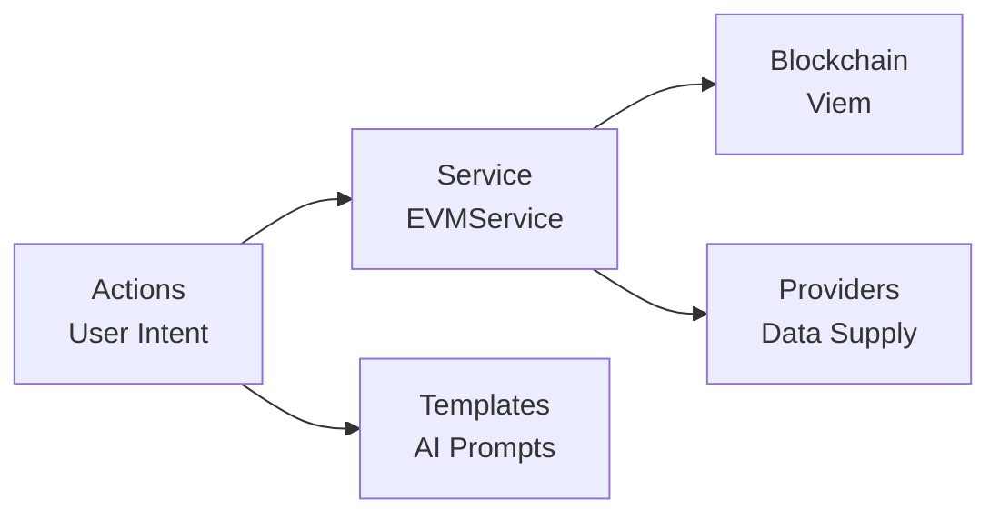

This guide provides an in-depth look at the EVM plugin's architecture, components, and implementation details.

## Architecture Overview

The EVM plugin follows a modular architecture with clear separation of concerns:



## Core Components

### EVMService

The central service that manages blockchain connections and wallet data:

```typescript
export class EVMService extends Service {
  static serviceType = 'evm-service';
  
  private walletProvider: WalletProvider;
  private intervalId: NodeJS.Timeout | null = null;

  async initialize(runtime: IAgentRuntime): Promise<void> {
    // Initialize wallet provider with chain configuration
    this.walletProvider = await initWalletProvider(runtime);
    
    // Set up periodic balance refresh
    this.intervalId = setInterval(
      () => this.refreshWalletData(),
      60000 // 1 minute
    );
  }

  async refreshWalletData(): Promise<void> {
    await this.walletProvider.getChainConfigs();
    // Update cached balance data
  }
}
```

### Actions

#### Transfer Action

Handles native and ERC20 token transfers:

```typescript
export const transferAction: Action = {
  name: 'EVM_TRANSFER',
  description: 'Transfer tokens on EVM chains',
  
  validate: async (runtime: IAgentRuntime) => {
    const privateKey = runtime.getSetting('EVM_PRIVATE_KEY');
    return !!privateKey || runtime.getSetting('WALLET_PUBLIC_KEY');
  },

  handler: async (runtime, message, state, options, callback) => {
    // 1. Extract parameters using AI
    const params = await extractTransferParams(runtime, message, state);
    
    // 2. Validate inputs
    if (!isAddress(params.toAddress)) {
      throw new Error('Invalid recipient address');
    }
    
    // 3. Execute transfer
    const result = await executeTransfer(params);
    
    // 4. Return response
    callback?.({
      text: `Transferred ${params.amount} ${params.token} to ${params.toAddress}`,
      content: { hash: result.hash }
    });
  }
};
```

#### Swap Action

Integrates with multiple DEX aggregators:

```typescript
export const swapAction: Action = {
  name: 'EVM_SWAP',
  description: 'Swap tokens on the same chain',
  
  handler: async (runtime, message, state, options, callback) => {
    // 1. Extract swap parameters
    const params = await extractSwapParams(runtime, message, state);
    
    // 2. Get quotes from aggregators
    const quotes = await Promise.all([
      getLiFiQuote(params),
      getBebopQuote(params)
    ]);
    
    // 3. Select best route
    const bestQuote = selectBestQuote(quotes);
    
    // 4. Execute swap
    const result = await executeSwap(bestQuote);
    
    callback?.({
      text: `Swapped ${params.fromAmount} ${params.fromToken} for ${result.toAmount} ${params.toToken}`,
      content: result
    });
  }
};
```

#### Bridge Action

Cross-chain token transfers using LiFi:

```typescript
export const bridgeAction: Action = {
  name: 'EVM_BRIDGE',
  description: 'Bridge tokens across chains',
  
  handler: async (runtime, message, state, options, callback) => {
    const params = await extractBridgeParams(runtime, message, state);
    
    // Get bridge route
    const route = await lifi.getRoutes({
      fromChainId: params.fromChain,
      toChainId: params.toChain,
      fromTokenAddress: params.fromToken,
      toTokenAddress: params.toToken,
      fromAmount: params.amount
    });
    
    // Execute bridge transaction
    const result = await lifi.executeRoute(route.routes[0]);
    
    callback?.({
      text: `Bridging ${params.amount} from ${params.fromChain} to ${params.toChain}`,
      content: { hash: result.hash, route: route.routes[0] }
    });
  }
};
```

### Providers

#### Wallet Provider

Supplies wallet balance information across all chains:

```typescript
export const walletProvider: Provider = {
  name: 'evmWalletProvider',
  
  get: async (runtime: IAgentRuntime) => {
    const service = runtime.getService<EVMService>('evm-service');
    const data = await service.getCachedData();
    
    if (!data?.walletInfo) return null;
    
    // Format balance information
    const balances = data.walletInfo.chains
      .map(chain => `${chain.name}: ${chain.nativeBalance} ${chain.symbol}`)
      .join('\n');
    
    return `Wallet balances:\n${balances}\n\nTotal value: $${data.walletInfo.totalValueUsd}`;
  }
};
```

#### Token Balance Provider

Dynamic provider for checking specific token balances:

```typescript
export const tokenBalanceProvider: Provider = {
  name: 'evmTokenBalance',
  
  get: async (runtime: IAgentRuntime, message: Memory) => {
    const tokenAddress = extractTokenAddress(message);
    const chain = extractChain(message);
    
    const balance = await getTokenBalance(
      runtime,
      tokenAddress,
      chain
    );
    
    return `Token balance: ${balance}`;
  }
};
```

### Templates

AI prompt templates for parameter extraction:

```typescript
export const transferTemplate = `Given the recent messages and wallet information:

{{recentMessages}}

{{walletInfo}}

Extract the transfer details:
- Amount to transfer (number only)
- Recipient address or ENS name
- Token symbol (or 'native' for ETH/BNB/etc)
- Chain name

Respond with:
<response>
  <amount>string | null</amount>
  <toAddress>string | null</toAddress>
  <token>string | null</token>
  <chain>string | null</chain>
</response>`;
```

## Chain Configuration

The plugin supports dynamic chain configuration:

```typescript
interface ChainConfig {
  chainId: number;
  name: string;
  chain: Chain;
  rpcUrl: string;
  nativeCurrency: {
    symbol: string;
    decimals: number;
  };
  walletClient?: WalletClient;
  publicClient?: PublicClient;
}

// Chains are configured based on environment variables
const configureChains = (runtime: IAgentRuntime): ChainConfig[] => {
  const chains: ChainConfig[] = [];
  
  // Check for custom RPC endpoints
  Object.entries(viemChains).forEach(([name, chain]) => {
    const customRpc = runtime.getSetting(`ETHEREUM_PROVIDER_${name.toUpperCase()}`);
    
    chains.push({
      chainId: chain.id,
      name: chain.name,
      chain,
      rpcUrl: customRpc || chain.rpcUrls.default.http[0],
      nativeCurrency: chain.nativeCurrency
    });
  });
  
  return chains;
};
```

## Token Resolution

The plugin automatically resolves token symbols to addresses:

```typescript
async function resolveTokenAddress(
  symbol: string,
  chainId: number
): Promise<Address> {
  // Check common tokens first
  const commonTokens = {
    'USDC': {
      1: '0xA0b86991c6218b36c1d19D4a2e9Eb0cE3606eB48',
      8453: '0x833589fCD6eDb6E08f4c7C32D4f71b54bdA02913',
      // ... other chains
    },
    'USDT': {
      1: '0xdAC17F958D2ee523a2206206994597C13D831ec7',
      // ... other chains
    }
  };
  
  if (commonTokens[symbol]?.[chainId]) {
    return commonTokens[symbol][chainId];
  }
  
  // Fallback to LiFi token list
  const tokens = await lifi.getTokens({ chainId });
  const token = tokens.find(t => 
    t.symbol.toLowerCase() === symbol.toLowerCase()
  );
  
  if (!token) {
    throw new Error(`Token ${symbol} not found on chain ${chainId}`);
  }
  
  return token.address;
}
```

## Governance Implementation

The plugin includes comprehensive DAO governance support:

```typescript
// Propose Action
export const proposeAction: Action = {
  name: 'EVM_GOV_PROPOSE',
  description: 'Create a governance proposal',
  
  handler: async (runtime, message, state, options, callback) => {
    const params = await extractProposalParams(runtime, message, state);
    
    const governorContract = getGovernorContract(params.chain);
    
    const tx = await governorContract.propose(
      params.targets,
      params.values,
      params.calldatas,
      params.description
    );
    
    callback?.({
      text: `Created proposal: ${params.description}`,
      content: { hash: tx.hash }
    });
  }
};

// Vote Action
export const voteAction: Action = {
  name: 'EVM_GOV_VOTE',
  description: 'Vote on a governance proposal',
  
  handler: async (runtime, message, state, options, callback) => {
    const params = await extractVoteParams(runtime, message, state);
    
    const voteValue = {
      'for': 1,
      'against': 0,
      'abstain': 2
    }[params.support.toLowerCase()];
    
    const tx = await governorContract.castVote(
      params.proposalId,
      voteValue
    );
    
    callback?.({
      text: `Voted ${params.support} on proposal ${params.proposalId}`,
      content: { hash: tx.hash }
    });
  }
};
```

## Error Handling

Comprehensive error handling for common scenarios:

```typescript
export async function handleTransactionError(
  error: any,
  context: string
): Promise<void> {
  if (error.code === 'INSUFFICIENT_FUNDS') {
    throw new Error(`Insufficient funds for ${context}`);
  }
  
  if (error.code === 'NONCE_TOO_LOW') {
    // Handle nonce issues
    await resetNonce();
    throw new Error('Transaction nonce issue, please retry');
  }
  
  if (error.message?.includes('gas required exceeds allowance')) {
    throw new Error(`Gas estimation failed for ${context}`);
  }
  
  // Log unknown errors
  logger.error(`Unknown error in ${context}:`, error);
  throw new Error(`Transaction failed: ${error.message}`);
}
```

## Testing

The plugin includes comprehensive test coverage:

```typescript
describe('EVM Transfer Action', () => {
  it('should transfer native tokens', async () => {
    const runtime = await createTestRuntime();
    const message = createMessage('Send 0.1 ETH to 0x123...');
    
    const result = await transferAction.handler(
      runtime,
      message,
      state,
      {},
      callback
    );
    
    expect(result).toBe(true);
    expect(callback).toHaveBeenCalledWith(
      expect.objectContaining({
        text: expect.stringContaining('Transferred 0.1 ETH')
      })
    );
  });
});
```

## Best Practices

1. **Always validate addresses** before executing transactions
2. **Use gas buffers** (typically 20%) for reliable execution
3. **Implement retry logic** for network failures
4. **Cache frequently accessed data** to reduce RPC calls
5. **Use simulation** before executing expensive operations
6. **Monitor gas prices** and adjust limits accordingly
7. **Handle slippage** appropriately for swaps
8. **Validate token approvals** before transfers

## Troubleshooting

Common issues and solutions:

- **"Insufficient funds"**: Check wallet balance includes gas costs
- **"Invalid address"**: Ensure address is checksummed correctly
- **"Gas estimation failed"**: Try with a fixed gas limit
- **"Nonce too low"**: Reset nonce or wait for pending transactions
- **"Network error"**: Check RPC endpoint availability