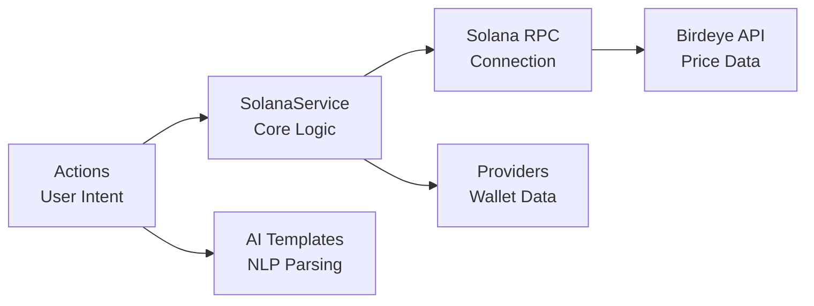

This guide provides comprehensive documentation of the Solana plugin's architecture, implementation, and advanced features.

## Architecture Overview

The Solana plugin follows a modular architecture optimized for high-performance blockchain interactions:



## Core Components

### SolanaService

The central service managing all Solana blockchain interactions:

```typescript
export class SolanaService extends Service {
  static serviceType = 'solana-service';
  
  private connection: Connection;
  private keypair?: Keypair;
  private wallet?: Wallet;
  private cache: Map<string, { data: any; timestamp: number }> = new Map();
  private subscriptions: number[] = [];

  async initialize(runtime: IAgentRuntime): Promise<void> {
    // Initialize connection
    const rpcUrl = runtime.getSetting('SOLANA_RPC_URL') || 'https://api.mainnet-beta.solana.com';
    this.connection = new Connection(rpcUrl, {
      commitment: 'confirmed',
      wsEndpoint: rpcUrl.replace('https', 'wss')
    });

    // Initialize wallet
    const privateKey = runtime.getSetting('SOLANA_PRIVATE_KEY');
    if (privateKey) {
      this.keypair = await loadKeypair(privateKey);
      this.wallet = new Wallet(this.keypair);
    }

    // Start portfolio monitoring
    this.startPortfolioTracking();
    
    // Register with trader service if available
    this.registerWithTraderService(runtime);
  }

  private async startPortfolioTracking(): Promise<void> {
    // Initial fetch
    await this.fetchPortfolioData();
    
    // Set up periodic refresh (2 minutes)
    setInterval(() => this.fetchPortfolioData(), 120000);
    
    // Set up WebSocket subscriptions
    if (this.keypair) {
      this.setupAccountSubscriptions();
    }
  }
}
```

### Actions

#### Transfer Action

Handles SOL and SPL token transfers with intelligent parsing:

```typescript
export const transferAction: Action = {
  name: 'TRANSFER_SOLANA',
  description: 'Transfer SOL or SPL tokens on Solana',
  
  validate: async (runtime: IAgentRuntime) => {
    const privateKey = runtime.getSetting('SOLANA_PRIVATE_KEY');
    return !!privateKey;
  },

  handler: async (runtime, message, state, options, callback) => {
    try {
      // Extract parameters using AI
      const params = await extractTransferParams(runtime, message, state);
      
      // Get service instance
      const service = runtime.getService<SolanaService>('solana-service');
      
      // Execute transfer
      const result = await executeTransfer(service, params);
      
      callback?.({
        text: `Successfully transferred ${params.amount} ${params.token} to ${params.recipient}`,
        content: {
          success: true,
          signature: result.signature,
          amount: params.amount,
          token: params.token,
          recipient: params.recipient
        }
      });
    } catch (error) {
      callback?.({
        text: `Transfer failed: ${error.message}`,
        content: { error: error.message }
      });
    }
  },

  examples: [
    [
      {
        name: 'user',
        content: { text: 'Send 1 SOL to 7xKXtg2CW87d97TXJSDpbD5jBkheTqA83TZRuJosgAsU' }
      },
      {
        name: 'assistant',
        content: { text: "I'll send 1 SOL to that address right away." }
      }
    ]
  ],

  similes: ['SEND_SOL', 'SEND_TOKEN_SOLANA', 'TRANSFER_SOL', 'PAY_SOL']
};
```

#### Swap Action

Token swapping using Jupiter aggregator:

```typescript
export const swapAction: Action = {
  name: 'SWAP_SOLANA',
  description: 'Swap tokens on Solana using Jupiter',
  
  handler: async (runtime, message, state, options, callback) => {
    // Extract swap parameters
    const params = await extractSwapParams(runtime, message, state);
    
    // Get Jupiter quote
    const quote = await getJupiterQuote({
      inputMint: params.fromToken,
      outputMint: params.toToken,
      amount: params.amount,
      slippageBps: params.slippage * 100 // Convert to basis points
    });
    
    // Execute swap
    const result = await executeJupiterSwap(
      service.connection,
      service.wallet,
      quote
    );
    
    callback?.({
      text: `Swapped ${params.fromAmount} ${params.fromSymbol} for ${formatAmount(quote.outAmount)} ${params.toSymbol}`,
      content: {
        success: true,
        signature: result.signature,
        fromAmount: params.fromAmount,
        toAmount: formatAmount(quote.outAmount),
        route: quote.routePlan
      }
    });
  }
};
```

### Providers

#### Wallet Provider

Supplies comprehensive wallet and portfolio data:

```typescript
export const walletProvider: Provider = {
  name: 'solana-wallet',
  description: 'Provides Solana wallet information and portfolio data',
  
  get: async (runtime: IAgentRuntime, message?: Memory, state?: State) => {
    const service = runtime.getService<SolanaService>('solana-service');
    const portfolioData = await service.getCachedPortfolioData();
    
    if (!portfolioData) {
      return 'Wallet data unavailable';
    }
    
    // Format portfolio for AI context
    const summary = formatPortfolioSummary(portfolioData);
    const tokenList = formatTokenBalances(portfolioData.tokens);
    
    return `Solana Wallet Portfolio:
Total Value: $${portfolioData.totalUsd.toFixed(2)} (${portfolioData.totalSol.toFixed(4)} SOL)

Token Balances:
${tokenList}

SOL Price: $${portfolioData.solPrice.toFixed(2)}
Last Updated: ${new Date(portfolioData.lastUpdated).toLocaleString()}`;
  }
};
```

### Templates

AI prompt templates for natural language understanding:

```typescript
export const transferTemplate = `Given the recent messages:
{{recentMessages}}

And wallet information:
{{walletInfo}}

Extract the following for a Solana transfer:
- Amount to send (number only)
- Token to send (SOL or token symbol/address)
- Recipient address or domain

Respond with:
<response>
  <amount>string</amount>
  <token>string</token>
  <recipient>string</recipient>
</response>`;

export const swapTemplate = `Given the swap request:
{{recentMessages}}

And available tokens:
{{walletInfo}}

Extract swap details:
- Input token (symbol or address)
- Input amount (or "all" for max)
- Output token (symbol or address)
- Slippage tolerance (percentage, default 1%)

<response>
  <inputToken>string</inputToken>
  <inputAmount>string</inputAmount>
  <outputToken>string</outputToken>
  <slippage>number</slippage>
</response>`;
```

## Advanced Features

### Keypair Management

The plugin supports multiple key formats and secure handling:

```typescript
export async function loadKeypair(privateKey: string): Promise<Keypair> {
  try {
    // Try base58 format first
    const decoded = bs58.decode(privateKey);
    if (decoded.length === 64) {
      return Keypair.fromSecretKey(decoded);
    }
  } catch (e) {
    // Not base58, try base64
  }

  try {
    // Try base64 format
    const decoded = Buffer.from(privateKey, 'base64');
    if (decoded.length === 64) {
      return Keypair.fromSecretKey(decoded);
    }
  } catch (e) {
    // Not base64
  }

  // Try JSON format (Solana CLI)
  try {
    const parsed = JSON.parse(privateKey);
    if (Array.isArray(parsed)) {
      return Keypair.fromSecretKey(Uint8Array.from(parsed));
    }
  } catch (e) {
    // Not JSON
  }

  throw new Error('Invalid private key format');
}
```

### WebSocket Subscriptions

Real-time account monitoring for instant updates:

```typescript
private setupAccountSubscriptions(): void {
  if (!this.keypair) return;

  // Subscribe to account changes
  const accountSub = this.connection.onAccountChange(
    this.keypair.publicKey,
    (accountInfo) => {
      elizaLogger.info('Account balance changed:', {
        lamports: accountInfo.lamports,
        sol: accountInfo.lamports / LAMPORTS_PER_SOL
      });
      
      // Trigger portfolio refresh
      this.fetchPortfolioData();
    },
    'confirmed'
  );
  
  this.subscriptions.push(accountSub);

  // Subscribe to token accounts
  this.subscribeToTokenAccounts();
}

private async subscribeToTokenAccounts(): Promise<void> {
  const tokenAccounts = await this.connection.getParsedTokenAccountsByOwner(
    this.keypair.publicKey,
    { programId: TOKEN_PROGRAM_ID }
  );

  tokenAccounts.value.forEach(({ pubkey }) => {
    const sub = this.connection.onAccountChange(
      pubkey,
      () => {
        elizaLogger.info('Token balance changed');
        this.fetchPortfolioData();
      },
      'confirmed'
    );
    
    this.subscriptions.push(sub);
  });
}
```

### Portfolio Data Management

Efficient caching and data fetching:

```typescript
interface PortfolioData {
  totalUsd: number;
  totalSol: number;
  solPrice: number;
  tokens: TokenBalance[];
  lastUpdated: number;
}

private async fetchPortfolioData(): Promise<PortfolioData> {
  const cacheKey = 'portfolio_data';
  const cached = this.cache.get(cacheKey);
  
  // Return cached data if fresh (2 minutes)
  if (cached && Date.now() - cached.timestamp < 120000) {
    return cached.data;
  }

  try {
    // Fetch from Birdeye API
    const response = await fetch(
      `https://api.birdeye.so/v1/wallet/portfolio?wallet=${this.keypair.publicKey.toBase58()}`,
      {
        headers: {
          'X-API-KEY': this.runtime.getSetting('BIRDEYE_API_KEY')
        }
      }
    );

    const data = await response.json();
    
    // Process and cache
    const portfolioData = this.processPortfolioData(data);
    this.cache.set(cacheKey, {
      data: portfolioData,
      timestamp: Date.now()
    });

    return portfolioData;
  } catch (error) {
    elizaLogger.error('Failed to fetch portfolio data:', error);
    return cached?.data || this.getEmptyPortfolio();
  }
}
```

### Transaction Building

Optimized transaction construction with priority fees:

```typescript
async function buildTransferTransaction(
  connection: Connection,
  sender: PublicKey,
  recipient: PublicKey,
  amount: number,
  token?: string
): Promise<Transaction> {
  const transaction = new Transaction();
  
  // Add priority fee for faster processing
  const priorityFee = ComputeBudgetProgram.setComputeUnitPrice({
    microLamports: 1000 // 0.001 SOL per compute unit
  });
  transaction.add(priorityFee);

  if (!token || token.toUpperCase() === 'SOL') {
    // Native SOL transfer
    transaction.add(
      SystemProgram.transfer({
        fromPubkey: sender,
        toPubkey: recipient,
        lamports: amount * LAMPORTS_PER_SOL
      })
    );
  } else {
    // SPL token transfer
    const mint = await resolveTokenMint(connection, token);
    const senderAta = await getAssociatedTokenAddress(mint, sender);
    const recipientAta = await getAssociatedTokenAddress(mint, recipient);
    
    // Check if recipient ATA exists
    const recipientAccount = await connection.getAccountInfo(recipientAta);
    if (!recipientAccount) {
      // Create ATA for recipient
      transaction.add(
        createAssociatedTokenAccountInstruction(
          sender,
          recipientAta,
          recipient,
          mint
        )
      );
    }
    
    // Add transfer instruction
    transaction.add(
      createTransferInstruction(
        senderAta,
        recipientAta,
        sender,
        amount * Math.pow(10, await getTokenDecimals(connection, mint))
      )
    );
  }

  // Get latest blockhash
  const { blockhash, lastValidBlockHeight } = await connection.getLatestBlockhash();
  transaction.recentBlockhash = blockhash;
  transaction.lastValidBlockHeight = lastValidBlockHeight;
  transaction.feePayer = sender;

  return transaction;
}
```

### Token Resolution

Intelligent token symbol to mint address resolution:

```typescript
async function resolveTokenMint(
  connection: Connection,
  tokenIdentifier: string
): Promise<PublicKey> {
  // Check if it's already a valid public key
  try {
    const pubkey = new PublicKey(tokenIdentifier);
    // Verify it's a token mint
    const accountInfo = await connection.getAccountInfo(pubkey);
    if (accountInfo?.owner.equals(TOKEN_PROGRAM_ID)) {
      return pubkey;
    }
  } catch (e) {
    // Not a valid public key, continue
  }

  // Common token mappings
  const commonTokens: Record<string, string> = {
    'USDC': 'EPjFWdd5AufqSSqeM2qN1xzybapC8G4wEGGkZwyTDt1v',
    'USDT': 'Es9vMFrzaCERmJfrF4H2FYD4KCoNkY11McCe8BenwNYB',
    'BONK': 'DezXAZ8z7PnrnRJjz3wXBoRgixCa6xjnB7YaB1pPB263',
    'RAY': '4k3Dyjzvzp8eMZWUXbBCjEvwSkkk59S5iCNLY3QrkX6R',
    'JTO': 'jtojtomepa8beP8AuQc6eXt5FriJwfFMwQx2v2f9mCL',
    // Add more as needed
  };

  const upperToken = tokenIdentifier.toUpperCase();
  if (commonTokens[upperToken]) {
    return new PublicKey(commonTokens[upperToken]);
  }

  // Try to fetch from token list or registry
  throw new Error(`Unknown token: ${tokenIdentifier}`);
}
```

### Jupiter Integration

Advanced swap execution with route optimization:

```typescript
interface JupiterSwapParams {
  inputMint: PublicKey;
  outputMint: PublicKey;
  amount: number;
  slippageBps: number;
  userPublicKey: PublicKey;
}

async function getJupiterQuote(params: JupiterSwapParams): Promise<QuoteResponse> {
  const url = new URL('https://quote-api.jup.ag/v6/quote');
  url.searchParams.append('inputMint', params.inputMint.toBase58());
  url.searchParams.append('outputMint', params.outputMint.toBase58());
  url.searchParams.append('amount', params.amount.toString());
  url.searchParams.append('slippageBps', params.slippageBps.toString());
  url.searchParams.append('onlyDirectRoutes', 'false');
  url.searchParams.append('asLegacyTransaction', 'false');

  const response = await fetch(url.toString());
  if (!response.ok) {
    throw new Error(`Jupiter quote failed: ${response.statusText}`);
  }

  return response.json();
}

async function executeJupiterSwap(
  connection: Connection,
  wallet: Wallet,
  quote: QuoteResponse
): Promise<{ signature: string }> {
  // Get serialized transaction from Jupiter
  const swapResponse = await fetch('https://quote-api.jup.ag/v6/swap', {
    method: 'POST',
    headers: { 'Content-Type': 'application/json' },
    body: JSON.stringify({
      quoteResponse: quote,
      userPublicKey: wallet.publicKey.toBase58(),
      wrapAndUnwrapSol: true,
      prioritizationFeeLamports: 'auto'
    })
  });

  const { swapTransaction } = await swapResponse.json();
  
  // Deserialize and sign
  const transaction = VersionedTransaction.deserialize(
    Buffer.from(swapTransaction, 'base64')
  );
  transaction.sign([wallet.payer]);

  // Send with confirmation
  const signature = await connection.sendTransaction(transaction, {
    skipPreflight: false,
    maxRetries: 3
  });

  // Wait for confirmation
  const confirmation = await connection.confirmTransaction({
    signature,
    blockhash: transaction.message.recentBlockhash,
    lastValidBlockHeight: transaction.message.lastValidBlockHeight
  });

  if (confirmation.value.err) {
    throw new Error(`Swap failed: ${confirmation.value.err}`);
  }

  return { signature };
}
```

### Error Handling

Comprehensive error handling with retry logic:

```typescript
export async function withRetry<T>(
  operation: () => Promise<T>,
  options: {
    maxAttempts?: number;
    delay?: number;
    backoff?: number;
    onError?: (error: Error, attempt: number) => void;
  } = {}
): Promise<T> {
  const {
    maxAttempts = 3,
    delay = 1000,
    backoff = 2,
    onError
  } = options;

  let lastError: Error;

  for (let attempt = 1; attempt <= maxAttempts; attempt++) {
    try {
      return await operation();
    } catch (error) {
      lastError = error;
      onError?.(error, attempt);

      if (attempt < maxAttempts) {
        const waitTime = delay * Math.pow(backoff, attempt - 1);
        elizaLogger.warn(`Attempt ${attempt} failed, retrying in ${waitTime}ms`, {
          error: error.message
        });
        await new Promise(resolve => setTimeout(resolve, waitTime));
      }
    }
  }

  throw lastError;
}

// Usage
const result = await withRetry(
  () => connection.sendTransaction(transaction),
  {
    maxAttempts: 3,
    onError: (error, attempt) => {
      if (error.message.includes('blockhash not found')) {
        // Refresh blockhash
        transaction.recentBlockhash = (await connection.getLatestBlockhash()).blockhash;
      }
    }
  }
);
```

### Performance Optimizations

#### Connection Pooling

```typescript
class ConnectionPool {
  private connections: Connection[] = [];
  private currentIndex = 0;

  constructor(rpcUrls: string[], config?: ConnectionConfig) {
    this.connections = rpcUrls.map(url => new Connection(url, config));
  }

  getConnection(): Connection {
    const connection = this.connections[this.currentIndex];
    this.currentIndex = (this.currentIndex + 1) % this.connections.length;
    return connection;
  }

  async healthCheck(): Promise<void> {
    const checks = this.connections.map(async (conn, index) => {
      try {
        await conn.getVersion();
        return { index, healthy: true };
      } catch (error) {
        return { index, healthy: false, error };
      }
    });

    const results = await Promise.all(checks);
    const unhealthy = results.filter(r => !r.healthy);
    
    if (unhealthy.length > 0) {
      elizaLogger.warn('Unhealthy connections:', unhealthy);
    }
  }
}
```

#### Batch Operations

```typescript
async function batchGetMultipleAccounts(
  connection: Connection,
  publicKeys: PublicKey[]
): Promise<(AccountInfo<Buffer> | null)[]> {
  const BATCH_SIZE = 100;
  const results: (AccountInfo<Buffer> | null)[] = [];

  for (let i = 0; i < publicKeys.length; i += BATCH_SIZE) {
    const batch = publicKeys.slice(i, i + BATCH_SIZE);
    const batchResults = await connection.getMultipleAccountsInfo(batch);
    results.push(...batchResults);
  }

  return results;
}
```

## Security Considerations

1. **Private Key Security**
   - Never log or expose private keys
   - Support multiple secure key formats
   - Use environment variables only

2. **Transaction Validation**
   - Always simulate before sending
   - Verify recipient addresses
   - Check token mint addresses

3. **Slippage Protection**
   - Default 1% slippage
   - Maximum 5% slippage
   - User confirmation for high slippage

4. **Rate Limiting**
   - Implement request throttling
   - Cache frequently accessed data
   - Use WebSocket for real-time data

## Monitoring & Logging

The plugin provides detailed logging for debugging and monitoring:

```typescript
// Transaction lifecycle
elizaLogger.info('Transfer initiated', { amount, token, recipient });
elizaLogger.debug('Transaction built', { instructions: tx.instructions.length });
elizaLogger.info('Transaction sent', { signature });
elizaLogger.info('Transaction confirmed', { signature, slot });

// Performance metrics
elizaLogger.debug('RPC latency', { method, duration });
elizaLogger.debug('Cache hit rate', { hits, misses, ratio });

// Error tracking
elizaLogger.error('Transaction failed', { error, context });
elizaLogger.warn('Retry attempt', { attempt, maxAttempts });
```