This guide provides detailed visual representations of the Knowledge plugin's architecture, processing flows, and component interactions.

## High-Level Architecture

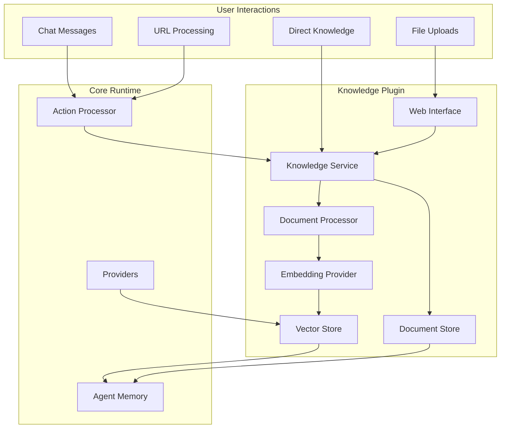

## Document Processing Flow

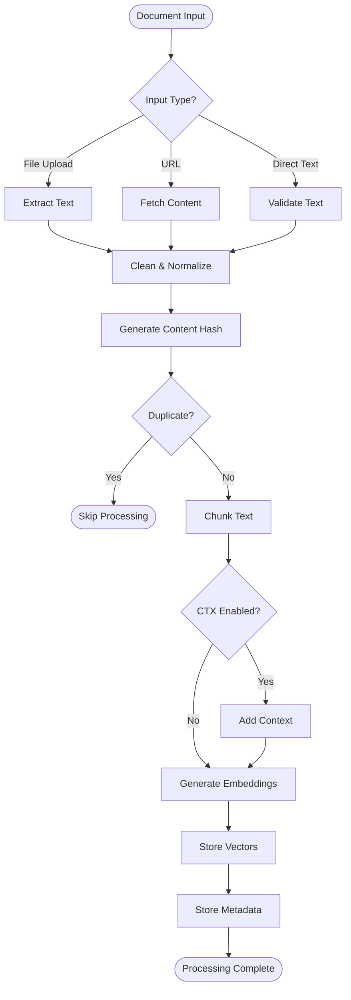

## Retrieval Flow

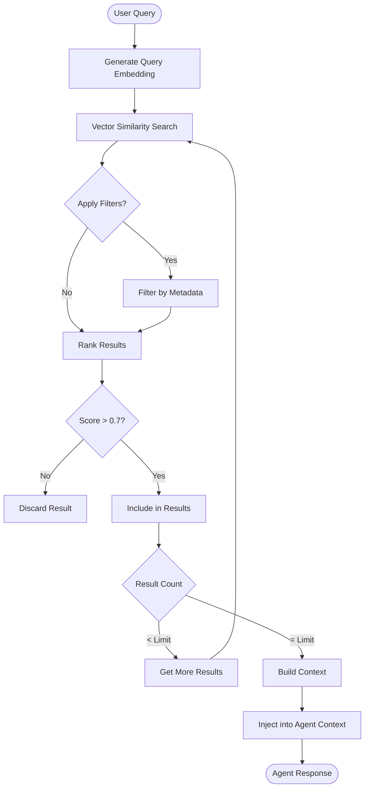

## Component Interactions

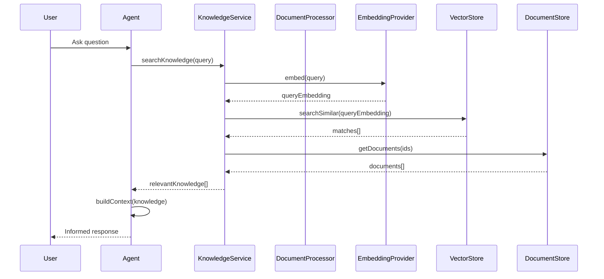

## Data Flow Architecture

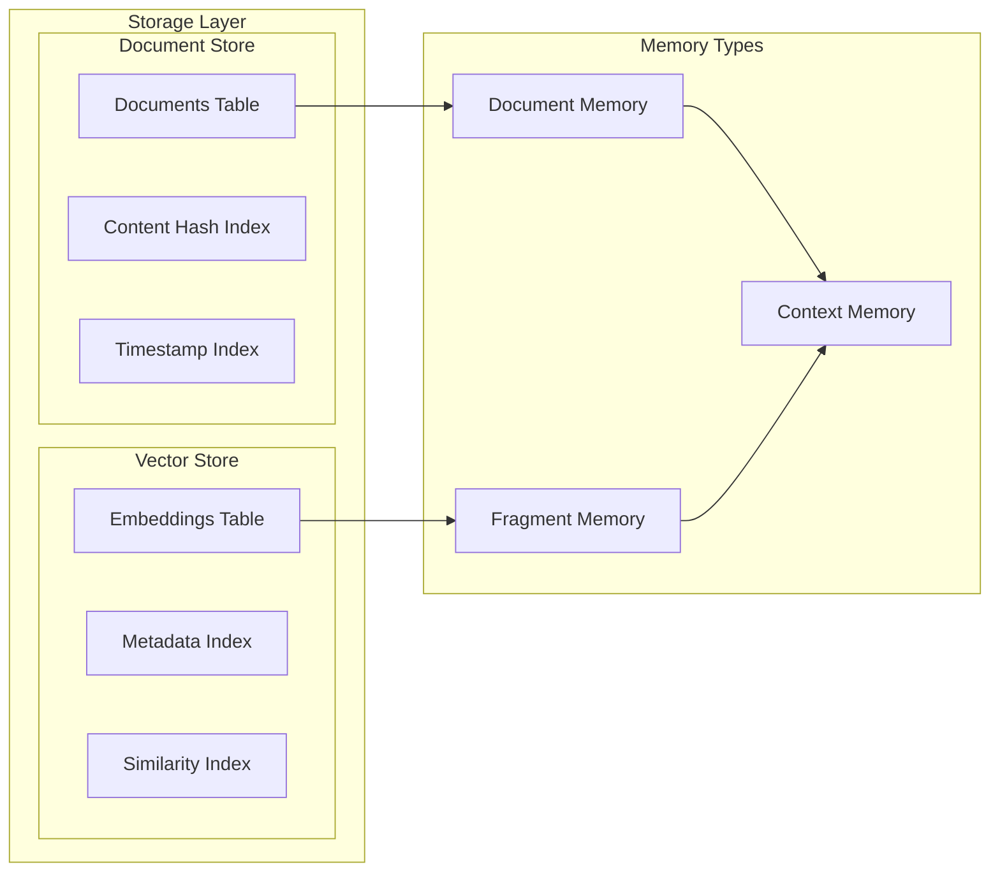

## Processing Pipeline Details

### Text Extraction Flow

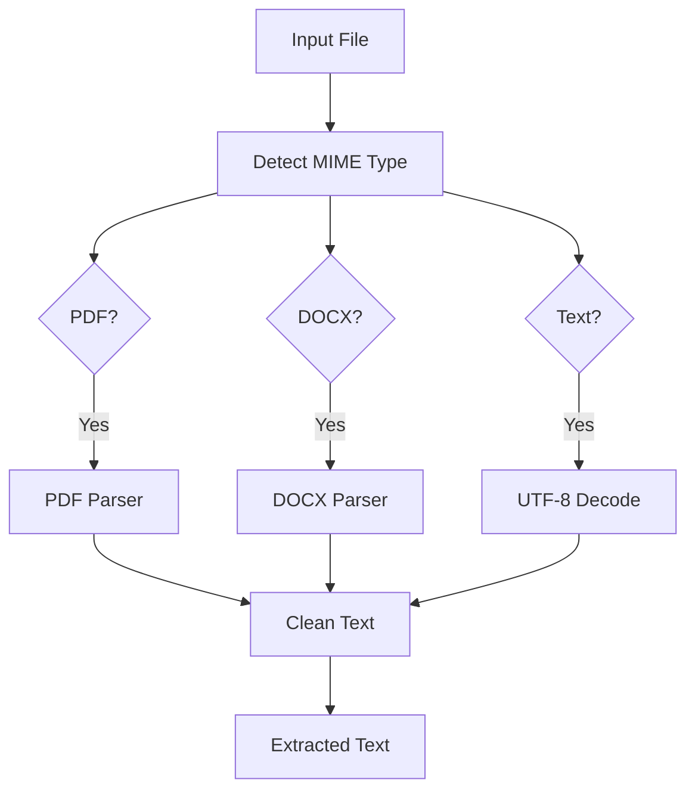

### Chunking Strategy

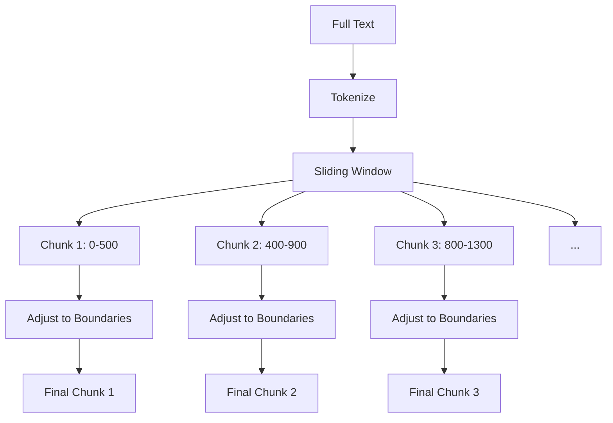

### Contextual Enrichment

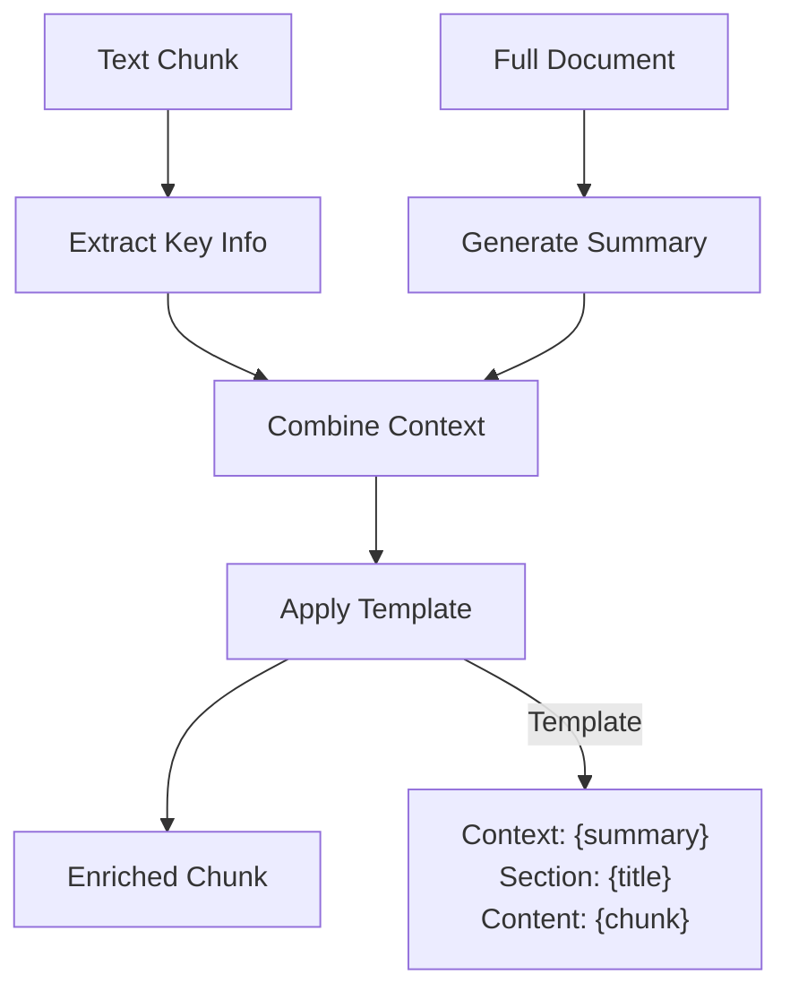

## Rate Limiting & Concurrency

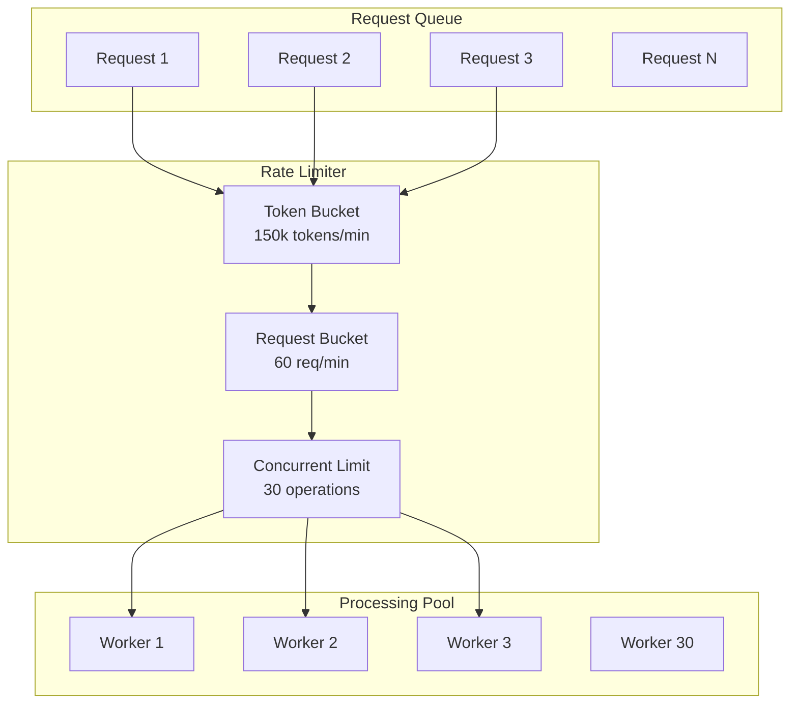

## Caching Architecture

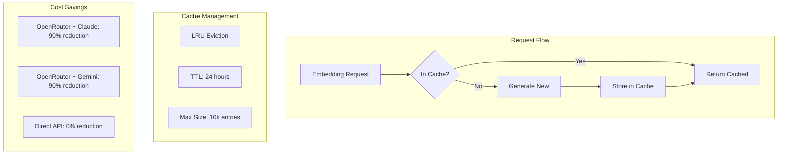

## Web Interface Architecture

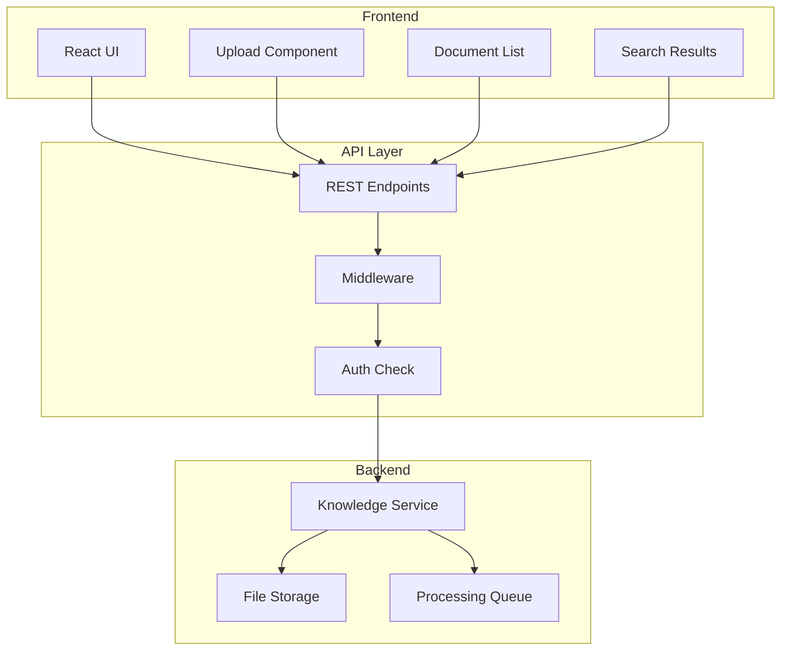

## Error Handling Flow

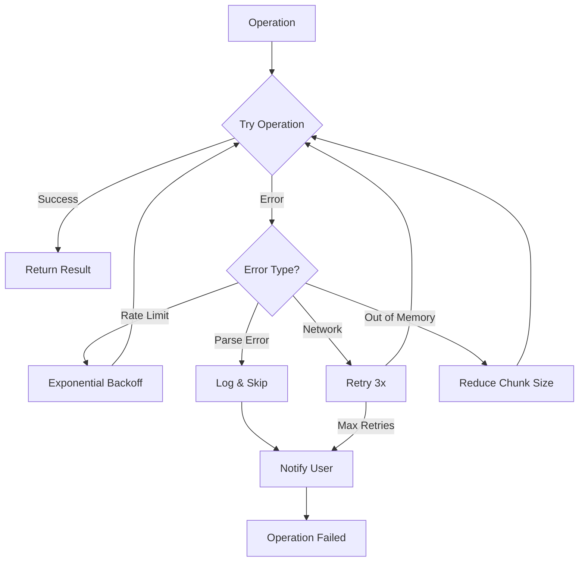

## Performance Characteristics

### Processing Times

```mermaid
gantt
    title Document Processing Timeline
    dateFormat X
    axisFormat %s
    
    section Small Doc (< 1MB)
    Text Extraction     :0, 1
    Chunking           :1, 2
    Embedding          :2, 5
    Storage            :5, 6
    
    section Medium Doc (1-10MB)
    Text Extraction     :0, 3
    Chunking           :3, 5
    Embedding          :5, 15
    Storage            :15, 17
    
    section Large Doc (10-50MB)
    Text Extraction     :0, 10
    Chunking           :10, 15
    Embedding          :15, 45
    Storage            :45, 50
```

### Storage Requirements

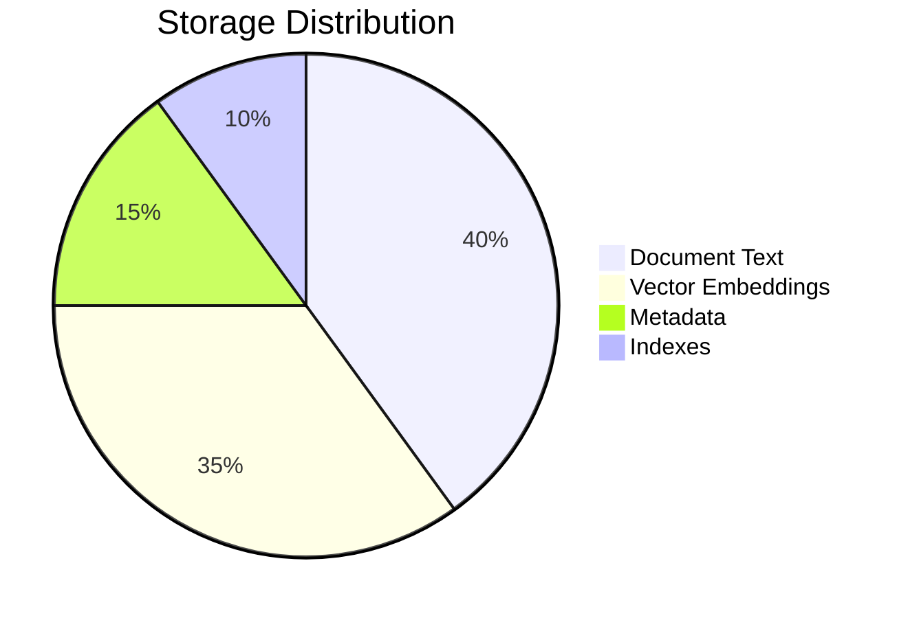

## Scaling Considerations

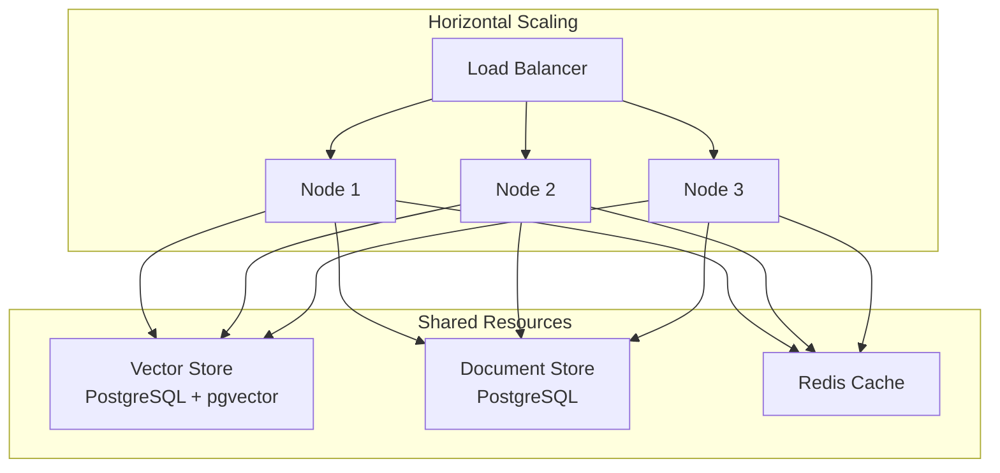

## Summary

The Knowledge plugin's architecture is designed for:

<CardGroup cols={2}>
  <Card title="Scalability" icon="chart-line">
    Handles large document collections efficiently
  </Card>
  <Card title="Performance" icon="gauge-max">
    Optimized processing and retrieval paths
  </Card>
  <Card title="Reliability" icon="shield-check">
    Robust error handling and recovery
  </Card>
  <Card title="Cost Efficiency" icon="dollar-sign">
    90% savings with intelligent caching
  </Card>
</CardGroup>

Understanding these flows helps you:
- Optimize configuration for your use case
- Debug issues effectively
- Plan for scale
- Integrate with other systems