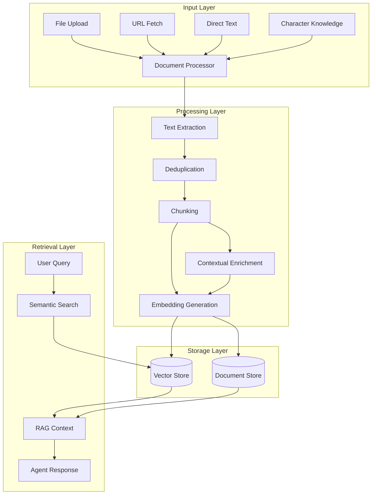

The `@elizaos/plugin-knowledge` package provides Retrieval Augmented Generation (RAG) capabilities for elizaOS agents. It enables agents to store, search, and automatically use knowledge from uploaded documents and text.

## Key Features

- **Multi-format Support**: Process PDFs, Word docs, text files, and more
- **Smart Deduplication**: Content-based IDs prevent duplicate entries
- **Automatic RAG**: Knowledge is automatically injected into relevant conversations
- **Character Knowledge**: Load knowledge from character definitions
- **REST API**: Manage documents via HTTP endpoints
- **Conversation Tracking**: Track which knowledge was used in responses

## Architecture Overview



## Core Components

### Knowledge Service

The main service class that handles all knowledge operations:

```typescript
class KnowledgeService extends Service {
  static readonly serviceType = 'knowledge';
  private knowledgeConfig: KnowledgeConfig;
  private knowledgeProcessingSemaphore: Semaphore;

  constructor(runtime: IAgentRuntime, config?: Partial<KnowledgeConfig>) {
    super(runtime);
    this.knowledgeProcessingSemaphore = new Semaphore(10);

    // Configuration with environment variable support
    this.knowledgeConfig = {
      CTX_KNOWLEDGE_ENABLED: parseBooleanEnv(config?.CTX_KNOWLEDGE_ENABLED),
      LOAD_DOCS_ON_STARTUP: loadDocsOnStartup,
      MAX_INPUT_TOKENS: config?.MAX_INPUT_TOKENS,
      MAX_OUTPUT_TOKENS: config?.MAX_OUTPUT_TOKENS,
      EMBEDDING_PROVIDER: config?.EMBEDDING_PROVIDER,
      TEXT_PROVIDER: config?.TEXT_PROVIDER,
      TEXT_EMBEDDING_MODEL: config?.TEXT_EMBEDDING_MODEL,
    };

    // Auto-load documents on startup if enabled
    if (this.knowledgeConfig.LOAD_DOCS_ON_STARTUP) {
      this.loadInitialDocuments();
    }
  }

  // Main public method for adding knowledge
  async addKnowledge(options: AddKnowledgeOptions): Promise<{
    clientDocumentId: string;
    storedDocumentMemoryId: UUID;
    fragmentCount: number;
  }> {
    // Generate content-based ID for deduplication
    const contentBasedId = generateContentBasedId(options.content, agentId, {
      includeFilename: options.originalFilename,
      contentType: options.contentType,
      maxChars: 2000,
    });

    // Check for duplicates
    const existingDocument = await this.runtime.getMemoryById(contentBasedId);
    if (existingDocument) {
      // Return existing document info
      return { clientDocumentId: contentBasedId, ... };
    }

    // Process new document
    return this.processDocument({ ...options, clientDocumentId: contentBasedId });
  }

  // Semantic search for knowledge
  async getKnowledge(
    message: Memory,
    scope?: { roomId?: UUID; worldId?: UUID; entityId?: UUID }
  ): Promise<KnowledgeItem[]> {
    const embedding = await this.runtime.useModel(ModelType.TEXT_EMBEDDING, {
      text: message.content.text,
    });

    const fragments = await this.runtime.searchMemories({
      tableName: 'knowledge',
      embedding,
      query: message.content.text,
      ...scope,
      count: 20,
      match_threshold: 0.1,
    });

    return fragments.map(fragment => ({
      id: fragment.id,
      content: fragment.content,
      similarity: fragment.similarity,
      metadata: fragment.metadata,
    }));
  }

  // RAG metadata enrichment for conversation tracking
  async enrichConversationMemoryWithRAG(
    memoryId: UUID,
    ragMetadata: {
      retrievedFragments: Array<{
        fragmentId: UUID;
        documentTitle: string;
        similarityScore?: number;
        contentPreview: string;
      }>;
      queryText: string;
      totalFragments: number;
      retrievalTimestamp: number;
    }
  ): Promise<void> {
    // Enriches conversation memories with RAG usage data
  }
}
```

### Document Processing

The service handles different file types with sophisticated processing logic:

```typescript
private async processDocument(options: AddKnowledgeOptions): Promise<{
  clientDocumentId: string;
  storedDocumentMemoryId: UUID;
  fragmentCount: number;
}> {
  let fileBuffer: Buffer | null = null;
  let extractedText: string;
  let documentContentToStore: string;
  const isPdfFile = contentType === 'application/pdf';

  if (isPdfFile) {
    // PDFs: Store original base64, extract text for fragments
    fileBuffer = Buffer.from(content, 'base64');
    extractedText = await extractTextFromDocument(fileBuffer, contentType, originalFilename);
    documentContentToStore = content; // Keep base64 for PDFs
  } else if (isBinaryContentType(contentType, originalFilename)) {
    // Other binary files: Extract and store as plain text
    fileBuffer = Buffer.from(content, 'base64');
    extractedText = await extractTextFromDocument(fileBuffer, contentType, originalFilename);
    documentContentToStore = extractedText; // Store extracted text
  } else {
    // Text files: Handle both base64 and plain text input
    if (looksLikeBase64(content)) {
      // Decode base64 text files
      const decodedBuffer = Buffer.from(content, 'base64');
      extractedText = decodedBuffer.toString('utf8');
      documentContentToStore = extractedText;
    } else {
      // Already plain text
      extractedText = content;
      documentContentToStore = content;
    }
  }

  // Create document memory with content-based ID
  const documentMemory = createDocumentMemory({
    text: documentContentToStore,
    agentId,
    clientDocumentId,
    originalFilename,
    contentType,
    worldId,
    fileSize: fileBuffer ? fileBuffer.length : extractedText.length,
    documentId: clientDocumentId,
    customMetadata: metadata,
  });

  // Store document and process fragments
  await this.runtime.createMemory(documentMemory, 'documents');
  
  const fragmentCount = await processFragmentsSynchronously({
    runtime: this.runtime,
    documentId: clientDocumentId,
    fullDocumentText: extractedText,
    agentId,
    contentType,
    roomId: roomId || agentId,
    entityId: entityId || agentId,
    worldId: worldId || agentId,
    documentTitle: originalFilename,
  });

  return { clientDocumentId, storedDocumentMemoryId, fragmentCount };
}
```

### Actions

The plugin provides two main actions:

#### PROCESS_KNOWLEDGE
Adds knowledge from files or text content:
- Supports file paths: `/path/to/document.pdf`
- Direct text: "Add this to your knowledge: ..."
- File types: PDF, DOCX, TXT, MD, CSV, etc.
- Automatically splits content into searchable fragments

#### SEARCH_KNOWLEDGE
Explicitly searches the knowledge base:
- Triggered by: "Search your knowledge for..."
- Returns top 3 most relevant results
- Displays formatted text snippets

### Knowledge Provider

Automatically injects relevant knowledge into agent responses:

- **Dynamic**: Runs on every message to find relevant context
- **Top 5 Results**: Retrieves up to 5 most relevant knowledge fragments
- **RAG Tracking**: Enriches conversation memories with knowledge usage metadata
- **Token Limit**: Caps knowledge at ~4000 tokens to prevent context overflow

The provider automatically:
1. Searches for relevant knowledge based on the user's message
2. Formats it with a "# Knowledge" header
3. Tracks which knowledge was used in the response
4. Enriches the conversation memory with RAG metadata

## Document Processing Pipeline

### 1. Document Ingestion

Knowledge can be added through multiple channels:

```typescript
// File upload (API endpoint sends base64-encoded content)
const result = await knowledgeService.addKnowledge({
  content: base64EncodedContent, // Base64 for binary files, can be plain text
  originalFilename: 'document.pdf',
  contentType: 'application/pdf',
  agentId: agentId, // Optional, defaults to runtime.agentId
  metadata: {
    tags: ['documentation', 'manual']
  }
});

// Direct text addition (internal use)
await knowledgeService._internalAddKnowledge({
  id: generateContentBasedId(content, agentId),
  content: { text: "Important information..." },
  metadata: {
    type: MemoryType.DOCUMENT,
    source: 'direct'
  }
});

// Character knowledge (loaded automatically from character definition)
await knowledgeService.processCharacterKnowledge([
  "Path: knowledge/facts.md\nKey facts about the product...",
  "Another piece of character knowledge..."
]);
```

### 2. Text Extraction

Supports multiple file formats:

```typescript
const supportedFormats = {
  'application/pdf': extractPDF,
  'application/vnd.openxmlformats-officedocument.wordprocessingml.document': extractDOCX,
  'text/plain': (buffer) => buffer.toString('utf-8'),
  'text/markdown': (buffer) => buffer.toString('utf-8'),
  'application/json': (buffer) => JSON.stringify(JSON.parse(buffer.toString('utf-8')), null, 2)
};
```

### 3. Content-Based Deduplication

Uses deterministic IDs to prevent duplicates:

```typescript
// Generate content-based ID combining:
// - Content (first 2KB)
// - Agent ID
// - Filename (if available)
// - Content type
const contentBasedId = generateContentBasedId(content, agentId, {
  includeFilename: options.originalFilename,
  contentType: options.contentType,
  maxChars: 2000
});

// Check if document already exists
const existingDocument = await this.runtime.getMemoryById(contentBasedId);
if (existingDocument) {
  // Return existing document info instead of creating duplicate
  return { clientDocumentId: contentBasedId, ... };
}
```

### 4. Intelligent Chunking

Content-aware text splitting:

```typescript
const defaultChunkOptions = {
  chunkSize: 500,      // tokens
  overlapSize: 100,    // tokens
  separators: ['\n\n', '\n', '. ', ' '],
  keepSeparator: true
};

function chunkText(text: string, options: ChunkOptions): string[] {
  const chunks: string[] = [];
  let currentChunk = '';
  
  // Smart chunking logic that respects:
  // - Token limits
  // - Sentence boundaries
  // - Paragraph structure
  // - Code blocks
  
  return chunks;
}
```

### 5. Contextual Enrichment

Optional feature for better retrieval:

```typescript
// When CTX_KNOWLEDGE_ENABLED=true
async function enrichChunk(chunk: string, document: string): Promise<string> {
  const context = await generateContext(chunk, document);
  return `${context}\n\n${chunk}`;
}
```

### 6. Embedding Generation

Create vector embeddings:

```typescript
async function generateEmbeddings(chunks: string[]): Promise<number[][]> {
  const embeddings = await embedder.embedMany(chunks);
  return embeddings;
}

// Batch processing with rate limiting
const batchSize = 10;
for (let i = 0; i < chunks.length; i += batchSize) {
  const batch = chunks.slice(i, i + batchSize);
  const embeddings = await generateEmbeddings(batch);
  await storeEmbeddings(embeddings);
  
  // Rate limiting
  await sleep(1000);
}
```

### 7. Storage

Documents and embeddings are stored separately:

```typescript
// Document storage
{
  id: "doc_123",
  content: "Full document text",
  metadata: {
    source: "upload",
    filename: "report.pdf",
    createdAt: "2024-01-20T10:00:00Z",
    hash: "sha256_hash"
  }
}

// Vector storage
{
  id: "vec_456",
  documentId: "doc_123",
  chunkIndex: 0,
  embedding: [0.123, -0.456, ...],
  content: "Chunk text",
  metadata: {
    position: { start: 0, end: 500 }
  }
}
```

## Retrieval & RAG

### Semantic Search

Find relevant knowledge using vector similarity:

```typescript
async function searchKnowledge(query: string, limit: number = 10): Promise<KnowledgeItem[]> {
  // Generate query embedding
  const queryEmbedding = await embedder.embed(query);
  
  // Search vector store
  const results = await vectorStore.searchMemories({
    tableName: "knowledge_embeddings",
    agentId: runtime.agentId,
    embedding: queryEmbedding,
    match_threshold: 0.7,
    match_count: limit,
    unique: true
  });
  
  // Enrich with document metadata
  return results.map(result => ({
    id: result.id,
    content: result.content.text,
    score: result.similarity,
    metadata: result.metadata
  }));
}
```

## API Reference

### REST Endpoints

#### Upload Documents

```http
POST /knowledge/upload
Content-Type: multipart/form-data

{
  "file": <binary>,
  "metadata": {
    "tags": ["product", "documentation"]
  }
}

Response: {
  "id": "doc_123",
  "status": "processing",
  "message": "Document uploaded successfully"
}
```

#### List Documents

```http
GET /knowledge/documents?page=1&limit=20

Response: {
  "documents": [
    {
      "id": "doc_123",
      "filename": "product-guide.pdf",
      "size": 1024000,
      "createdAt": "2024-01-20T10:00:00Z",
      "chunkCount": 15
    }
  ],
  "total": 45,
  "page": 1,
  "pages": 3
}
```

#### Delete Document

```http
DELETE /knowledge/documents/doc_123

Response: {
  "success": true,
  "message": "Document and associated embeddings deleted"
}
```

#### Search Knowledge

```http
GET /knowledge/search?q=pricing&limit=5

Response: {
  "results": [
    {
      "id": "chunk_456",
      "content": "Our pricing starts at $99/month...",
      "score": 0.92,
      "metadata": {
        "source": "pricing.pdf",
        "page": 3
      }
    }
  ]
}
```

### TypeScript Interfaces

```typescript
interface AddKnowledgeOptions {
  agentId?: UUID; // Optional, defaults to runtime.agentId
  worldId: UUID;
  roomId: UUID;
  entityId: UUID;
  clientDocumentId: UUID;
  contentType: string; // MIME type
  originalFilename: string;
  content: string; // Base64 for binary, plain text for text files
  metadata?: Record<string, unknown>;
}

interface KnowledgeConfig {
  CTX_KNOWLEDGE_ENABLED: boolean;
  LOAD_DOCS_ON_STARTUP: boolean;
  MAX_INPUT_TOKENS?: string | number;
  MAX_OUTPUT_TOKENS?: string | number;
  EMBEDDING_PROVIDER?: string;
  TEXT_PROVIDER?: string;
  TEXT_EMBEDDING_MODEL?: string;
}

interface TextGenerationOptions {
  provider?: 'anthropic' | 'openai' | 'openrouter' | 'google';
  modelName?: string;
  maxTokens?: number;
  cacheDocument?: string; // For OpenRouter caching
  cacheOptions?: { type: 'ephemeral' };
  autoCacheContextualRetrieval?: boolean;
}
```

## Advanced Features

### Contextual Embeddings

Enable for 50% better retrieval accuracy:

```env
CTX_KNOWLEDGE_ENABLED=true
```

This feature:
- Adds document context to each chunk
- Improves semantic understanding
- Reduces false positives
- Enables better cross-reference retrieval

### Document Caching

With OpenRouter, enable caching for 90% cost reduction:

```typescript
const config = {
  provider: 'openrouter',
  enableCache: true,
  cacheExpiry: 86400 // 24 hours
};
```

### Custom Document Processors

Extend for special formats:

```typescript
class CustomProcessor extends DocumentProcessor {
  async extractCustomFormat(buffer: Buffer): Promise<string> {
    // Custom extraction logic
    return extractedText;
  }
  
  registerProcessor() {
    this.processors.set('application/custom', this.extractCustomFormat);
  }
}
```

### Performance Optimization

#### Rate Limiting

```typescript
const rateLimiter = {
  maxConcurrent: 5,
  requestsPerMinute: 60,
  tokensPerMinute: 40000
};
```

#### Batch Processing

```typescript
async function batchProcess(documents: Document[]) {
  const chunks = [];
  
  for (const batch of chunk(documents, 10)) {
    const results = await Promise.all(
      batch.map(doc => processDocument(doc))
    );
    chunks.push(...results);
    
    await sleep(1000); // Rate limiting
  }
  
  return chunks;
}
```

#### Memory Management

```typescript
// Clear cache periodically
setInterval(() => {
  knowledgeService.clearCache();
}, 3600000); // Every hour

// Stream large files
async function processLargeFile(path: string) {
  const stream = createReadStream(path);
  const chunks = [];
  
  for await (const chunk of stream) {
    chunks.push(await processChunk(chunk));
  }
  
  return chunks;
}
```

## Integration Patterns

### Basic Integration

```json
{
  "name": "SupportAgent",
  "plugins": ["@elizaos/plugin-knowledge"],
  "knowledge": [
    "Default knowledge statement 1",
    "Default knowledge statement 2"
  ]
}
```

### Configuration Options

```env
# Enable automatic document loading from agent's docs folder
LOAD_DOCS_ON_STARTUP=true

# Enable contextual embeddings for better retrieval
CTX_KNOWLEDGE_ENABLED=true

# Configure embedding provider (defaults to OpenAI)
EMBEDDING_PROVIDER=openai
TEXT_EMBEDDING_MODEL=text-embedding-3-small
```

### Using the Service

```typescript
// Get the knowledge service
const knowledgeService = runtime.getService<KnowledgeService>('knowledge');

// Add knowledge programmatically
const result = await knowledgeService.addKnowledge({
  content: documentContent, // Base64 or plain text
  originalFilename: 'guide.pdf',
  contentType: 'application/pdf',
  worldId: runtime.agentId,
  roomId: message.roomId,
  entityId: message.entityId
});

// Search for knowledge
const results = await knowledgeService.getKnowledge(message, {
  roomId: message.roomId,
  worldId: runtime.agentId
});
```

## Best Practices

<Tabs>
  <Tab title="Document Organization">
    <Steps>
      <Step title="Use clear, descriptive filenames">
        Choose names that clearly indicate the content (e.g., `product-guide-v2.pdf` instead of `doc1.pdf`)
      </Step>
      <Step title="Group related documents in folders">
        Create logical folder structures like `products/`, `support/`, `policies/`
      </Step>
      <Step title="Tag documents with metadata">
        Add categories, dates, and versions to improve searchability
      </Step>
      <Step title="Keep individual documents focused">
        One topic per document for better retrieval accuracy
      </Step>
    </Steps>
  </Tab>
  
  <Tab title="Performance">
    <Steps>
      <Step title="Enable caching for frequently accessed knowledge">
        Set `enableCache: true` for 90% cost reduction on repeated queries
      </Step>
      <Step title="Use appropriate chunk sizes">
        Start with 500 tokens, adjust based on your content type
      </Step>
      <Step title="Implement rate limiting">
        Respect API limits with batch processing and delays
      </Step>
      <Step title="Monitor memory usage">
        Clear cache periodically for large knowledge bases
      </Step>
    </Steps>
  </Tab>
  
  <Tab title="Security">
    <Warning>
      <Steps>
        <Step title="Validate file uploads">
          Check file types, sizes, and scan for malicious content
        </Step>
        <Step title="Sanitize extracted text">
          Remove potentially harmful scripts or executable content
        </Step>
        <Step title="Implement access controls">
          Use role-based permissions for sensitive documents
        </Step>
        <Step title="Avoid storing sensitive data">
          Never embed passwords, API keys, or PII in the knowledge base
        </Step>
      </Steps>
    </Warning>
  </Tab>
  
  <Tab title="Testing">
    <Steps>
      <Step title="Test retrieval accuracy">
        Regularly verify that searches return relevant results
      </Step>
      <Step title="Validate chunk boundaries">
        Ensure important context isn't split across chunks
      </Step>
      <Step title="Ensure deduplication works">
        Test that duplicate uploads are properly detected
      </Step>
      <Step title="Monitor embedding quality">
        Check similarity scores and adjust thresholds as needed
      </Step>
    </Steps>
  </Tab>
</Tabs>

## Troubleshooting

### Common Issues

#### Documents Not Loading

<Warning>
Check file permissions and paths:
```bash
ls -la agent/docs/
# Should show read permissions
```
</Warning>

#### Poor Retrieval Quality

<Tip>
Try adjusting chunk size and overlap:
```env
EMBEDDING_CHUNK_SIZE=800
EMBEDDING_OVERLAP_SIZE=200
```
</Tip>

#### Rate Limiting Errors

<Note>
Implement exponential backoff:
```typescript
async function withRetry(fn, maxRetries = 3) {
  for (let i = 0; i < maxRetries; i++) {
    try {
      return await fn();
    } catch (error) {
      if (i === maxRetries - 1) throw error;
      await sleep(Math.pow(2, i) * 1000);
    }
  }
}
```
</Note>

### Debug Logging

Enable verbose logging:

```env
# .env
LOG_LEVEL=debug
```

## Summary

The Knowledge Plugin provides a complete RAG system that:

- **Processes Documents**: Handles PDFs, Word docs, text files, and more with automatic text extraction
- **Manages Deduplication**: Uses content-based IDs to prevent duplicate knowledge entries
- **Chunks Intelligently**: Splits documents into searchable fragments with configurable overlap
- **Retrieves Semantically**: Finds relevant knowledge using vector similarity search
- **Enhances Conversations**: Automatically injects relevant knowledge into agent responses
- **Tracks Usage**: Records which knowledge was used in each conversation

Key features:
- Automatic document loading on startup
- Character knowledge integration
- RAG metadata tracking for conversation history
- REST API for document management
- Support for contextual embeddings
- Provider-agnostic embedding support

The plugin seamlessly integrates with elizaOS agents to provide them with a searchable knowledge base that enhances their ability to provide accurate, contextual responses.