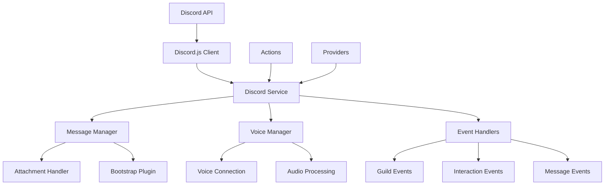

## Overview

The `@elizaos/plugin-discord` package provides comprehensive Discord integration for elizaOS agents. It enables agents to operate as fully-featured Discord bots with support for text channels, voice channels, direct messages, slash commands, and media processing.

This plugin handles all Discord-specific functionality including:
- Initializing and managing the Discord bot connection
- Processing messages and interactions across multiple servers
- Managing voice channel connections and audio processing
- Handling media attachments and transcription
- Implementing Discord-specific actions and state providers
- Supporting channel restrictions and permission management

## Architecture Overview



## Core Components

### Discord Service

The `DiscordService` class is the main entry point for Discord functionality:

```typescript
export class DiscordService extends Service implements IDiscordService {
  static serviceType: string = DISCORD_SERVICE_NAME;
  client: DiscordJsClient | null;
  character: Character;
  messageManager?: MessageManager;
  voiceManager?: VoiceManager;
  private allowedChannelIds?: string[];
  
  constructor(runtime: IAgentRuntime) {
    super(runtime);
    // Initialize Discord client with proper intents
    // Set up event handlers
    // Parse channel restrictions
  }
}
```

#### Key Responsibilities:

1. **Client Initialization**
   - Creates Discord.js client with required intents
   - Handles authentication with bot token
   - Manages connection lifecycle

2. **Event Registration**
   - Listens for Discord events (messages, interactions, etc.)
   - Routes events to appropriate handlers
   - Manages event cleanup on disconnect

3. **Channel Restrictions**
   - Parses `CHANNEL_IDS` environment variable
   - Enforces channel-based access control
   - Filters messages based on allowed channels

4. **Component Coordination**
   - Initializes MessageManager and VoiceManager
   - Coordinates between different components
   - Manages shared state and resources

### Message Manager

The `MessageManager` class handles all message-related operations:

```typescript
export class MessageManager {
  private client: DiscordJsClient;
  private runtime: IAgentRuntime;
  private inlinePositionalCallbacks: Map<string, (message: DiscordMessage, args: string) => void>;
  
  async handleMessage(message: DiscordMessage): Promise<void> {
    // Convert Discord message to elizaOS format
    // Process attachments
    // Send to bootstrap plugin
    // Handle response
  }
  
  async processAttachments(message: DiscordMessage): Promise<Content[]> {
    // Download and process media files
    // Generate descriptions for images
    // Transcribe audio/video
  }
}
```

#### Message Processing Flow:

1. **Message Reception**
   ```typescript
   // Discord message received
   if (message.author.bot) return; // Ignore bot messages
   if (!this.shouldProcessMessage(message)) return;
   ```

2. **Format Conversion**
   ```typescript
   const elizaMessage = await this.convertMessage(message);
   elizaMessage.channelId = message.channel.id;
   elizaMessage.serverId = message.guild?.id;
   ```

3. **Attachment Processing**
   ```typescript
   if (message.attachments.size > 0) {
     elizaMessage.attachments = await this.processAttachments(message);
   }
   ```

4. **Response Handling**
   ```typescript
   const callback = async (response: Content) => {
     await this.sendResponse(message.channel, response);
   };
   ```

### Voice Manager

The `VoiceManager` class manages voice channel operations:

```typescript
export class VoiceManager {
  private client: DiscordJsClient;
  private runtime: IAgentRuntime;
  private connections: Map<string, VoiceConnection>;
  
  async joinChannel(channel: VoiceChannel): Promise<void> {
    // Create voice connection
    // Set up audio processing
    // Handle connection events
  }
  
  async processAudioStream(stream: AudioStream): Promise<void> {
    // Process incoming audio
    // Send to transcription service
    // Handle transcribed text
  }
}
```

#### Voice Features:

1. **Connection Management**
   - Join/leave voice channels
   - Handle connection state changes
   - Manage multiple connections

2. **Audio Processing**
   - Capture audio streams
   - Process voice activity
   - Handle speaker changes

3. **Transcription Integration**
   - Send audio to transcription services
   - Process transcribed text
   - Generate responses

### Attachment Handler

Processes various types of Discord attachments:

```typescript
export async function processAttachments(
  attachments: Attachment[],
  runtime: IAgentRuntime
): Promise<Content[]> {
  const contents: Content[] = [];
  
  for (const attachment of attachments) {
    if (isImage(attachment)) {
      // Process image with vision model
      const description = await describeImage(attachment.url, runtime);
      contents.push({ type: 'image', description });
    } else if (isAudio(attachment)) {
      // Transcribe audio
      const transcript = await transcribeAudio(attachment.url, runtime);
      contents.push({ type: 'audio', transcript });
    }
  }
  
  return contents;
}
```

## Event Processing Flow

### 1. Guild Join Event

```typescript
client.on(Events.GuildCreate, async (guild: Guild) => {
  // Create server room
  await createGuildRoom(guild);
  
  // Emit WORLD_JOINED event
  runtime.emitEvent([DiscordEventTypes.GUILD_CREATE, EventType.WORLD_JOINED], {
    world: convertGuildToWorld(guild),
    runtime
  });
  
  // Register slash commands
  await registerCommands(guild);
});
```

### 2. Message Create Event

```typescript
client.on(Events.MessageCreate, async (message: DiscordMessage) => {
  // Check permissions and filters
  if (!shouldProcessMessage(message)) return;
  
  // Process through MessageManager
  await messageManager.handleMessage(message);
  
  // Track conversation context
  updateConversationContext(message);
});
```

### 3. Interaction Create Event

```typescript
client.on(Events.InteractionCreate, async (interaction: Interaction) => {
  if (!interaction.isChatInputCommand()) return;
  
  // Route to appropriate handler
  const handler = commandHandlers.get(interaction.commandName);
  if (handler) {
    await handler(interaction, runtime);
  }
});
```

## Actions

### chatWithAttachments

Handles messages that include media attachments:

```typescript
export const chatWithAttachments: Action = {
  name: "CHAT_WITH_ATTACHMENTS",
  description: "Process and respond to messages with attachments",
  
  async handler(runtime, message, state, options, callback) {
    // Process attachments
    const processedContent = await processAttachments(
      message.attachments,
      runtime
    );
    
    // Generate response considering attachments
    const response = await generateResponse(
      message,
      processedContent,
      runtime
    );
    
    // Send response
    await callback(response);
  }
};
```

### joinVoice

Connects the bot to a voice channel:

```typescript
export const joinVoice: Action = {
  name: "JOIN_VOICE",
  description: "Join a voice channel",
  
  async handler(runtime, message, state, options, callback) {
    const channelId = options.channelId || message.channelId;
    const channel = await client.channels.fetch(channelId);
    
    if (channel?.type === ChannelType.GuildVoice) {
      await voiceManager.joinChannel(channel);
      await callback({
        text: `Joined voice channel: ${channel.name}`
      });
    }
  }
};
```

### transcribeMedia

Transcribes audio or video files:

```typescript
export const transcribeMedia: Action = {
  name: "TRANSCRIBE_MEDIA",
  description: "Convert audio/video to text",
  
  async handler(runtime, message, state, options, callback) {
    const mediaUrl = options.url || message.attachments?.[0]?.url;
    
    if (mediaUrl) {
      const transcript = await transcribeAudio(mediaUrl, runtime);
      await callback({
        text: `Transcript: ${transcript}`
      });
    }
  }
};
```

## Providers

### channelStateProvider

Provides current Discord channel context:

```typescript
export const channelStateProvider: Provider = {
  name: "CHANNEL_STATE",
  description: "Current Discord channel information",
  
  async get(runtime, message, state) {
    const channelId = message.channelId;
    const channel = await client.channels.fetch(channelId);
    
    return {
      channelId,
      channelName: channel?.name,
      channelType: channel?.type,
      guildId: channel?.guild?.id,
      guildName: channel?.guild?.name,
      memberCount: channel?.guild?.memberCount
    };
  }
};
```

### voiceStateProvider

Provides voice channel state information:

```typescript
export const voiceStateProvider: Provider = {
  name: "VOICE_STATE",
  description: "Voice channel state and members",
  
  async get(runtime, message, state) {
    const voiceChannel = getCurrentVoiceChannel(message.serverId);
    
    if (!voiceChannel) return null;
    
    return {
      channelId: voiceChannel.id,
      channelName: voiceChannel.name,
      members: voiceChannel.members.map(m => ({
        id: m.id,
        name: m.displayName,
        speaking: m.voice.speaking
      })),
      connection: {
        state: voiceConnection?.state,
        ping: voiceConnection?.ping
      }
    };
  }
};
```

## Configuration

### Environment Variables

```bash
# Required
DISCORD_APPLICATION_ID=123456789012345678
DISCORD_API_TOKEN=your-bot-token-here

# Optional Channel Restrictions
CHANNEL_IDS=123456789012345678,987654321098765432

# Voice Configuration
DISCORD_VOICE_CHANNEL_ID=123456789012345678
VOICE_ACTIVITY_THRESHOLD=0.5

# Testing
DISCORD_TEST_CHANNEL_ID=123456789012345678
```

### Bot Permissions

Required Discord permissions:

```typescript
const requiredPermissions = new PermissionsBitField([
  // Text Permissions
  PermissionsBitField.Flags.ViewChannel,
  PermissionsBitField.Flags.SendMessages,
  PermissionsBitField.Flags.SendMessagesInThreads,
  PermissionsBitField.Flags.CreatePublicThreads,
  PermissionsBitField.Flags.CreatePrivateThreads,
  PermissionsBitField.Flags.EmbedLinks,
  PermissionsBitField.Flags.AttachFiles,
  PermissionsBitField.Flags.ReadMessageHistory,
  PermissionsBitField.Flags.AddReactions,
  PermissionsBitField.Flags.UseExternalEmojis,
  
  // Voice Permissions
  PermissionsBitField.Flags.Connect,
  PermissionsBitField.Flags.Speak,
  PermissionsBitField.Flags.UseVAD,
  
  // Application Commands
  PermissionsBitField.Flags.UseApplicationCommands
]);
```

### Bot Invitation

Generate an invitation URL:

```typescript
const inviteUrl = `https://discord.com/api/oauth2/authorize?` +
  `client_id=${DISCORD_APPLICATION_ID}` +
  `&permissions=${requiredPermissions.bitfield}` +
  `&scope=bot%20applications.commands`;
```

## Multi-Server Architecture

The plugin supports operating across multiple Discord servers simultaneously:

### Server Isolation

Each server maintains its own:
- Conversation context
- User relationships
- Channel states
- Voice connections

```typescript
// Server-specific context
const serverContext = new Map<string, ServerContext>();

interface ServerContext {
  guildId: string;
  conversations: Map<string, Conversation>;
  voiceConnection?: VoiceConnection;
  settings: ServerSettings;
}
```

### Command Registration

Slash commands are registered per-server:

```typescript
async function registerServerCommands(guild: Guild) {
  const commands = [
    {
      name: 'chat',
      description: 'Chat with the bot',
      options: [{
        name: 'message',
        type: ApplicationCommandOptionType.String,
        description: 'Your message',
        required: true
      }]
    }
  ];
  
  await guild.commands.set(commands);
}
```

## Permission Management

### Permission Checking

Before performing actions:

```typescript
function checkPermissions(
  channel: GuildChannel,
  permissions: PermissionsBitField
): boolean {
  const botMember = channel.guild.members.me;
  if (!botMember) return false;
  
  const channelPerms = channel.permissionsFor(botMember);
  return channelPerms?.has(permissions) ?? false;
}
```

### Error Handling

Handle permission errors gracefully:

```typescript
try {
  await channel.send(response);
} catch (error) {
  if (error.code === 50013) { // Missing Permissions
    logger.warn(`Missing permissions in channel ${channel.id}`);
    // Try to notify in a channel where we have permissions
    await notifyPermissionError(channel.guild);
  }
}
```

## Performance Optimization

### Message Caching

Cache frequently accessed data:

```typescript
const messageCache = new LRUCache<string, ProcessedMessage>({
  max: 1000,
  ttl: 1000 * 60 * 60 // 1 hour
});
```

### Rate Limiting

Implement rate limiting for API calls:

```typescript
const rateLimiter = new RateLimiter({
  windowMs: 60000, // 1 minute
  max: 30 // 30 requests per minute
});
```

### Voice Connection Pooling

Reuse voice connections:

```typescript
const voiceConnectionPool = new Map<string, VoiceConnection>();

async function getOrCreateVoiceConnection(
  channel: VoiceChannel
): Promise<VoiceConnection> {
  const existing = voiceConnectionPool.get(channel.guild.id);
  if (existing?.state.status === VoiceConnectionStatus.Ready) {
    return existing;
  }
  
  const connection = await createNewConnection(channel);
  voiceConnectionPool.set(channel.guild.id, connection);
  return connection;
}
```

## Error Handling

### Connection Errors

Handle Discord connection issues:

```typescript
client.on('error', (error) => {
  logger.error('Discord client error:', error);
  // Attempt reconnection
  scheduleReconnection();
});

client.on('disconnect', () => {
  logger.warn('Discord client disconnected');
  // Clean up resources
  cleanupConnections();
});
```

### API Errors

Handle Discord API errors:

```typescript
async function handleDiscordAPIError(error: DiscordAPIError) {
  switch (error.code) {
    case 10008: // Unknown Message
      logger.debug('Message not found, may have been deleted');
      break;
    case 50001: // Missing Access
      logger.warn('Bot lacks access to channel');
      break;
    case 50013: // Missing Permissions
      logger.warn('Bot missing required permissions');
      break;
    default:
      logger.error('Discord API error:', error);
  }
}
```

## Integration Guide

### Basic Setup

```typescript
import { discordPlugin } from '@elizaos/plugin-discord';
import { AgentRuntime } from '@elizaos/core';

const runtime = new AgentRuntime({
  plugins: [discordPlugin],
  character: {
    name: "MyBot",
    clients: ["discord"],
    settings: {
      DISCORD_APPLICATION_ID: process.env.DISCORD_APPLICATION_ID,
      DISCORD_API_TOKEN: process.env.DISCORD_API_TOKEN
    }
  }
});

await runtime.start();
```

### Custom Actions

Add Discord-specific actions:

```typescript
const customDiscordAction: Action = {
  name: "DISCORD_CUSTOM",
  description: "Custom Discord action",
  
  async handler(runtime, message, state, options, callback) {
    // Access Discord-specific context
    const discordService = runtime.getService('discord') as DiscordService;
    const channel = await discordService.client.channels.fetch(message.channelId);
    
    // Perform Discord-specific operations
    if (channel?.type === ChannelType.GuildText) {
      await channel.setTopic('Updated by bot');
    }
    
    await callback({
      text: "Custom action completed"
    });
  }
};
```

### Event Handlers

Listen for Discord-specific events:

```typescript
runtime.on(DiscordEventTypes.GUILD_MEMBER_ADD, async (event) => {
  const { member, guild } = event;
  
  // Welcome new members
  const welcomeChannel = guild.channels.cache.find(
    ch => ch.name === 'welcome'
  );
  
  if (welcomeChannel?.type === ChannelType.GuildText) {
    await welcomeChannel.send(`Welcome ${member.user.username}!`);
  }
});
```

## Best Practices

1. **Token Security**
   ```typescript
   // Never hardcode tokens
   const token = process.env.DISCORD_API_TOKEN;
   if (!token) throw new Error('Discord token not configured');
   ```

2. **Error Recovery**
   ```typescript
   // Implement exponential backoff
   async function retryWithBackoff(fn: Function, maxRetries = 3) {
     for (let i = 0; i < maxRetries; i++) {
       try {
         return await fn();
       } catch (error) {
         if (i === maxRetries - 1) throw error;
         await sleep(Math.pow(2, i) * 1000);
       }
     }
   }
   ```

3. **Resource Cleanup**
   ```typescript
   // Clean up on shutdown
   process.on('SIGINT', async () => {
     await voiceManager.disconnectAll();
     client.destroy();
     process.exit(0);
   });
   ```

4. **Monitoring**
   ```typescript
   // Track performance metrics
   const metrics = {
     messagesProcessed: 0,
     averageResponseTime: 0,
     activeVoiceConnections: 0
   };
   ```

## Debugging

Enable debug logging:

```bash
DEBUG=eliza:discord:* npm run start
```

Common debug points:
- Connection establishment
- Message processing pipeline
- Voice connection state
- Permission checks
- API rate limits

## Support

For issues and questions:
- 📚 Check the [examples](./examples.mdx)
- 💬 Join our [Discord community](https://discord.gg/elizaos)
- 🐛 Report issues on [GitHub](https://github.com/elizaos/eliza/issues)