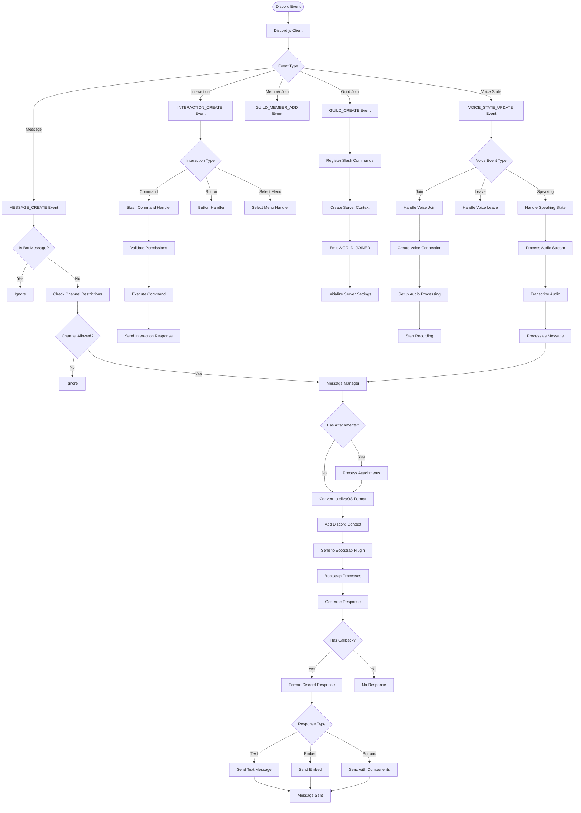
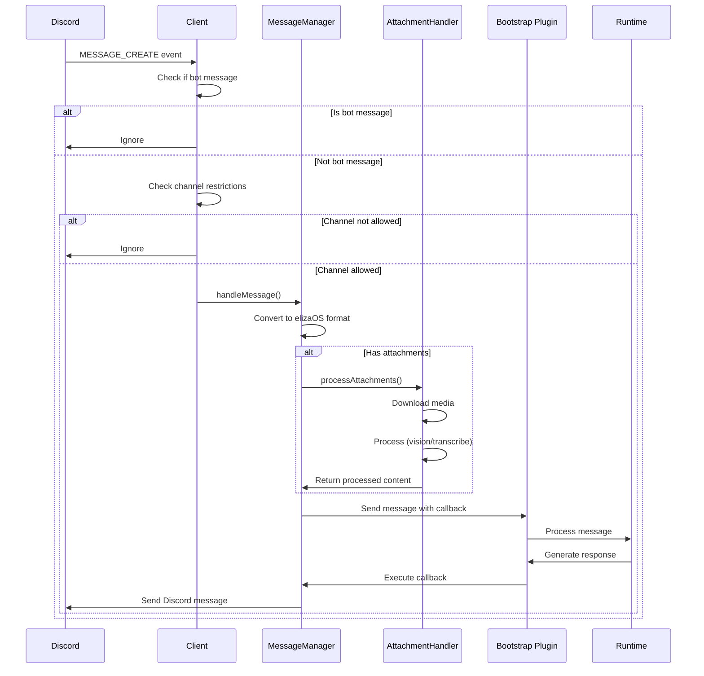
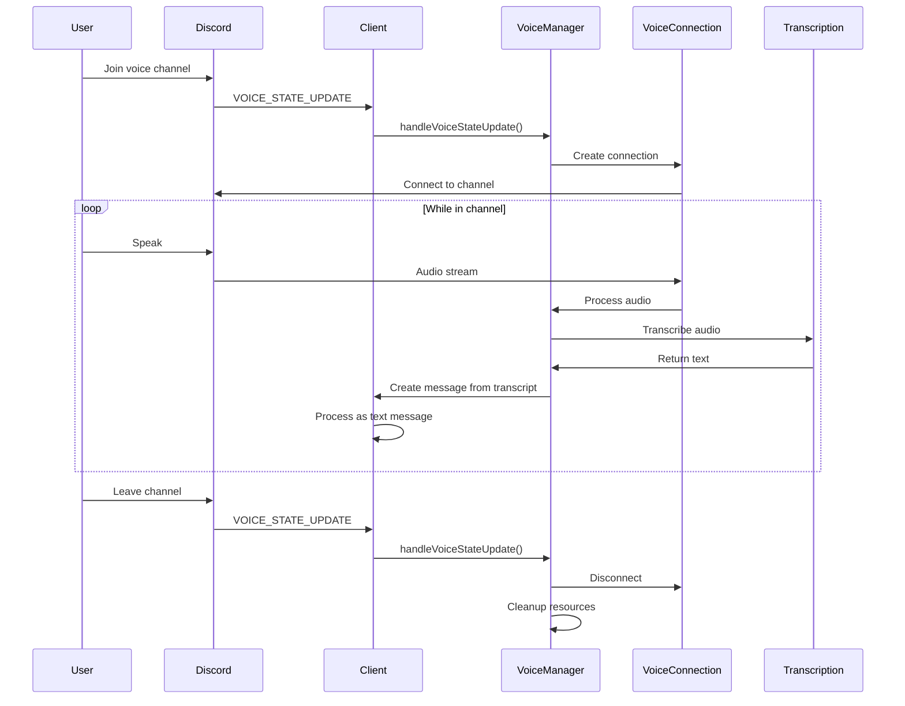
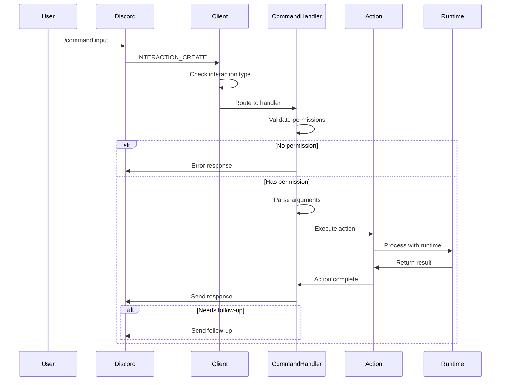
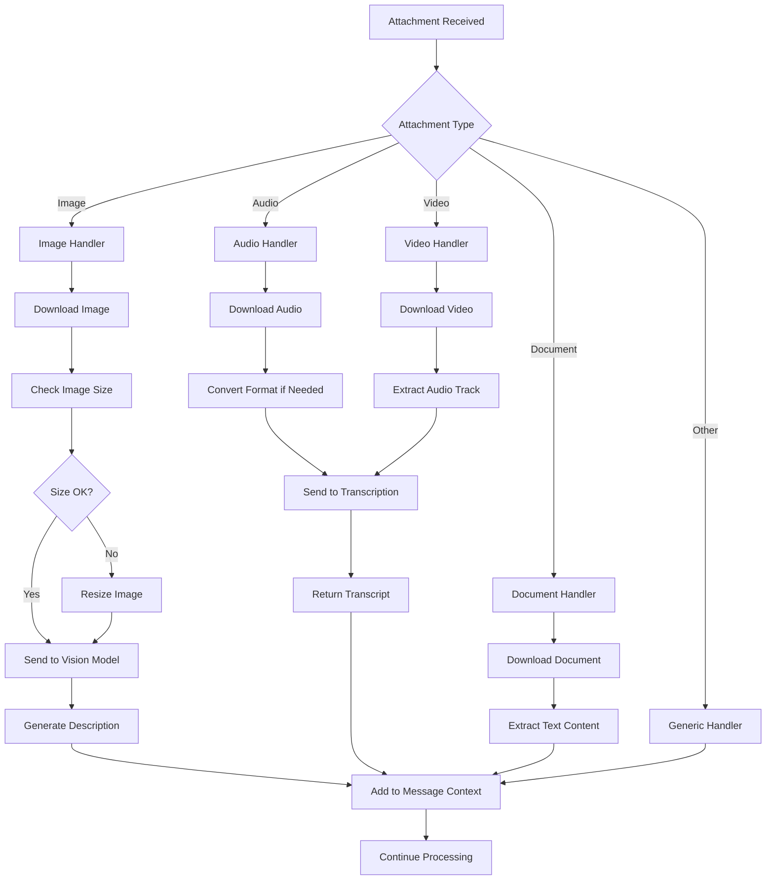
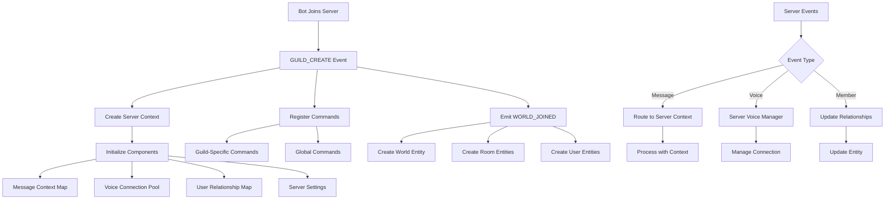
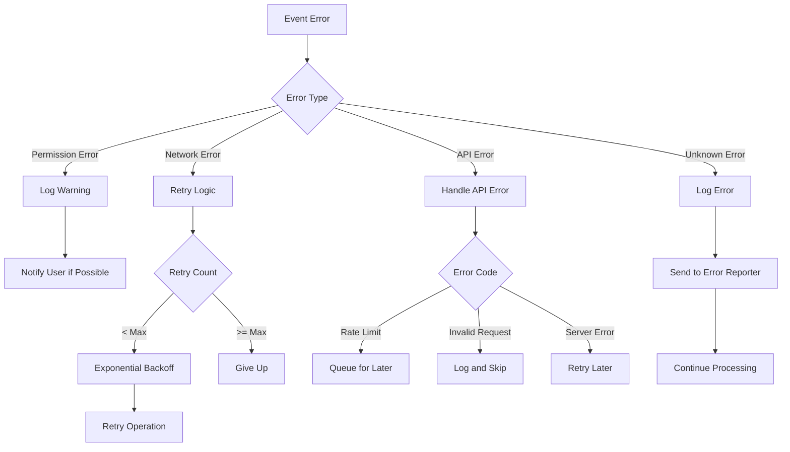

This document provides a comprehensive breakdown of how events flow through the Discord plugin system.

## Complete Event Flow Diagram



## Detailed Event Flows

### 1. Message Processing Flow



### 2. Voice Channel Flow



### 3. Slash Command Flow



### 4. Attachment Processing Flow



### 5. Multi-Server Event Flow



## Event Type Reference

### Discord.js Events

| Event | Description | Plugin Handler |
|-------|-------------|----------------|
| `ready` | Client is ready | Initialize services |
| `messageCreate` | New message | MessageManager |
| `messageUpdate` | Message edited | MessageManager |
| `messageDelete` | Message deleted | Cleanup handler |
| `interactionCreate` | Slash command/button | Interaction router |
| `guildCreate` | Bot joins server | Server initializer |
| `guildDelete` | Bot leaves server | Cleanup handler |
| `guildMemberAdd` | Member joins | Relationship manager |
| `voiceStateUpdate` | Voice state change | VoiceManager |
| `error` | Client error | Error handler |
| `disconnect` | Lost connection | Reconnection handler |

### elizaOS Events Emitted

| Event | When Emitted | Payload |
|-------|--------------|---------|
| `WORLD_JOINED` | Bot joins server | World, rooms, entities |
| `MESSAGE_RECEIVED` | Message processed | elizaOS message format |
| `VOICE_MESSAGE_RECEIVED` | Voice transcribed | Transcribed message |
| `REACTION_RECEIVED` | Reaction added | Reaction details |
| `INTERACTION_RECEIVED` | Slash command used | Interaction data |

## State Management

### Message Context

```typescript
interface MessageContext {
  channelId: string;
  serverId: string;
  userId: string;
  threadId?: string;
  referencedMessageId?: string;
  attachments: ProcessedAttachment[];
  discordMetadata: {
    messageId: string;
    timestamp: number;
    editedTimestamp?: number;
    isPinned: boolean;
    mentions: string[];
  };
}
```

### Voice Context

```typescript
interface VoiceContext {
  channelId: string;
  serverId: string;
  connection: VoiceConnection;
  activeUsers: Map<string, VoiceUserState>;
  recordingState: {
    isRecording: boolean;
    startTime?: number;
    audioBuffer: Buffer[];
  };
}
```

## Error Handling in Event Flow

### Error Propagation



## Performance Considerations

### Event Batching

For high-volume servers, events are batched:

```typescript
class EventBatcher {
  private messageQueue: DiscordMessage[] = [];
  private batchTimer?: NodeJS.Timeout;
  
  addMessage(message: DiscordMessage) {
    this.messageQueue.push(message);
    
    if (!this.batchTimer) {
      this.batchTimer = setTimeout(() => {
        this.processBatch();
      }, 100); // 100ms batch window
    }
  }
  
  private async processBatch() {
    const batch = [...this.messageQueue];
    this.messageQueue = [];
    this.batchTimer = undefined;
    
    // Process messages in parallel
    await Promise.all(
      batch.map(msg => this.processMessage(msg))
    );
  }
}
```

### Connection Pooling

Voice connections are pooled to reduce overhead:

```typescript
class VoiceConnectionPool {
  private connections = new Map<string, VoiceConnection>();
  private maxConnections = 10;
  
  async getConnection(channelId: string): Promise<VoiceConnection> {
    // Reuse existing connection
    const existing = this.connections.get(channelId);
    if (existing?.state.status === VoiceConnectionStatus.Ready) {
      return existing;
    }
    
    // Check pool limit
    if (this.connections.size >= this.maxConnections) {
      await this.evictOldestConnection();
    }
    
    // Create new connection
    const connection = await this.createConnection(channelId);
    this.connections.set(channelId, connection);
    return connection;
  }
}
```

## Monitoring Event Flow

### Event Metrics

Track event processing metrics:

```typescript
interface EventMetrics {
  eventType: string;
  processingTime: number;
  success: boolean;
  errorType?: string;
  serverId: string;
  channelId: string;
}

class EventMonitor {
  private metrics: EventMetrics[] = [];
  
  recordEvent(metric: EventMetrics) {
    this.metrics.push(metric);
    
    // Log slow events
    if (metric.processingTime > 1000) {
      logger.warn(`Slow event processing: ${metric.eventType} took ${metric.processingTime}ms`);
    }
  }
  
  getStats() {
    return {
      totalEvents: this.metrics.length,
      averageProcessingTime: this.calculateAverage(),
      errorRate: this.calculateErrorRate(),
      eventBreakdown: this.getEventTypeBreakdown()
    };
  }
}
```

## Best Practices

1. **Event Debouncing**
   - Debounce rapid events (typing indicators, voice state)
   - Batch similar events when possible

2. **Error Isolation**
   - Don't let one event error affect others
   - Use try-catch at event handler level

3. **Resource Management**
   - Clean up event listeners on disconnect
   - Limit concurrent event processing

4. **Monitoring**
   - Track event processing times
   - Monitor error rates by event type
   - Alert on unusual patterns