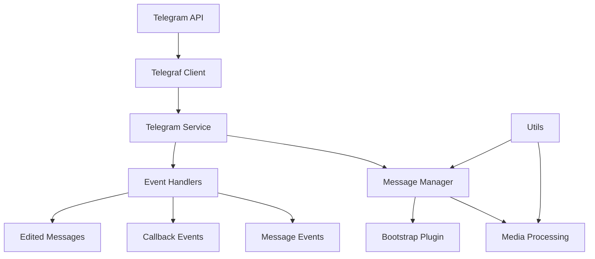
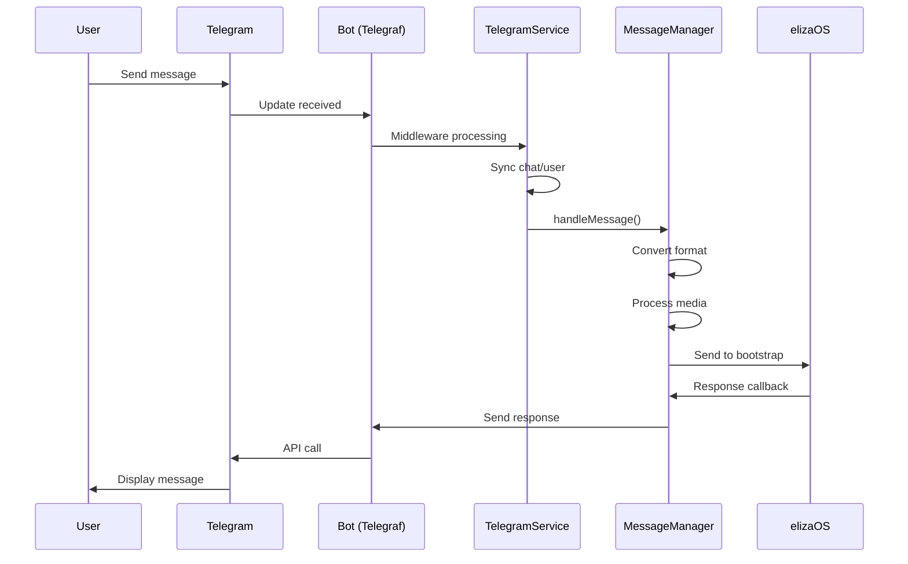
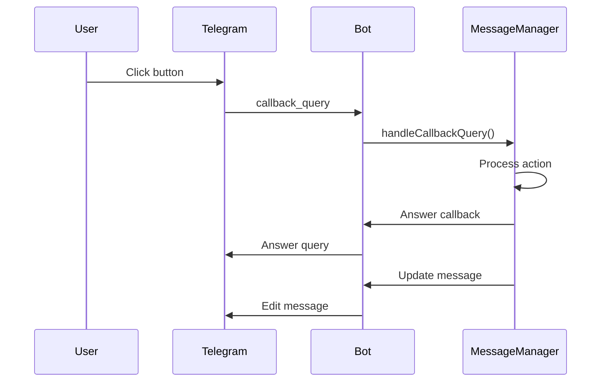

## Overview

The `@elizaos/plugin-telegram` package provides comprehensive Telegram Bot API integration for elizaOS agents. It enables agents to operate as Telegram bots with support for private chats, groups, channels, media processing, interactive buttons, and forum topics.

This plugin handles all Telegram-specific functionality including:
- Initializing and managing the Telegram bot connection via Telegraf
- Processing messages across different chat types
- Handling media attachments and documents
- Managing interactive UI elements (buttons, keyboards)
- Supporting forum topics as separate conversation contexts
- Implementing access control and chat restrictions

## Architecture Overview



## Core Components

### Telegram Service

The `TelegramService` class is the main entry point for Telegram functionality:

```typescript
export class TelegramService extends Service {
  static serviceType = TELEGRAM_SERVICE_NAME;
  private bot: Telegraf<Context> | null;
  public messageManager: MessageManager | null;
  private knownChats: Map<string, any> = new Map();
  private syncedEntityIds: Set<string> = new Set<string>();
  
  constructor(runtime: IAgentRuntime) {
    super(runtime);
    // Initialize bot with token
    // Set up middleware
    // Configure event handlers
  }
}
```

#### Key Responsibilities:

1. **Bot Initialization**
   - Creates Telegraf instance with bot token
   - Configures API root if custom endpoint provided
   - Handles connection lifecycle

2. **Middleware Setup**
   - Preprocesses incoming updates
   - Manages chat synchronization
   - Handles user entity creation

3. **Event Registration**
   - Message handlers
   - Callback query handlers
   - Edited message handlers

4. **Chat Management**
   - Tracks known chats
   - Syncs chat metadata
   - Manages access control

### Message Manager

The `MessageManager` class handles all message-related operations:

```typescript
export class MessageManager {
  private bot: Telegraf<Context>;
  private runtime: IAgentRuntime;
  private messageHistory: Map<string, Array<TelegramMessage>>;
  private messageCallbacks: Map<string, (response: Content) => void>;
  
  async handleMessage(ctx: Context): Promise<void> {
    // Convert Telegram message to elizaOS format
    // Process media if present
    // Send to bootstrap plugin
    // Handle response
  }
  
  async sendMessageToTelegram(
    chatId: number | string,
    content: Content,
    replyToMessageId?: number
  ): Promise<void> {
    // Format content for Telegram
    // Handle buttons/keyboards
    // Send via bot API
  }
}
```

#### Message Processing Flow:

1. **Message Reception**
   ```typescript
   // Telegram message received
   const message = ctx.message;
   if (!this.shouldProcessMessage(ctx)) return;
   ```

2. **Format Conversion**
   ```typescript
   const elizaMessage: ElizaMessage = {
     content: {
       text: message.text || message.caption || '',
       attachments: await this.processAttachments(message)
     },
     userId: createUniqueUuid(ctx.from.id.toString()),
     channelId: ctx.chat.id.toString(),
     roomId: this.getRoomId(ctx)
   };
   ```

3. **Media Processing**
   ```typescript
   if (message.photo || message.document || message.voice) {
     elizaMessage.content.attachments = await processMediaAttachments(
       ctx,
       this.bot,
       this.runtime
     );
   }
   ```

4. **Response Handling**
   ```typescript
   const callback = async (response: Content) => {
     await this.sendMessageToTelegram(
       ctx.chat.id,
       response,
       message.message_id
     );
   };
   ```

### Utilities

Various utility functions support the core functionality:

```typescript
// Media processing
export async function processMediaAttachments(
  ctx: Context,
  bot: Telegraf,
  runtime: IAgentRuntime
): Promise<Attachment[]> {
  const attachments: Attachment[] = [];
  
  if (ctx.message?.photo) {
    // Process photo
    const photo = ctx.message.photo[ctx.message.photo.length - 1];
    const file = await bot.telegram.getFile(photo.file_id);
    // Download and process...
  }
  
  if (ctx.message?.voice) {
    // Process voice message
    const voice = ctx.message.voice;
    const file = await bot.telegram.getFile(voice.file_id);
    // Transcribe audio...
  }
  
  return attachments;
}

// Button creation
export function createInlineKeyboard(buttons: Button[]): InlineKeyboardMarkup {
  const keyboard = buttons.map(button => [{
    text: button.text,
    ...(button.url ? { url: button.url } : { callback_data: button.callback_data })
  }]);
  
  return { inline_keyboard: keyboard };
}
```

## Event Processing Flow

### Message Flow



### Callback Query Flow



## Configuration

### Environment Variables

```bash
# Required
TELEGRAM_BOT_TOKEN=123456:ABC-DEF1234ghIkl-zyx57W2v1u123ew11

# Optional
TELEGRAM_API_ROOT=https://api.telegram.org  # Custom API endpoint
TELEGRAM_ALLOWED_CHATS=["123456789", "-987654321"]  # JSON array of chat IDs

# Testing
TELEGRAM_TEST_CHAT_ID=-1001234567890  # Test chat for integration tests
```

### Character Configuration

```typescript
const character = {
  name: "TelegramBot",
  clients: ["telegram"],
  settings: {
    // Bot behavior
    allowDirectMessages: true,
    shouldOnlyJoinInAllowedGroups: false,
    allowedGroupIds: ["-123456789", "-987654321"],
    messageTrackingLimit: 100,
    
    // Templates
    templates: {
      telegramMessageHandlerTemplate: "Custom message template",
      telegramShouldRespondTemplate: "Custom decision template"
    }
  }
};
```

### Bot Creation

1. **Create Bot with BotFather**
   ```
   1. Open @BotFather in Telegram
   2. Send /newbot
   3. Choose a name for your bot
   4. Choose a username (must end in 'bot')
   5. Save the token provided
   ```

2. **Configure Bot Settings**
   ```
   /setprivacy - Disable for group message access
   /setcommands - Set bot commands
   /setdescription - Add bot description
   /setabouttext - Set about text
   ```

## Message Handling

### Message Types

The plugin handles various Telegram message types:

```typescript
// Text messages
if (ctx.message?.text) {
  content.text = ctx.message.text;
}

// Media messages
if (ctx.message?.photo) {
  // Process photo with caption
  content.text = ctx.message.caption || '';
  content.attachments = await processPhoto(ctx.message.photo);
}

// Voice messages
if (ctx.message?.voice) {
  // Transcribe voice to text
  const transcript = await transcribeVoice(ctx.message.voice);
  content.text = transcript;
}

// Documents
if (ctx.message?.document) {
  // Process document
  content.attachments = await processDocument(ctx.message.document);
}
```

### Message Context

Each message maintains context about its origin:

```typescript
interface TelegramMessageContext {
  chatId: string;
  chatType: 'private' | 'group' | 'supergroup' | 'channel';
  messageId: number;
  userId: string;
  username?: string;
  threadId?: number;  // For forum topics
  replyToMessageId?: number;
}
```

### Message History

The plugin tracks conversation history:

```typescript
class MessageHistory {
  private history: Map<string, TelegramMessage[]> = new Map();
  private limit: number;
  
  addMessage(chatId: string, message: TelegramMessage) {
    const messages = this.history.get(chatId) || [];
    messages.push(message);
    
    // Maintain limit
    if (messages.length > this.limit) {
      messages.splice(0, messages.length - this.limit);
    }
    
    this.history.set(chatId, messages);
  }
  
  getHistory(chatId: string): TelegramMessage[] {
    return this.history.get(chatId) || [];
  }
}
```

## Media Processing

### Image Processing

```typescript
async function processPhoto(
  photos: PhotoSize[],
  bot: Telegraf,
  runtime: IAgentRuntime
): Promise<Attachment> {
  // Get highest resolution photo
  const photo = photos[photos.length - 1];
  
  // Get file info
  const file = await bot.telegram.getFile(photo.file_id);
  const url = `https://api.telegram.org/file/bot${token}/${file.file_path}`;
  
  // Download and analyze
  const description = await analyzeImage(url, runtime);
  
  return {
    type: 'image',
    url,
    description,
    metadata: {
      fileId: photo.file_id,
      width: photo.width,
      height: photo.height
    }
  };
}
```

### Voice Transcription

```typescript
async function transcribeVoice(
  voice: Voice,
  bot: Telegraf,
  runtime: IAgentRuntime
): Promise<string> {
  // Get voice file
  const file = await bot.telegram.getFile(voice.file_id);
  const url = `https://api.telegram.org/file/bot${token}/${file.file_path}`;
  
  // Download audio
  const audioBuffer = await downloadFile(url);
  
  // Transcribe using runtime's transcription service
  const transcript = await runtime.transcribe(audioBuffer, {
    mimeType: voice.mime_type || 'audio/ogg',
    duration: voice.duration
  });
  
  return transcript;
}
```

### Document Handling

```typescript
async function processDocument(
  document: Document,
  bot: Telegraf,
  runtime: IAgentRuntime
): Promise<Attachment> {
  const file = await bot.telegram.getFile(document.file_id);
  const url = `https://api.telegram.org/file/bot${token}/${file.file_path}`;
  
  // Process based on MIME type
  if (document.mime_type?.startsWith('image/')) {
    return processImageDocument(document, url, runtime);
  } else if (document.mime_type?.startsWith('text/')) {
    return processTextDocument(document, url, runtime);
  }
  
  // Generic document
  return {
    type: 'document',
    url,
    name: document.file_name,
    mimeType: document.mime_type
  };
}
```

## Interactive Elements

### Inline Keyboards

Create interactive button layouts:

```typescript
// Simple button layout
const keyboard = {
  inline_keyboard: [[
    { text: "Option 1", callback_data: "opt_1" },
    { text: "Option 2", callback_data: "opt_2" }
  ], [
    { text: "Cancel", callback_data: "cancel" }
  ]]
};

// URL buttons
const urlKeyboard = {
  inline_keyboard: [[
    { text: "Visit Website", url: "https://example.com" },
    { text: "Documentation", url: "https://docs.example.com" }
  ]]
};

// Mixed buttons
const mixedKeyboard = {
  inline_keyboard: [[
    { text: "Action", callback_data: "action" },
    { text: "Learn More", url: "https://example.com" }
  ]]
};
```

### Callback Handling

Process button clicks:

```typescript
bot.on('callback_query', async (ctx) => {
  const callbackData = ctx.callbackQuery.data;
  
  // Answer callback to remove loading state
  await ctx.answerCbQuery();
  
  // Process based on callback data
  switch (callbackData) {
    case 'opt_1':
      await ctx.editMessageText('You selected Option 1');
      break;
    case 'opt_2':
      await ctx.editMessageText('You selected Option 2');
      break;
    case 'cancel':
      await ctx.deleteMessage();
      break;
  }
});
```

### Reply Keyboards

Create custom keyboard layouts:

```typescript
const replyKeyboard = {
  keyboard: [
    ['Button 1', 'Button 2'],
    ['Button 3', 'Button 4'],
    ['Cancel']
  ],
  resize_keyboard: true,
  one_time_keyboard: true
};

await ctx.reply('Choose an option:', {
  reply_markup: replyKeyboard
});
```

## Group Management

### Access Control

Restrict bot to specific groups:

```typescript
function checkGroupAccess(ctx: Context): boolean {
  if (!this.runtime.character.shouldOnlyJoinInAllowedGroups) {
    return true;
  }
  
  const allowedGroups = this.runtime.character.allowedGroupIds || [];
  const chatId = ctx.chat?.id.toString();
  
  return allowedGroups.includes(chatId);
}
```

### Group Features

Handle group-specific functionality:

```typescript
// Check if bot is admin
async function isBotAdmin(ctx: Context): Promise<boolean> {
  const botId = ctx.botInfo.id;
  const member = await ctx.getChatMember(botId);
  
  return member.status === 'administrator' || member.status === 'creator';
}

// Get group info
async function getGroupInfo(ctx: Context) {
  const chat = await ctx.getChat();
  
  return {
    id: chat.id,
    title: chat.title,
    type: chat.type,
    memberCount: await ctx.getChatMembersCount(),
    description: chat.description
  };
}
```

### Privacy Mode

Handle bot privacy settings:

```typescript
// With privacy mode disabled (recommended)
// Bot receives all messages in groups

// With privacy mode enabled
// Bot only receives:
// - Messages that mention the bot
// - Replies to bot's messages
// - Commands
```

## Forum Topics

### Topic Detection

Identify and handle forum topics:

```typescript
function getTopicId(ctx: Context): number | undefined {
  // Forum messages have thread_id
  return ctx.message?.message_thread_id;
}

function getRoomId(ctx: Context): string {
  const chatId = ctx.chat.id;
  const topicId = getTopicId(ctx);
  
  if (topicId) {
    // Treat topic as separate room
    return `${chatId}-topic-${topicId}`;
  }
  
  return chatId.toString();
}
```

### Topic Context

Maintain separate context per topic:

```typescript
class TopicManager {
  private topicContexts: Map<string, TopicContext> = new Map();
  
  getContext(chatId: string, topicId?: number): TopicContext {
    const key = topicId ? `${chatId}-${topicId}` : chatId;
    
    if (!this.topicContexts.has(key)) {
      this.topicContexts.set(key, {
        messages: [],
        metadata: {},
        lastActivity: Date.now()
      });
    }
    
    return this.topicContexts.get(key)!;
  }
}
```

## Error Handling

### API Errors

Handle Telegram API errors:

```typescript
async function handleTelegramError(error: any) {
  if (error.response?.error_code === 429) {
    // Rate limited
    const retryAfter = error.response.parameters?.retry_after || 60;
    logger.warn(`Rate limited, retry after ${retryAfter}s`);
    await sleep(retryAfter * 1000);
    return true; // Retry
  }
  
  if (error.response?.error_code === 400) {
    // Bad request
    logger.error('Bad request:', error.response.description);
    return false; // Don't retry
  }
  
  // Network error
  if (error.code === 'ETIMEOUT' || error.code === 'ECONNREFUSED') {
    logger.error('Network error:', error.message);
    return true; // Retry
  }
  
  return false;
}
```

### Multi-Agent Environment

Handle bot token conflicts:

```typescript
// Error: 409 Conflict
// Only one getUpdates request allowed per bot token

// Solution 1: Use different tokens
const bot1 = new Telegraf(process.env.BOT1_TOKEN);
const bot2 = new Telegraf(process.env.BOT2_TOKEN);

// Solution 2: Use webhooks instead of polling
bot.telegram.setWebhook('https://your-domain.com/bot-webhook');

// Solution 3: Single bot, multiple personalities
const multiPersonalityBot = new Telegraf(token);
multiPersonalityBot.use(async (ctx, next) => {
  // Route to different agents based on context
  const agent = selectAgent(ctx);
  await agent.handleUpdate(ctx);
});
```

### Connection Management

Handle connection issues:

```typescript
class ConnectionManager {
  private reconnectAttempts = 0;
  private maxReconnectAttempts = 5;
  
  async connect() {
    try {
      await this.bot.launch();
      this.reconnectAttempts = 0;
    } catch (error) {
      if (this.reconnectAttempts < this.maxReconnectAttempts) {
        this.reconnectAttempts++;
        const delay = Math.min(1000 * Math.pow(2, this.reconnectAttempts), 30000);
        logger.warn(`Reconnecting in ${delay}ms...`);
        await sleep(delay);
        return this.connect();
      }
      throw error;
    }
  }
}
```

## Integration Guide

### Basic Setup

```typescript
import { telegramPlugin } from '@elizaos/plugin-telegram';
import { AgentRuntime } from '@elizaos/core';

const runtime = new AgentRuntime({
  plugins: [telegramPlugin],
  character: {
    name: "TelegramBot",
    clients: ["telegram"],
    settings: {
      TELEGRAM_BOT_TOKEN: process.env.TELEGRAM_BOT_TOKEN
    }
  }
});

await runtime.start();
```

### Custom Message Handler

Override default message handling:

```typescript
const customHandler = {
  name: "CUSTOM_TELEGRAM_HANDLER",
  description: "Custom Telegram message handler",
  
  handler: async (runtime, message, state, options, callback) => {
    // Access Telegram-specific data
    const telegramContext = message.metadata?.telegram;
    
    if (telegramContext?.messageType === 'photo') {
      // Special handling for photos
      const analysis = await analyzePhoto(message.attachments[0]);
      await callback({
        text: `I see: ${analysis}`
      });
      return true;
    }
    
    // Default handling
    return false;
  }
};
```

### Webhook Setup

Configure webhooks for production:

```typescript
// Set webhook
await bot.telegram.setWebhook('https://your-domain.com/telegram-webhook', {
  certificate: fs.readFileSync('path/to/cert.pem'), // Optional
  allowed_updates: ['message', 'callback_query'],
  drop_pending_updates: true
});

// Express webhook handler
app.post('/telegram-webhook', (req, res) => {
  bot.handleUpdate(req.body);
  res.sendStatus(200);
});
```

### Testing

```typescript
describe('Telegram Plugin Tests', () => {
  let service: TelegramService;
  let runtime: AgentRuntime;
  
  beforeAll(async () => {
    runtime = createTestRuntime();
    service = new TelegramService(runtime);
    await service.start();
  });
  
  it('should process text messages', async () => {
    const mockUpdate = createMockTextMessage('Hello bot');
    await service.bot.handleUpdate(mockUpdate);
    
    // Verify response
    expect(mockTelegram.sendMessage).toHaveBeenCalled();
  });
});
```

## Best Practices

1. **Token Security**
   - Never commit tokens to version control
   - Use environment variables
   - Rotate tokens periodically

2. **Rate Limiting**
   - Implement exponential backoff
   - Cache frequently requested data
   - Use bulk operations when possible

3. **Group Management**
   - Always check permissions before actions
   - Handle bot removal gracefully
   - Implement admin controls

4. **Error Handling**
   - Log all API errors
   - Provide user-friendly error messages
   - Implement retry logic for transient errors

5. **Performance**
   - Use webhooks in production
   - Implement message queuing
   - Optimize media processing

## Support

For issues and questions:
- 📚 Check the [examples](./examples.mdx)
- 💬 Join our [Discord community](https://discord.gg/elizaos)
- 🐛 Report issues on [GitHub](https://github.com/elizaos/eliza/issues)