# Telegram Plugin Message Flow - Detailed Breakdown

This document provides a comprehensive breakdown of how messages flow through the Telegram plugin system.

## Complete Message Flow Diagram

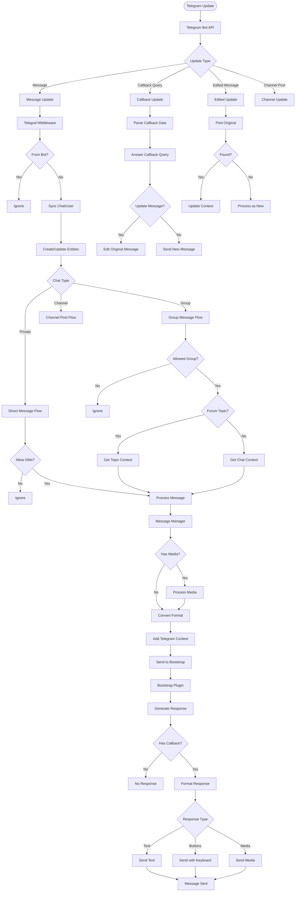

## Detailed Event Flows

### 1. Initial Update Processing

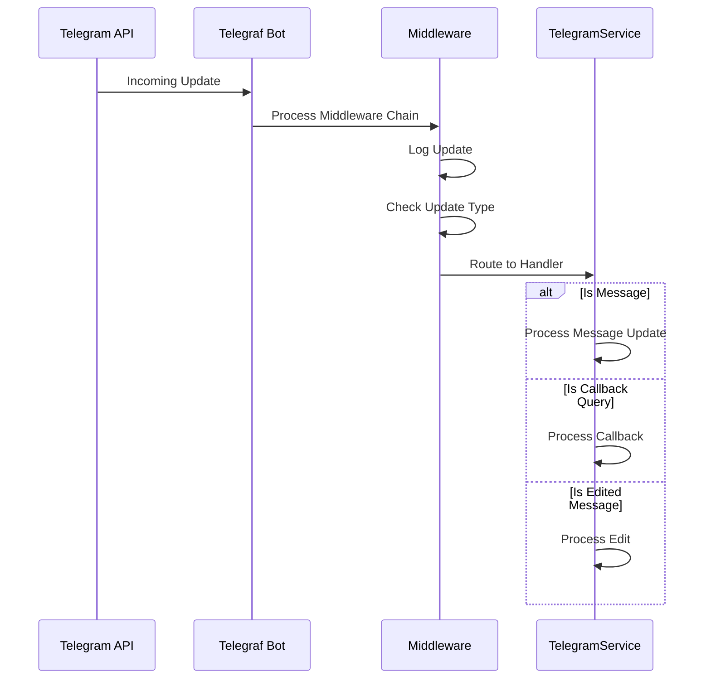

### 2. Chat/User Synchronization

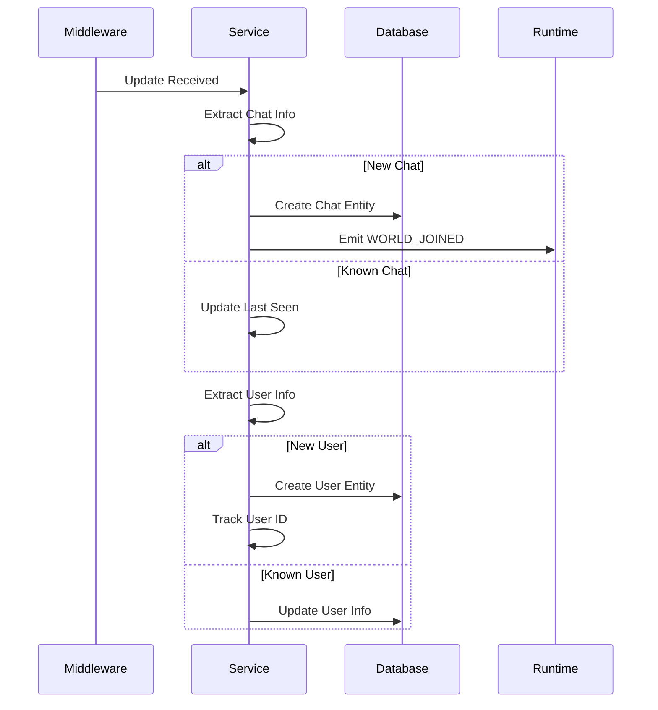

### 3. Message Processing Pipeline

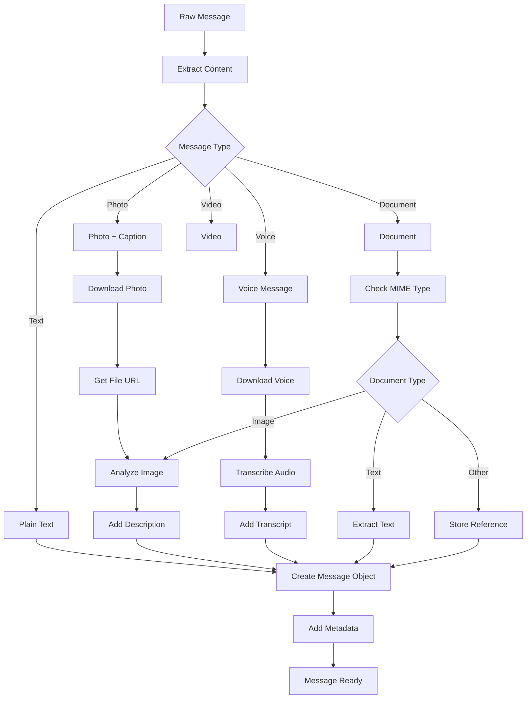

### 4. Media Processing Flow

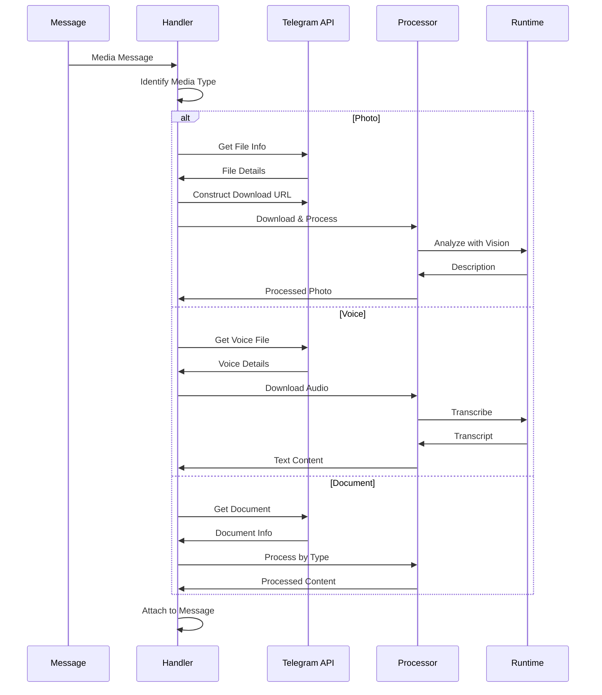

### 5. Response Generation Flow

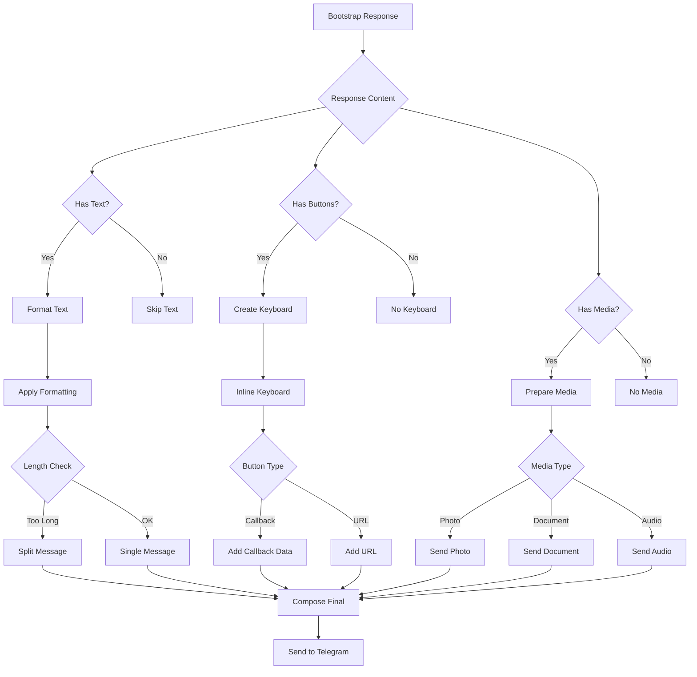

### 6. Forum Topic Handling

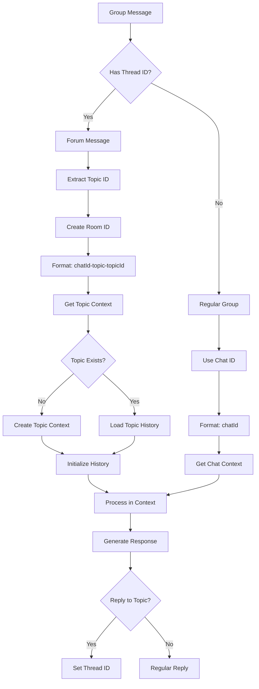

## State Management

### Message State

```typescript
interface TelegramMessageState {
  // Core message data
  messageId: number;
  chatId: string;
  userId: string;
  timestamp: Date;
  
  // Content
  text?: string;
  media?: MediaAttachment[];
  
  // Context
  replyToMessageId?: number;
  threadId?: number;
  editedAt?: Date;
  
  // Metadata
  entities?: MessageEntity[];
  buttons?: InlineKeyboardButton[][];
}
```

### Chat State

```typescript
interface TelegramChatState {
  chatId: string;
  chatType: 'private' | 'group' | 'supergroup' | 'channel';
  title?: string;
  username?: string;
  
  // Settings
  allowedUsers?: string[];
  messageLimit: number;
  
  // Forum support
  isForumChat: boolean;
  topics: Map<number, TopicState>;
  
  // History
  messages: TelegramMessage[];
  lastActivity: Date;
}
```

### Callback State

```typescript
interface CallbackState {
  messageId: number;
  chatId: string;
  callbackData: string;
  userId: string;
  timestamp: Date;
  
  // For maintaining state
  originalMessage?: TelegramMessage;
  context?: any;
}
```

## Error Handling Flow

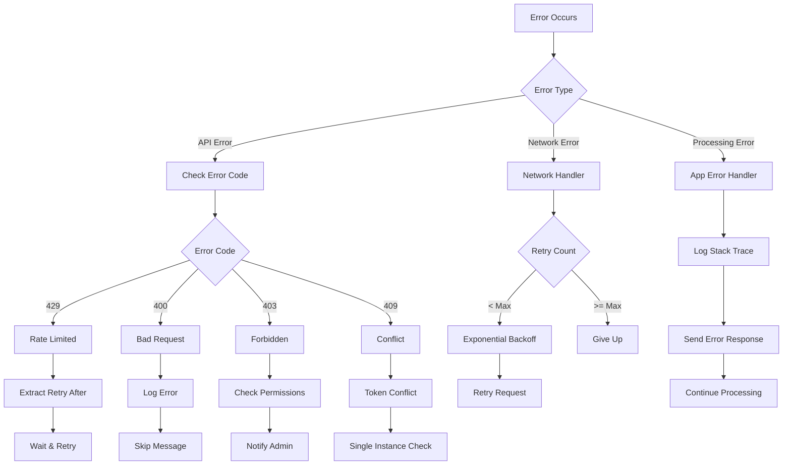

## Performance Optimization

### Message Batching

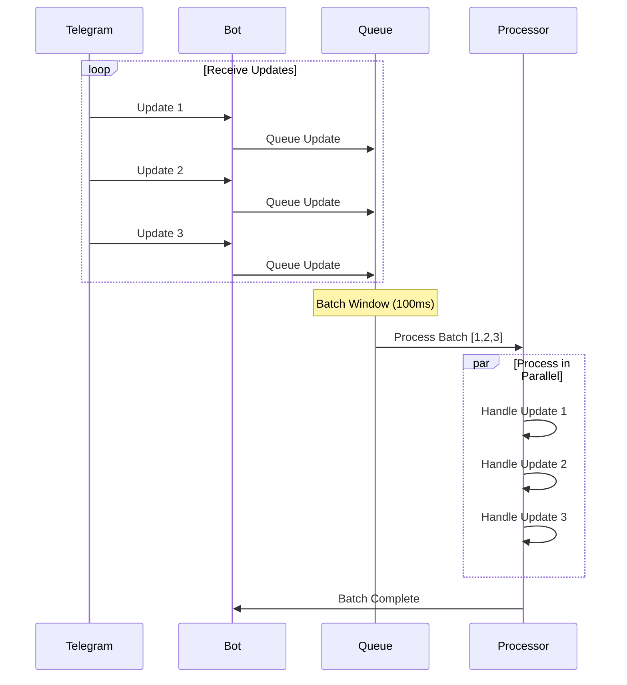

### Caching Strategy

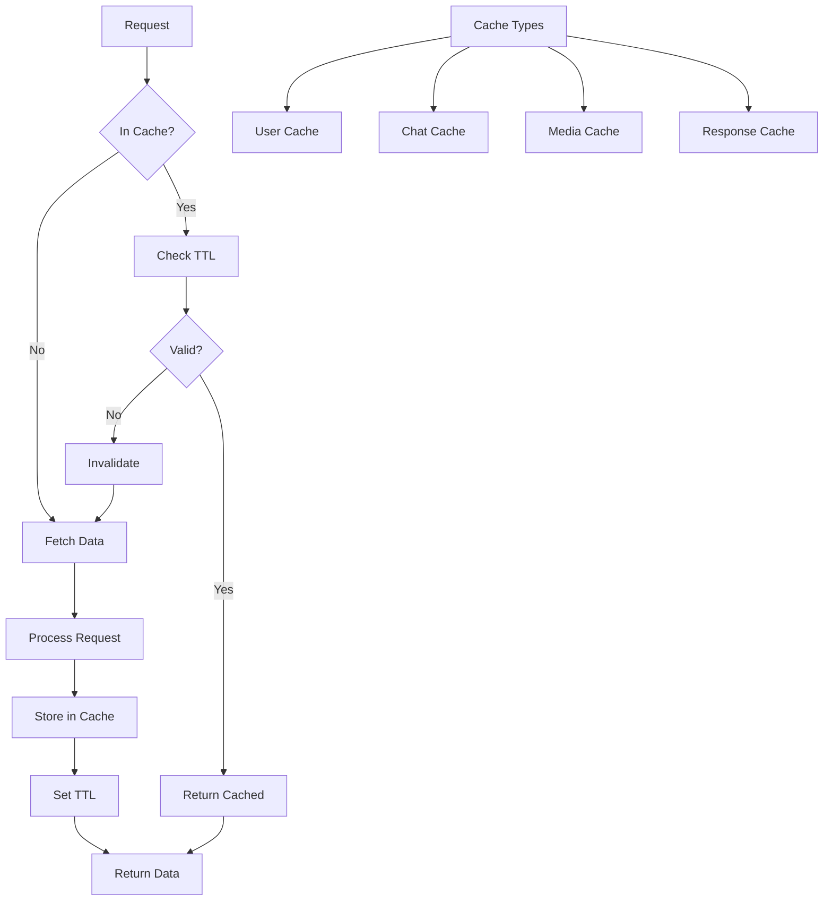

## Webhook vs Polling

### Polling Flow

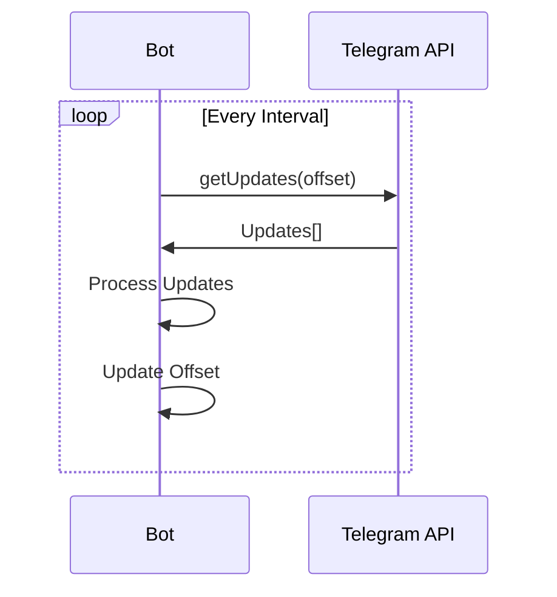

### Webhook Flow

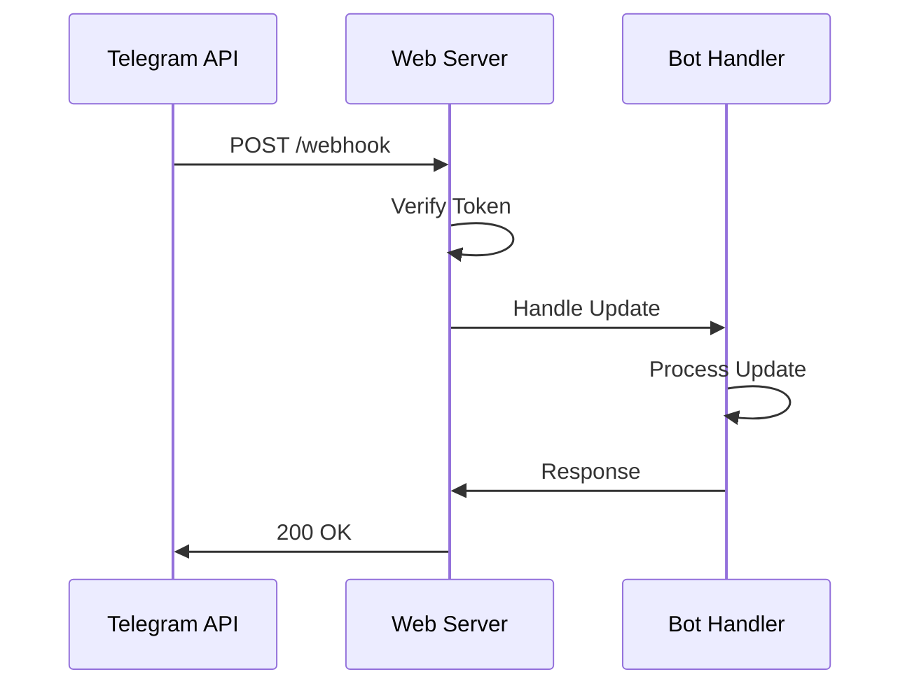

## Multi-Language Support

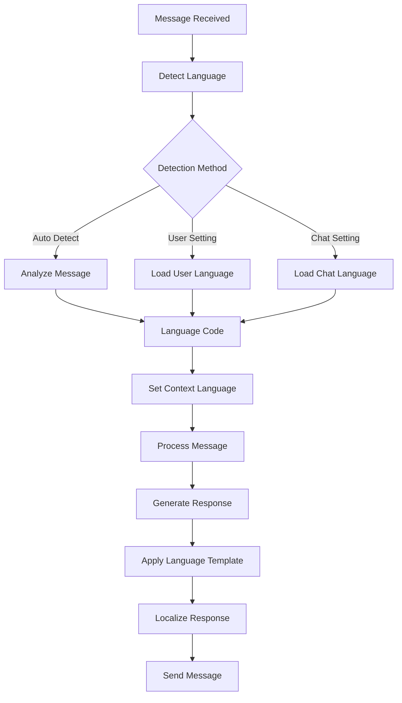

## Security Flow

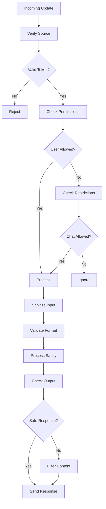

## Best Practices

1. **Update Handling**
   - Process updates asynchronously
   - Implement proper error boundaries
   - Log all update types

2. **State Management**
   - Maintain minimal state
   - Use TTL for cached data
   - Clean up old conversations

3. **Performance**
   - Batch similar operations
   - Use webhooks in production
   - Implement connection pooling

4. **Error Recovery**
   - Implement exponential backoff
   - Log errors with context
   - Provide fallback responses

5. **Security**
   - Validate all inputs
   - Sanitize user content
   - Implement rate limiting