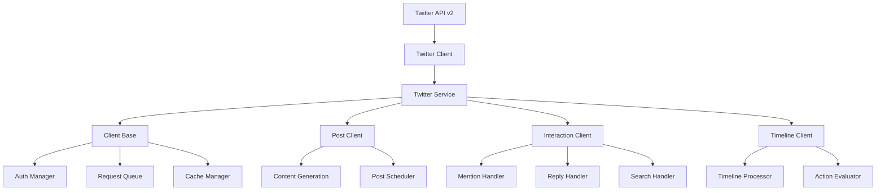

## Overview

The `@elizaos/plugin-twitter` package provides comprehensive Twitter/X API v2 integration for elizaOS agents. It enables agents to operate as fully autonomous Twitter bots with capabilities including tweet posting, timeline monitoring, interaction handling, direct messaging, and advanced features like weighted timeline algorithms.

This plugin handles all Twitter-specific functionality including:
- Managing Twitter API authentication and client connections
- Autonomous tweet generation and posting
- Timeline monitoring and interaction processing
- Search functionality and mention tracking
- Direct message handling
- Advanced timeline algorithms with configurable weights
- Rate limiting and request queuing
- Media attachment support

## Architecture Overview



## Core Components

### Twitter Service

The `TwitterService` class manages multiple Twitter client instances:

```typescript
export class TwitterService extends Service {
  static serviceType: string = TWITTER_SERVICE_NAME;
  private static instance: TwitterService;
  private clients: Map<string, TwitterClientInstance> = new Map();
  
  async createClient(
    runtime: IAgentRuntime,
    clientId: string,
    state: any
  ): Promise<TwitterClientInstance> {
    // Create and initialize client
    const client = new TwitterClientInstance(runtime, state);
    await client.client.init();
    
    // Start services based on configuration
    if (client.post) client.post.start();
    if (client.interaction) client.interaction.start();
    if (client.timeline) client.timeline.start();
    
    // Store client
    this.clients.set(clientKey, client);
    
    // Emit WORLD_JOINED event
    await this.emitServerJoinedEvent(runtime, client);
    
    return client;
  }
}
```

### Client Base

The foundation for all Twitter operations:

```typescript
export class ClientBase {
  private twitterClient: TwitterApi;
  private scraper: Scraper;
  profile: TwitterProfile | null;
  
  async init() {
    // Initialize Twitter API client
    this.twitterClient = new TwitterApi({
      appKey: this.config.TWITTER_API_KEY,
      appSecret: this.config.TWITTER_API_SECRET_KEY,
      accessToken: this.config.TWITTER_ACCESS_TOKEN,
      accessSecret: this.config.TWITTER_ACCESS_TOKEN_SECRET,
    });
    
    // Verify credentials
    this.profile = await this.verifyCredentials();
    
    // Initialize scraper for additional functionality
    await this.initializeScraper();
  }
  
  async tweet(content: string, options?: TweetOptions): Promise<Tweet> {
    // Handle dry run mode
    if (this.config.TWITTER_DRY_RUN) {
      return this.simulateTweet(content, options);
    }
    
    // Post tweet with rate limiting
    return this.requestQueue.add(async () => {
      const response = await this.twitterClient.v2.tweet({
        text: content,
        ...options
      });
      
      // Cache the tweet
      this.cacheManager.addTweet(response.data);
      
      return response.data;
    });
  }
}
```

### Post Client

Handles autonomous tweet posting:

```typescript
export class TwitterPostClient {
  private postInterval: NodeJS.Timeout | null = null;
  private lastPostTime: number = 0;
  
  async start() {
    // Check if posting is enabled
    if (!this.runtime.getSetting("TWITTER_POST_ENABLE")) {
      logger.info("Twitter posting is DISABLED");
      return;
    }
    
    logger.info("Twitter posting is ENABLED");
    
    // Post immediately if configured
    if (this.runtime.getSetting("TWITTER_POST_IMMEDIATELY")) {
      await this.generateAndPostTweet();
    }
    
    // Schedule regular posts
    this.scheduleNextPost();
  }
  
  private async generateAndPostTweet() {
    try {
      // Generate tweet content
      const content = await this.generateTweetContent();
      
      // Validate length
      if (content.length > this.maxTweetLength) {
        // Create thread if too long
        return this.postThread(content);
      }
      
      // Post single tweet
      const tweet = await this.client.tweet(content);
      logger.info(`Posted tweet: ${tweet.id}`);
      
      // Update last post time
      this.lastPostTime = Date.now();
      
    } catch (error) {
      logger.error("Failed to post tweet:", error);
    }
  }
  
  private scheduleNextPost() {
    // Calculate next post time with variance
    const baseInterval = this.calculateInterval();
    const variance = this.applyVariance(baseInterval);
    
    this.postInterval = setTimeout(async () => {
      await this.generateAndPostTweet();
      this.scheduleNextPost(); // Reschedule
    }, variance);
  }
}
```

### Interaction Client

Manages timeline monitoring and interactions:

```typescript
export class TwitterInteractionClient {
  private searchInterval: NodeJS.Timeout | null = null;
  private processedTweets: Set<string> = new Set();
  
  async start() {
    if (!this.runtime.getSetting("TWITTER_SEARCH_ENABLE")) {
      logger.info("Twitter search/interactions are DISABLED");
      return;
    }
    
    logger.info("Twitter search/interactions are ENABLED");
    
    // Start monitoring
    this.startMonitoring();
  }
  
  private async processTimelineTweets() {
    try {
      // Get home timeline
      const timeline = await this.client.getHomeTimeline({
        max_results: 100,
        exclude: ['retweets']
      });
      
      // Filter new tweets
      const newTweets = timeline.data.filter(tweet => 
        !this.processedTweets.has(tweet.id)
      );
      
      // Process based on algorithm
      const algorithm = this.runtime.getSetting("TWITTER_TIMELINE_ALGORITHM");
      const tweetsToProcess = algorithm === "weighted" 
        ? this.applyWeightedAlgorithm(newTweets)
        : this.applyLatestAlgorithm(newTweets);
      
      // Process interactions
      for (const tweet of tweetsToProcess) {
        await this.processTweet(tweet);
        this.processedTweets.add(tweet.id);
      }
      
    } catch (error) {
      logger.error("Error processing timeline:", error);
    }
  }
  
  private async processTweet(tweet: Tweet) {
    // Check if we should respond
    if (!this.shouldRespond(tweet)) return;
    
    // Generate response
    const response = await this.generateResponse(tweet);
    
    // Post response
    if (response) {
      await this.client.reply(tweet.id, response);
    }
  }
}
```

### Timeline Client

Advanced timeline processing with actions:

```typescript
export class TwitterTimelineClient {
  private actionInterval: NodeJS.Timeout | null = null;
  
  async start() {
    if (!this.runtime.getSetting("TWITTER_ENABLE_ACTION_PROCESSING")) {
      logger.info("Twitter action processing is DISABLED");
      return;
    }
    
    logger.info("Twitter action processing is ENABLED");
    
    // Schedule timeline actions
    this.scheduleActions();
  }
  
  private async executeTimelineActions() {
    try {
      // Get timeline with extended data
      const timeline = await this.client.getEnhancedTimeline();
      
      // Evaluate possible actions
      const actions = await this.evaluateActions(timeline);
      
      // Execute highest priority action
      if (actions.length > 0) {
        const action = actions[0];
        await this.executeAction(action);
      }
      
    } catch (error) {
      logger.error("Error executing timeline actions:", error);
    }
  }
  
  private async evaluateActions(timeline: Tweet[]): Promise<Action[]> {
    const actions: Action[] = [];
    
    for (const tweet of timeline) {
      // Like evaluation
      if (this.shouldLike(tweet)) {
        actions.push({
          type: 'like',
          target: tweet,
          score: this.calculateLikeScore(tweet)
        });
      }
      
      // Retweet evaluation
      if (this.shouldRetweet(tweet)) {
        actions.push({
          type: 'retweet',
          target: tweet,
          score: this.calculateRetweetScore(tweet)
        });
      }
      
      // Quote tweet evaluation
      if (this.shouldQuote(tweet)) {
        actions.push({
          type: 'quote',
          target: tweet,
          score: this.calculateQuoteScore(tweet)
        });
      }
    }
    
    // Sort by score
    return actions.sort((a, b) => b.score - a.score);
  }
}
```

## Authentication & Setup

### Developer Account Setup

1. **Apply for Developer Account**
   ```
   1. Go to https://developer.twitter.com
   2. Click "Sign up"
   3. Complete application process
   4. Wait for approval
   ```

2. **Create App**
   ```
   1. Go to Developer Portal
   2. Create new app
   3. Name your app
   4. Save app details
   ```

3. **Configure Permissions**
   ```
   1. Go to app settings
   2. Click "User authentication settings"
   3. Enable OAuth 1.0a
   4. Set permissions to "Read and write"
   5. Add callback URL: http://localhost:3000/callback
   6. Save settings
   ```

### OAuth Setup

**Critical: Use OAuth 1.0a, NOT OAuth 2.0!**

```typescript
// Correct credentials (OAuth 1.0a)
const credentials = {
  // From "Consumer Keys" section
  apiKey: process.env.TWITTER_API_KEY,              // Consumer API Key
  apiSecretKey: process.env.TWITTER_API_SECRET_KEY, // Consumer API Secret
  
  // From "Authentication Tokens" section
  accessToken: process.env.TWITTER_ACCESS_TOKEN,         // Access Token
  accessTokenSecret: process.env.TWITTER_ACCESS_TOKEN_SECRET // Access Token Secret
};

// WRONG - Don't use these (OAuth 2.0)
// ❌ Client ID
// ❌ Client Secret  
// ❌ Bearer Token
```

### Token Regeneration

After changing permissions:

1. Go to "Keys and tokens"
2. Under "Authentication Tokens"
3. Click "Regenerate" for Access Token & Secret
4. Copy new tokens
5. Update `.env` file

## Configuration

### Environment Variables

```bash
# Required OAuth 1.0a Credentials
TWITTER_API_KEY=                    # Consumer API Key
TWITTER_API_SECRET_KEY=             # Consumer API Secret  
TWITTER_ACCESS_TOKEN=               # Access Token (with write permissions)
TWITTER_ACCESS_TOKEN_SECRET=        # Access Token Secret

# Basic Configuration
TWITTER_DRY_RUN=false              # Test mode without posting
TWITTER_TARGET_USERS=              # Comma-separated usernames or "*"
TWITTER_RETRY_LIMIT=5              # Max retry attempts
TWITTER_POLL_INTERVAL=120          # Timeline polling interval (seconds)

# Post Generation
TWITTER_POST_ENABLE=false          # Enable autonomous posting
TWITTER_POST_INTERVAL_MIN=90       # Min interval (minutes)
TWITTER_POST_INTERVAL_MAX=180      # Max interval (minutes)
TWITTER_POST_IMMEDIATELY=false     # Post on startup
TWITTER_POST_INTERVAL_VARIANCE=0.2 # Interval variance (0.0-1.0)

# Interaction Settings
TWITTER_SEARCH_ENABLE=true         # Enable timeline monitoring
TWITTER_INTERACTION_INTERVAL_MIN=15    # Min interaction interval
TWITTER_INTERACTION_INTERVAL_MAX=30    # Max interaction interval
TWITTER_AUTO_RESPOND_MENTIONS=true     # Auto-respond to mentions
TWITTER_AUTO_RESPOND_REPLIES=true      # Auto-respond to replies
TWITTER_MAX_INTERACTIONS_PER_RUN=10    # Max interactions per cycle

# Timeline Algorithm
TWITTER_TIMELINE_ALGORITHM=weighted    # "weighted" or "latest"
TWITTER_TIMELINE_USER_BASED_WEIGHT=3   # User importance weight
TWITTER_TIMELINE_TIME_BASED_WEIGHT=2   # Recency weight
TWITTER_TIMELINE_RELEVANCE_WEIGHT=5    # Content relevance weight

# Advanced Settings
TWITTER_MAX_TWEET_LENGTH=4000      # Max tweet length
TWITTER_DM_ONLY=false             # Only process DMs
TWITTER_ENABLE_ACTION_PROCESSING=false  # Enable likes/RTs
TWITTER_ACTION_INTERVAL=240       # Action interval (minutes)
```

### Character Configuration

```typescript
const character = {
  name: "TwitterBot",
  clients: ["twitter"],
  postExamples: [
    "Exploring the future of decentralized AI...",
    "What if consciousness is just emergence at scale?",
    "Building in public: day 42 of the journey"
  ],
  settings: {
    // Override environment variables
    TWITTER_POST_ENABLE: "true",
    TWITTER_POST_INTERVAL_MIN: "60"
  }
};
```

## Timeline Algorithms

### Weighted Algorithm

Sophisticated scoring system for quality interactions:

```typescript
interface WeightedScoringParams {
  userWeight: number;      // Default: 3
  timeWeight: number;      // Default: 2
  relevanceWeight: number; // Default: 5
}

function calculateWeightedScore(tweet: Tweet, params: WeightedScoringParams): number {
  // User-based scoring (0-10)
  const userScore = calculateUserScore(tweet.author);
  
  // Time-based scoring (0-10)
  const ageInHours = (Date.now() - tweet.createdAt) / (1000 * 60 * 60);
  const timeScore = Math.max(0, 10 - (ageInHours / 2));
  
  // Relevance scoring (0-10)
  const relevanceScore = calculateRelevanceScore(tweet.text);
  
  // Combined weighted score
  return (userScore * params.userWeight) +
         (timeScore * params.timeWeight) +
         (relevanceScore * params.relevanceWeight);
}

function calculateUserScore(author: TwitterUser): number {
  let score = 5; // Base score
  
  // Target users get max score
  if (isTargetUser(author.username)) return 10;
  
  // Adjust based on metrics
  if (author.verified) score += 2;
  if (author.followersCount > 10000) score += 1;
  if (author.followingRatio > 0.8) score += 1;
  if (hasInteractedBefore(author.id)) score += 1;
  
  return Math.min(score, 10);
}
```

### Latest Algorithm

Simple chronological processing:

```typescript
function applyLatestAlgorithm(tweets: Tweet[]): Tweet[] {
  return tweets
    .sort((a, b) => b.createdAt - a.createdAt)
    .slice(0, this.maxInteractionsPerRun);
}
```

## Message Processing

### Tweet Generation

```typescript
async function generateTweet(runtime: IAgentRuntime): Promise<string> {
  // Build context
  const context = {
    recentTweets: await getRecentTweets(),
    currentTopics: await getTrendingTopics(),
    character: runtime.character,
    postExamples: runtime.character.postExamples
  };
  
  // Generate using LLM
  const response = await runtime.generateText({
    messages: [{
      role: 'system',
      content: buildTweetPrompt(context)
    }],
    maxTokens: 100
  });
  
  // Validate and clean
  return validateTweet(response.text);
}
```

### Response Generation

```typescript
async function generateResponse(
  tweet: Tweet,
  runtime: IAgentRuntime
): Promise<string | null> {
  // Check if we should respond
  if (!shouldRespond(tweet)) return null;
  
  // Build conversation context
  const thread = await getConversationThread(tweet.id);
  
  // Generate contextual response
  const response = await runtime.generateText({
    messages: [
      {
        role: 'system',
        content: 'You are responding to a tweet. Be concise and engaging.'
      },
      ...thread.map(t => ({
        role: t.author.id === runtime.agentId ? 'assistant' : 'user',
        content: t.text
      }))
    ],
    maxTokens: 100
  });
  
  return response.text;
}
```

## Rate Limiting & Queuing

### Request Queue Implementation

```typescript
class RequestQueue {
  private queue: Array<() => Promise<any>> = [];
  private processing = false;
  private rateLimiter: RateLimiter;
  
  async add<T>(request: () => Promise<T>): Promise<T> {
    return new Promise((resolve, reject) => {
      this.queue.push(async () => {
        try {
          // Check rate limits
          await this.rateLimiter.waitIfNeeded();
          
          // Execute request
          const result = await request();
          resolve(result);
        } catch (error) {
          reject(error);
        }
      });
      
      this.process();
    });
  }
  
  private async process() {
    if (this.processing || this.queue.length === 0) return;
    
    this.processing = true;
    
    while (this.queue.length > 0) {
      const request = this.queue.shift()!;
      
      try {
        await request();
      } catch (error) {
        if (error.code === 429) {
          // Rate limited - pause queue
          const retryAfter = error.rateLimit?.reset || 900;
          await this.pause(retryAfter * 1000);
        }
      }
      
      // Small delay between requests
      await sleep(100);
    }
    
    this.processing = false;
  }
}
```

### Rate Limiter

```typescript
class RateLimiter {
  private windows: Map<string, RateLimitWindow> = new Map();
  
  async checkLimit(endpoint: string): Promise<boolean> {
    const window = this.getWindow(endpoint);
    const now = Date.now();
    
    // Reset window if expired
    if (now > window.resetTime) {
      window.count = 0;
      window.resetTime = now + window.windowMs;
    }
    
    // Check if limit exceeded
    return window.count < window.limit;
  }
  
  async waitIfNeeded(endpoint: string): Promise<void> {
    const canProceed = await this.checkLimit(endpoint);
    
    if (!canProceed) {
      const window = this.getWindow(endpoint);
      const waitTime = window.resetTime - Date.now();
      
      logger.warn(`Rate limit hit for ${endpoint}, waiting ${waitTime}ms`);
      await sleep(waitTime);
    }
  }
}
```

## Error Handling

### API Error Handling

```typescript
async function handleTwitterError(error: any): Promise<boolean> {
  // Rate limit error
  if (error.code === 429) {
    const resetTime = error.rateLimit?.reset || Date.now() + 900000;
    const waitTime = resetTime - Date.now();
    
    logger.warn(`Rate limited. Waiting ${waitTime}ms`);
    await sleep(waitTime);
    return true; // Retry
  }
  
  // Authentication errors
  if (error.code === 401) {
    logger.error('Authentication failed. Check credentials.');
    return false; // Don't retry
  }
  
  // Permission errors
  if (error.code === 403) {
    logger.error('Permission denied. Check app permissions.');
    return false; // Don't retry
  }
  
  // Bad request
  if (error.code === 400) {
    logger.error('Bad request:', error.message);
    return false; // Don't retry
  }
  
  // Network errors
  if (error.code === 'ECONNRESET' || error.code === 'ETIMEDOUT') {
    logger.warn('Network error, will retry...');
    return true; // Retry
  }
  
  // Unknown error
  logger.error('Unknown error:', error);
  return false;
}
```

### Retry Logic

```typescript
async function retryWithBackoff<T>(
  fn: () => Promise<T>,
  maxRetries = 3,
  baseDelay = 1000
): Promise<T> {
  let lastError: any;
  
  for (let i = 0; i < maxRetries; i++) {
    try {
      return await fn();
    } catch (error) {
      lastError = error;
      
      const shouldRetry = await handleTwitterError(error);
      if (!shouldRetry) throw error;
      
      // Exponential backoff
      const delay = baseDelay * Math.pow(2, i);
      logger.info(`Retry ${i + 1}/${maxRetries} after ${delay}ms`);
      await sleep(delay);
    }
  }
  
  throw lastError;
}
```

## Integration Guide

### Basic Setup

```typescript
import { twitterPlugin } from '@elizaos/plugin-twitter';
import { AgentRuntime } from '@elizaos/core';
import { bootstrapPlugin } from '@elizaos/plugin-bootstrap';

const runtime = new AgentRuntime({
  plugins: [bootstrapPlugin, twitterPlugin],
  character: {
    name: "TwitterBot",
    clients: ["twitter"],
    postExamples: [
      "Just shipped a new feature!",
      "Thoughts on the future of AI?"
    ],
    settings: {
      TWITTER_API_KEY: process.env.TWITTER_API_KEY,
      TWITTER_API_SECRET_KEY: process.env.TWITTER_API_SECRET_KEY,
      TWITTER_ACCESS_TOKEN: process.env.TWITTER_ACCESS_TOKEN,
      TWITTER_ACCESS_TOKEN_SECRET: process.env.TWITTER_ACCESS_TOKEN_SECRET,
      TWITTER_POST_ENABLE: "true"
    }
  }
});

await runtime.start();
```

### Multi-Account Setup

```typescript
// Create multiple Twitter clients
const mainAccount = await twitterService.createClient(
  runtime,
  'main-account',
  mainAccountConfig
);

const supportAccount = await twitterService.createClient(
  runtime,
  'support-account',
  supportAccountConfig
);

// Each client operates independently
mainAccount.post.start();
supportAccount.interaction.start();
```

### Custom Actions

```typescript
const customTwitterAction: Action = {
  name: "TWITTER_ANALYTICS",
  description: "Analyze tweet performance",
  
  handler: async (runtime, message, state, options, callback) => {
    const twitterService = runtime.getService('twitter') as TwitterService;
    const client = twitterService.getClient(runtime.agentId);
    
    // Get recent tweets
    const tweets = await client.client.getRecentTweets();
    
    // Analyze performance
    const analytics = tweets.map(tweet => ({
      id: tweet.id,
      text: tweet.text.substring(0, 50),
      likes: tweet.public_metrics.like_count,
      retweets: tweet.public_metrics.retweet_count,
      replies: tweet.public_metrics.reply_count
    }));
    
    await callback({
      text: `Recent tweet performance:\n${JSON.stringify(analytics, null, 2)}`
    });
    
    return true;
  }
};
```

## Performance Optimization

### Caching Strategy

```typescript
class TwitterCache {
  private tweetCache: LRUCache<string, Tweet>;
  private userCache: LRUCache<string, TwitterUser>;
  private timelineCache: CachedTimeline | null = null;
  
  constructor() {
    this.tweetCache = new LRUCache({
      max: 10000,
      ttl: 1000 * 60 * 60 // 1 hour
    });
    
    this.userCache = new LRUCache({
      max: 5000,
      ttl: 1000 * 60 * 60 * 24 // 24 hours
    });
  }
  
  async getCachedTimeline(): Promise<Tweet[] | null> {
    if (!this.timelineCache) return null;
    
    const age = Date.now() - this.timelineCache.timestamp;
    if (age > 60000) return null; // 1 minute expiry
    
    return this.timelineCache.tweets;
  }
}
```

### Batch Operations

```typescript
async function batchOperations() {
  // Batch user lookups
  const userIds = tweets.map(t => t.author_id);
  const users = await client.v2.users(userIds);
  
  // Batch tweet lookups
  const tweetIds = mentions.map(m => m.referenced_tweet_id);
  const referencedTweets = await client.v2.tweets(tweetIds);
  
  // Process in parallel
  await Promise.all([
    processTweets(tweets),
    processUsers(users),
    processMentions(mentions)
  ]);
}
```

### Memory Management

```typescript
class MemoryManager {
  private maxProcessedTweets = 10000;
  private cleanupInterval = 1000 * 60 * 60; // 1 hour
  
  startCleanup() {
    setInterval(() => {
      this.cleanup();
    }, this.cleanupInterval);
  }
  
  cleanup() {
    // Clean old processed tweets
    if (this.processedTweets.size > this.maxProcessedTweets) {
      const toRemove = this.processedTweets.size - this.maxProcessedTweets;
      const iterator = this.processedTweets.values();
      
      for (let i = 0; i < toRemove; i++) {
        this.processedTweets.delete(iterator.next().value);
      }
    }
    
    // Force garbage collection if available
    if (global.gc) {
      global.gc();
    }
  }
}
```

## Best Practices

1. **Authentication**
   - Always use OAuth 1.0a for user context
   - Store credentials securely
   - Regenerate tokens after permission changes

2. **Rate Limiting**
   - Implement proper backoff strategies
   - Cache frequently accessed data
   - Use batch endpoints when possible

3. **Content Generation**
   - Provide diverse postExamples
   - Vary posting times with variance
   - Monitor engagement metrics

4. **Error Handling**
   - Log all errors with context
   - Implement graceful degradation
   - Notify on critical failures

5. **Performance**
   - Use appropriate timeline algorithms
   - Implement efficient caching
   - Monitor memory usage

## Support

For issues and questions:
- 📚 Check the [examples](./examples.mdx)
- 💬 Join our [Discord community](https://discord.gg/elizaos)
- 🐛 Report issues on [GitHub](https://github.com/elizaos/eliza/issues)