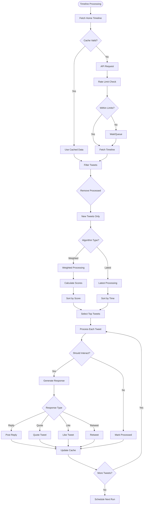
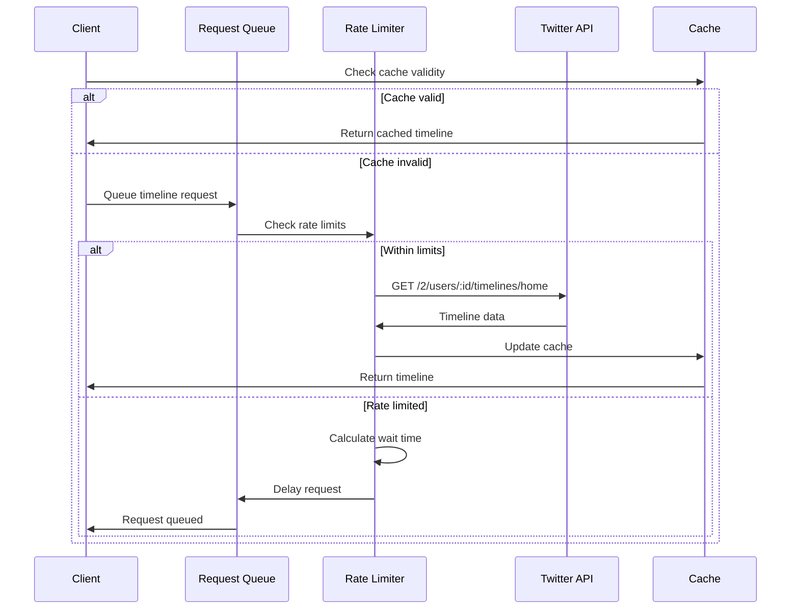
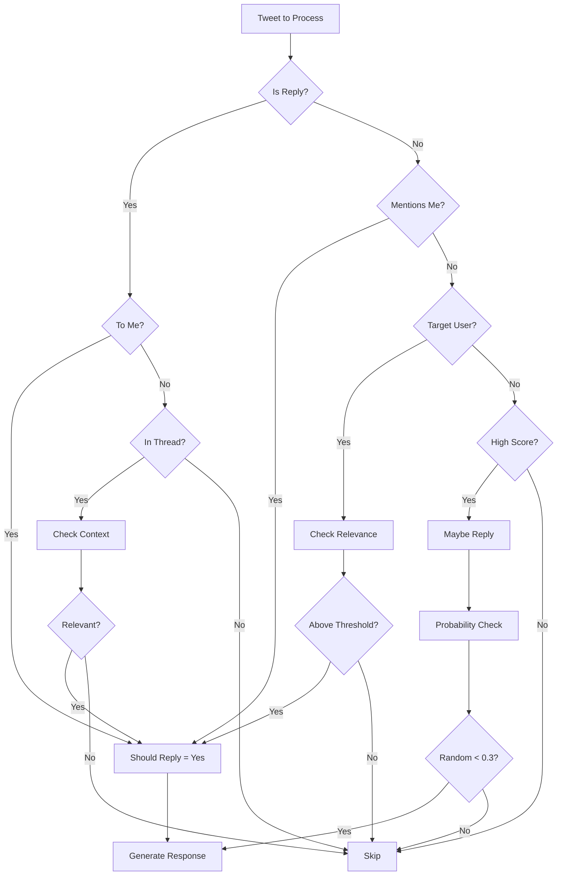
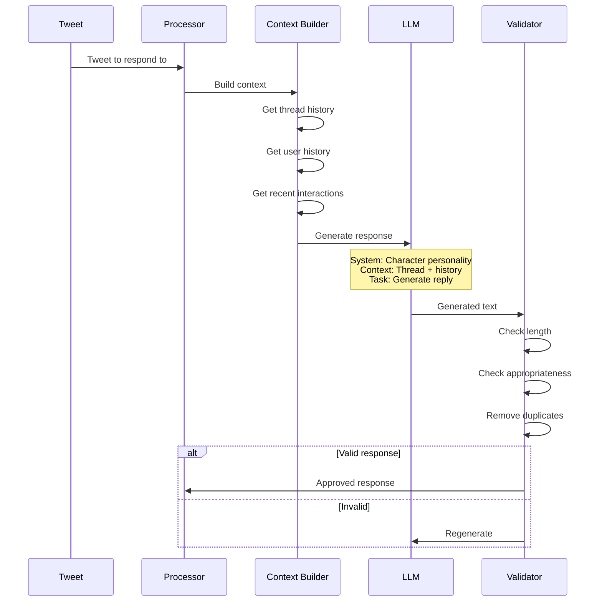
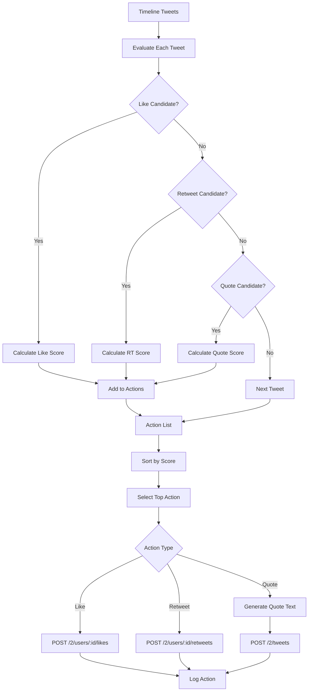
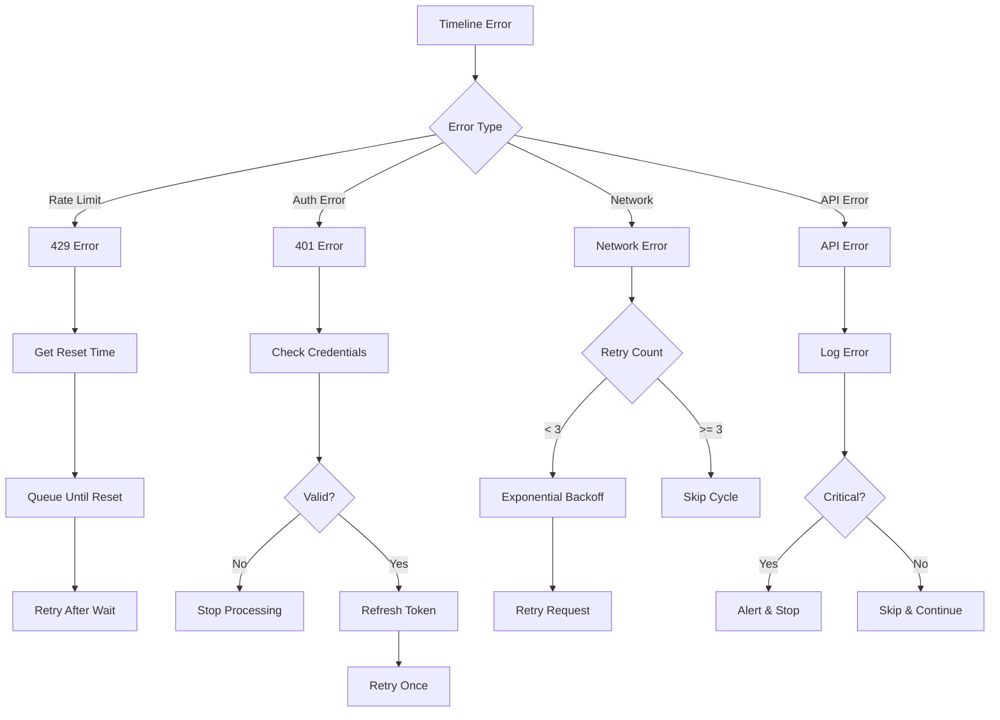
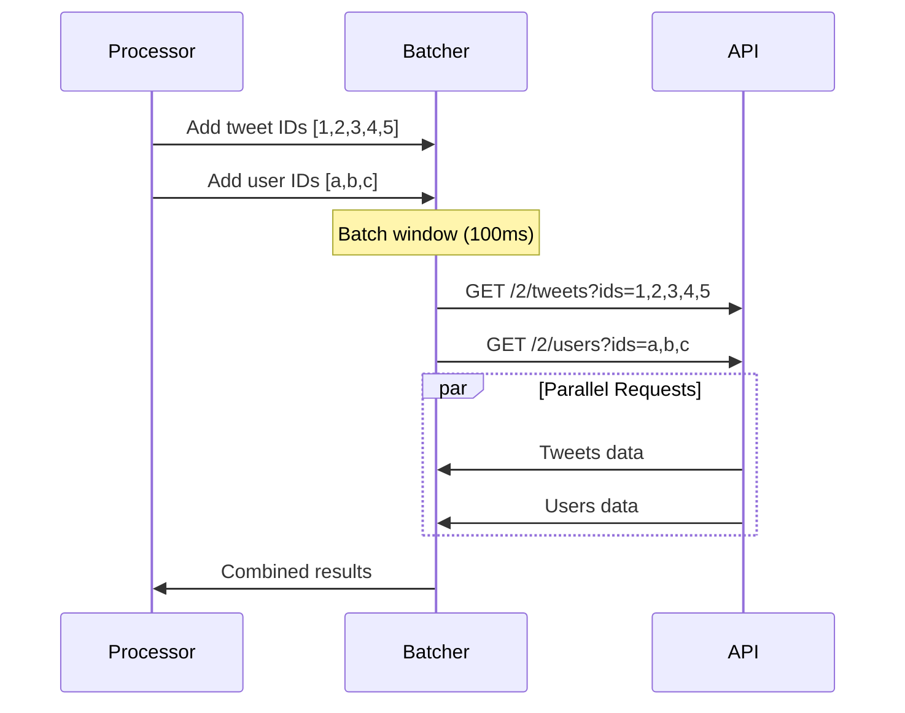
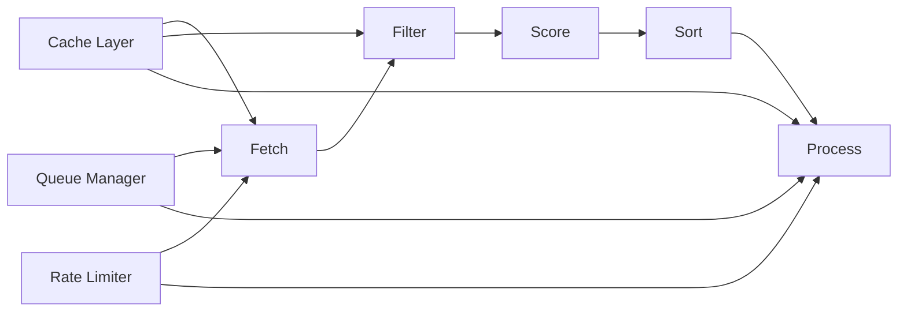
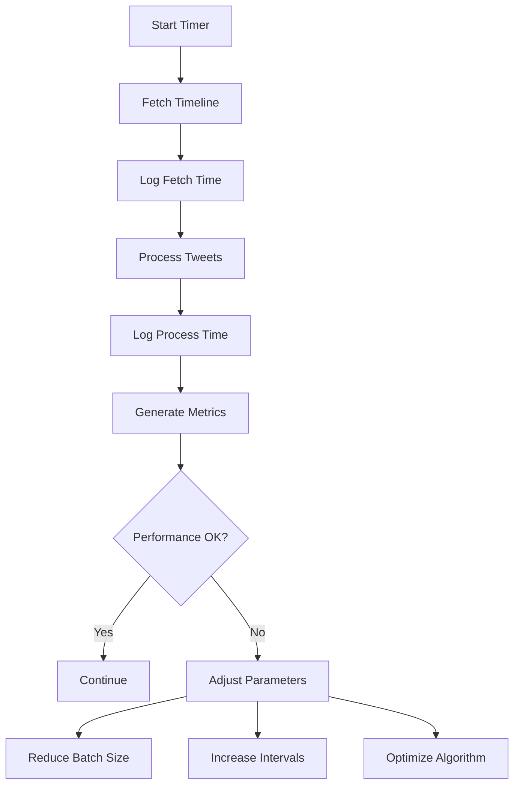
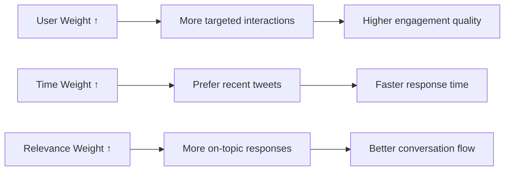

This document provides a comprehensive breakdown of how the Twitter plugin processes timeline data and generates interactions.

## Complete Timeline Flow Diagram



## Detailed Processing Flows

### 1. Timeline Fetching



### 2. Weighted Algorithm Flow

```mermaid
flowchart TD
    A[Tweet List] --> B[For Each Tweet]
    
    B --> C[Calculate User Score]
    C --> D{Target User?}
    D -->|Yes| E[Score = 10]
    D -->|No| F[Base Score = 5]
    
    F --> G{Verified?}
    G -->|Yes| H[Score +2]
    G -->|No| I[Continue]
    
    H --> J{High Followers?}
    I --> J
    J -->|Yes| K[Score +1]
    J -->|No| L[Continue]
    
    K --> M[User Score Complete]
    L --> M
    E --> M
    
    B --> N[Calculate Time Score]
    N --> O[Age in Hours]
    O --> P[Score = 10 - (Age/2)]
    P --> Q[Cap at 0-10]
    
    B --> R[Calculate Relevance]
    R --> S[Analyze Content]
    S --> T{Keywords Match?}
    T -->|Yes| U[High Relevance]
    T -->|No| V[Low Relevance]
    
    U --> W[Relevance Score]
    V --> W
    
    M --> X[Combine Scores]
    Q --> X
    W --> X
    
    X --> Y[Final Score = (U*3 + T*2 + R*5)]
    Y --> Z[Add to Scored List]
```

### 3. Interaction Decision Flow



### 4. Response Generation Flow



### 5. Action Processing Flow



## Timeline State Management

### Cache Structure

```typescript
interface TimelineCache {
  tweets: Tweet[];
  users: Map<string, TwitterUser>;
  timestamp: number;
  etag?: string;
}

interface ProcessingState {
  processedTweets: Set<string>;
  lastProcessTime: number;
  interactionCount: number;
  rateLimitStatus: RateLimitInfo;
}
```

### Scoring Components

```typescript
interface ScoringWeights {
  user: number;      // Default: 3
  time: number;      // Default: 2
  relevance: number; // Default: 5
}

interface TweetScore {
  tweetId: string;
  userScore: number;
  timeScore: number;
  relevanceScore: number;
  totalScore: number;
  factors: {
    isTargetUser: boolean;
    isVerified: boolean;
    followerCount: number;
    hasKeywords: boolean;
    age: number;
  };
}
```

## Error Handling in Timeline Flow



## Performance Optimization

### Batch Processing



### Processing Pipeline



## Monitoring & Metrics

### Timeline Processing Metrics

```typescript
interface TimelineMetrics {
  fetchTime: number;
  tweetCount: number;
  newTweetCount: number;
  processedCount: number;
  interactionCount: number;
  errorCount: number;
  cacheHitRate: number;
  averageScore: number;
}
```

### Performance Tracking



## Configuration Impact

### Algorithm Selection

| Algorithm | Best For | Performance | Quality |
|-----------|----------|-------------|---------|
| Weighted | Quality interactions | Slower | Higher |
| Latest | High volume | Faster | Lower |

### Weight Configuration Effects



## Best Practices

1. **Cache Management**
   - Implement TTL for timeline cache
   - Clear processed tweets periodically
   - Monitor cache hit rates

2. **Rate Limit Handling**
   - Track limits per endpoint
   - Implement request queuing
   - Use exponential backoff

3. **Score Tuning**
   - Monitor interaction quality
   - Adjust weights based on results
   - A/B test different configurations

4. **Error Recovery**
   - Implement circuit breakers
   - Log all failures with context
   - Graceful degradation

5. **Performance Monitoring**
   - Track processing times
   - Monitor API usage
   - Alert on anomalies