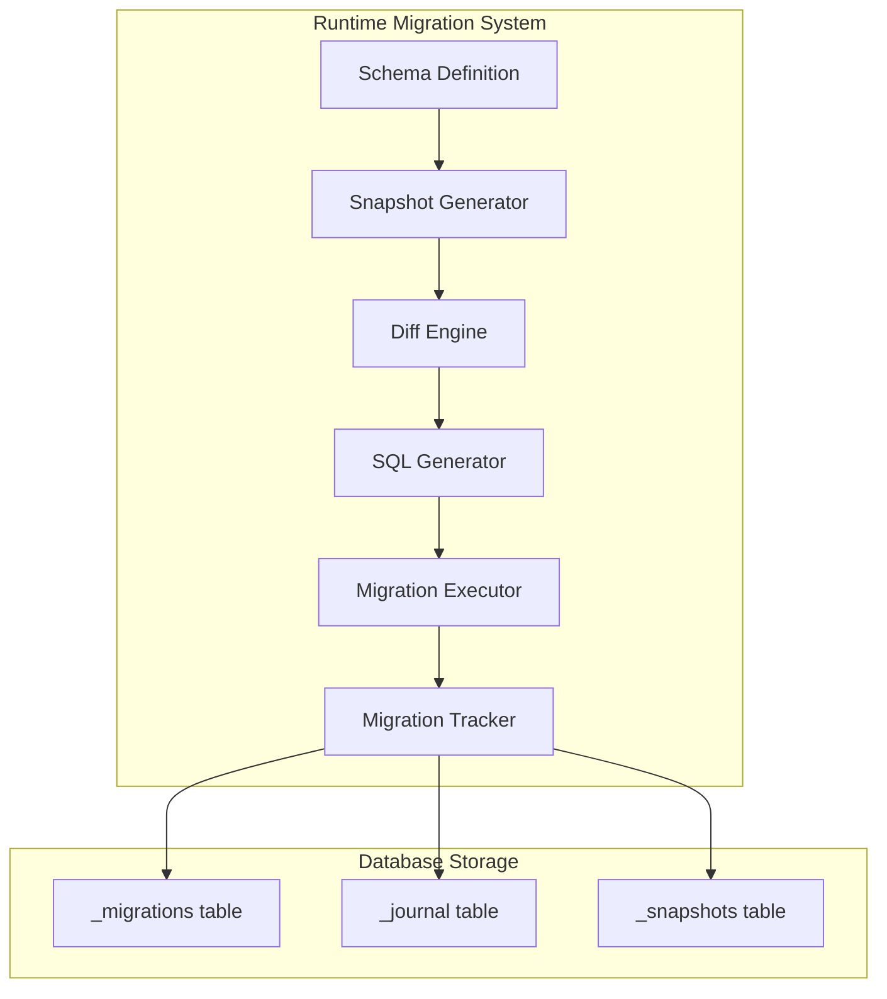

# 🚀 Production-Ready Dynamic Migration System - Implementation Plan

Based on the requirements for a runtime-executable migration system that stores everything in the database instead of files, this document outlines a comprehensive solution.

## 📋 Executive Summary

We're transforming Drizzle's file-based migration system into a database-centric, runtime-executable system that:

- **Runs migrations dynamically at runtime** without any file operations
- **Stores all metadata in database tables** (migrations, snapshots, journal)
- **Supports full schema evolution** (CREATE, ALTER, DROP operations)
- **Provides production safety** (rollback, validation, transaction safety)
- **Maintains compatibility** with Drizzle's schema parsing

## 🏗️ Architecture Overview



## 📊 Phase 1: Database Schema Design

### Migration Tracking Tables (Same as Drizzle but in DB)

```sql
-- 1. Migrations table (like Drizzle's __drizzle_migrations)
CREATE SCHEMA IF NOT EXISTS migrations;

CREATE TABLE IF NOT EXISTS migrations._migrations (
    id SERIAL PRIMARY KEY,
    plugin_name TEXT NOT NULL,
    hash TEXT NOT NULL,
    created_at BIGINT NOT NULL
);

-- 2. Migration Journal (replaces _journal.json file)
CREATE TABLE IF NOT EXISTS migrations._journal (
    plugin_name TEXT PRIMARY KEY,
    version TEXT NOT NULL,
    dialect TEXT NOT NULL DEFAULT 'postgresql',
    entries JSONB NOT NULL DEFAULT '[]'
);

-- 3. Migration Snapshots (replaces snapshot JSON files)
CREATE TABLE IF NOT EXISTS migrations._snapshots (
    id SERIAL PRIMARY KEY,
    plugin_name TEXT NOT NULL,
    idx INTEGER NOT NULL,
    snapshot JSONB NOT NULL,
    created_at TIMESTAMP DEFAULT NOW(),
    UNIQUE(plugin_name, idx)
);
```

## 📐 Phase 2: Core Components Design

### 2.1 Dynamic Migration Manager

```typescript
// src/migrator/dynamic-migration-manager.ts
export class DynamicMigrationManager {
  private db: DrizzleDB;
  private journalManager: JournalManager;
  private snapshotManager: SnapshotManager;
  private diffEngine: SchemaDiffEngine;
  private sqlGenerator: DynamicSQLGenerator;

  async migrate(pluginName: string, schema: any, options?: MigrationOptions): Promise<void> {
    // 1. Load or create journal
    // 2. Generate current snapshot
    // 3. Load previous snapshot
    // 4. Calculate diff
    // 5. Generate SQL statements
    // 6. Execute migration
    // 7. Store metadata
  }
}
```

### 2.2 Journal Manager (Database-based)

```typescript
// src/migrator/managers/journal-manager.ts
export class JournalManager {
  async loadJournal(pluginName: string): Promise<Journal | null>;
  async saveJournal(pluginName: string, journal: Journal): Promise<void>;
  async addEntry(pluginName: string, entry: JournalEntry): Promise<void>;
  async getNextIdx(pluginName: string): Promise<number>;
}
```

### 2.3 Snapshot Manager

```typescript
// src/migrator/managers/snapshot-manager.ts
export class SnapshotManager {
  async saveSnapshot(
    pluginName: string,
    idx: number,
    type: 'previous' | 'current',
    snapshot: any
  ): Promise<void>;
  async loadSnapshot(pluginName: string, idx: number, type: string): Promise<any | null>;
  async getLatestSnapshot(pluginName: string): Promise<any | null>;
}
```

## 🔄 Phase 3: Migration Flow (Exactly Like Drizzle)

### 3.1 Migration Flow - Direct Port from Drizzle

```typescript
// Direct adaptation of Drizzle's pg-core/dialect.ts migrate function
export async function executeDynamicMigration(
  db: DrizzleDB,
  pluginName: string,
  schema: any
): Promise<void> {
  // 1. Create migration schema/tables if not exists
  await db.execute(sql`CREATE SCHEMA IF NOT EXISTS migrations`);
  await createMigrationTables(db);

  // 2. Generate snapshot from current schema
  const currentSnapshot = await generateSnapshot(schema);
  const currentHash = hashSnapshot(currentSnapshot);

  // 3. Check last migration
  const lastMigration = await db.execute(
    sql`SELECT id, hash, created_at FROM migrations._migrations 
        WHERE plugin_name = ${pluginName} 
        ORDER BY created_at DESC LIMIT 1`
  );

  // 4. Load previous snapshot and calculate diff
  const previousSnapshot = await loadLatestSnapshot(db, pluginName);
  const sqlStatements = await generateMigrationSQL(previousSnapshot, currentSnapshot);

  // 5. Run in transaction (auto-rollback on failure)
  if (sqlStatements.length > 0) {
    await db.transaction(async (tx) => {
      // Execute migration SQL
      for (const stmt of sqlStatements) {
        await tx.execute(sql.raw(stmt));
      }

      // Record migration
      const idx = await getNextIdx(tx, pluginName);
      await tx.execute(
        sql`INSERT INTO migrations._migrations (plugin_name, hash, created_at) 
            VALUES (${pluginName}, ${currentHash}, ${Date.now()})`
      );

      // Update journal
      await updateJournal(tx, pluginName, idx, currentHash);

      // Store snapshot
      await tx.execute(
        sql`INSERT INTO migrations._snapshots (plugin_name, idx, snapshot) 
            VALUES (${pluginName}, ${idx}, ${currentSnapshot})`
      );
    });
  }
}
```

### 3.2 Schema Diff Engine

```typescript
// src/migrator/engines/schema-diff-engine.ts
export class SchemaDiffEngine {
  async calculateDiff(prev: SchemaSnapshot, curr: SchemaSnapshot): Promise<SchemaDiff> {
    return {
      tables: {
        created: [...],
        modified: [...],
        deleted: [...]
      },
      columns: {
        added: [...],
        modified: [...],
        deleted: [...]
      },
      indexes: {...},
      constraints: {...}
    };
  }
}
```

## 🛡️ Phase 4: Safety (Just Like Drizzle)

### What Drizzle Does for Safety:

1. **Transactions**: All migrations run in a transaction
2. **Auto-rollback**: If any SQL fails, the entire transaction rolls back
3. **Hash checking**: Prevents re-running same migration
4. **That's it!** No complex rollback tables or validation

```typescript
// The ONLY safety we need (same as Drizzle)
await db.transaction(async (tx) => {
  try {
    // Run all migration SQL
    for (const stmt of sqlStatements) {
      await tx.execute(sql.raw(stmt));
    }
    // Record migration
    await recordMigration(tx, pluginName, hash);
  } catch (error) {
    // Transaction automatically rolls back on error
    throw error;
  }
});
```

## 📁 Phase 5: Simplified File Structure

```
packages/plugin-sql/src/migrator/
├── runtime/
│   ├── index.ts                     # Main entry point
│   ├── runtime-migrator.ts          # Core migration logic
│   ├── types.ts                     # Types
│   │
│   ├── storage/
│   │   ├── journal-storage.ts       # DB-based journal (replaces _journal.json)
│   │   ├── snapshot-storage.ts      # DB-based snapshots (replaces .json files)
│   │   └── migration-tracker.ts     # Track migrations (like __drizzle_migrations)
│   │
│   └── drizzle-adapters/
│       ├── snapshot-generator.ts    # Port from Drizzle's snapshot generation
│       ├── sql-generator.ts         # Port from Drizzle's SQL generation
│       └── diff-calculator.ts       # Port from Drizzle's diff logic
```

## 🚦 Implementation Steps (Simple)

### Step 1: Database Tables

1. Create the 3 migration tables
2. Test basic CRUD operations

### Step 2: Port Drizzle Functions

1. Copy snapshot generation logic from Drizzle
2. Copy diff calculation from Drizzle
3. Copy SQL generation from Drizzle
4. Just change file I/O to database I/O

### Step 3: Wire It Together

1. Create main migration function
2. Test with simple schema changes
3. Test with complex schema changes

## ✅ Success Criteria

1. **Works like Drizzle**: Same behavior, just DB storage instead of files
2. **Runtime execution**: Can run migrations programmatically
3. **Transaction safety**: Automatic rollback on failure (like Drizzle)
4. **Plugin namespacing**: Support schema-based isolation for plugins

## 💡 What We're Doing (Simple)

We're taking Drizzle's migration system and changing ONLY the storage:

**Drizzle stores in files:**

- `_journal.json` → We store in `_journal` table
- `0000_snapshot.json` → We store in `_snapshots` table
- `__drizzle_migrations` table → We keep similar `_migrations` table

**Everything else stays the same:**

- Same snapshot generation
- Same diff calculation
- Same SQL generation
- Same transaction-based execution

## 🔧 Technical Details

### How We Adapt Drizzle's Code:

1. **Replace File Operations**:

   ```typescript
   // Instead of: fs.writeFileSync(journalPath, JSON.stringify(journal))
   await journalManager.saveJournal(pluginName, journal);
   ```

2. **Store SQL in Database**:

   ```typescript
   // Instead of: fs.writeFileSync(`${outFolder}/${tag}.sql`, sql)
   await historyManager.saveMigration(pluginName, idx, sqlStatements);
   ```

3. **Load Snapshots from DB**:
   ```typescript
   // Instead of: JSON.parse(fs.readFileSync(snapshotPath))
   const snapshot = await snapshotManager.loadSnapshot(pluginName, idx);
   ```

### How It Will Be Used:

```typescript
// Simple usage - just like your current migrator but dynamic
import { RuntimeMigrator } from './migrator/runtime';

const migrator = new RuntimeMigrator(db);

// For main schema (no namespace)
await migrator.migrate('plugin-sql', sqlSchema);

// For plugin schemas (with namespace)
await migrator.migrate('plugin-custom', customSchema);
```

## 🎯 What Needs to Be Done

### The Core Work:

1. **Create 3 tables** for storing journal, snapshots, and migrations
2. **Port Drizzle's code** - literally copy their functions and change file I/O to DB I/O
3. **Test it** - Make sure it works the same as Drizzle

### The Main Files to Port from Drizzle:

- `/drizzle-kit/src/cli/commands/migrate.ts` - The migration logic
- `/drizzle-kit/src/serializer/pgSerializer.ts` - Snapshot generation
- `/drizzle-kit/src/snapshotsDiffer.ts` - Diff calculation
- `/drizzle-orm/src/pg-core/dialect.ts` - The migrate() function

## 🔍 Note

This is literally just Drizzle's migration system but storing metadata in DB tables instead of files. Nothing fancy, no extra complexity.

## 📚 References

- Original Drizzle migration system: `/drizzle-orm/drizzle-kit/src/cli/commands/migrate.ts`
- Schema parsing: `/drizzle-orm/drizzle-kit/src/cli/schema.ts`
- Current migrator implementation: `packages/plugin-sql/src/migrator/`

---

**Summary:**

1. Take Drizzle's code
2. Replace file I/O with database I/O
3. Done

That's it. No fancy features, no complex safety mechanisms, just Drizzle's proven migration system adapted for runtime use.
